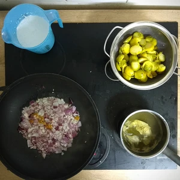

Herbstzeit ist Rosenkohlzeit. Ich habe bis zu diesem Jahr kein Rosenkohl gegessen. Es ist jetzt kein Hype, wie es im sozialen Medien einst propagiert wurde, aber ich wollte etwas ausprobieren.
<!-- more -->

# Zutaten
* 200g Rosenkohl
* 160g Filet oder 200g Tofu
* 1 Zwiebel
* 3 Knoblauch Zehen
* 150ml Gemüsebrühe
* 150ml Milche [Hafermilch](/articles/hafermilch-2022-01-29/), [Sojamilch](/articles/soja-milch-2023-02-04/)
* 1 EL Kokosöl
* 1/2 TL Kurkuma
* 1/2 TL Paprikapulver
* 1/2 TL Kümmel
* 1/2 TL Musskatnuss
* Etwas frisch gemahlenen Pfeffer
* Prise Salz
* Sesam

Für dieses Curry aus Rosenkohl, muss dieser erst gewaschen, dann der Strunk entfernt werden und zum Schluss halbiert werden.
Die Zwiebel und den Knoblauch hackt ihr klein. Als Beilage zum Rosenkohl, bereiten nehmen wir entweder 200g Tofu, denn ihr nach Wahl würzen und marinieren könnt, oder 160g fertige Filets (zum Beispiel auf Soja oder Erbsenbasis) und würfelt diese.

Kurkuma, Paprikapulver, Kümmel, Salz und Muskatnuss werden miteinander zu einer Gewürzmischung vermischt.

||
|---|
||

Erhitzt nun das Kokosöl in einem Wok, oder breiten Topf und bratet darin den Rosenkohl an, bis es leicht bräunlich wird, woraufhin ihr diesen wieder herausnimmt und dann Zwiebel wie Knoblauch anbratet. Sobald die Zwiebel glasig sind, kommt das Tofu oder alternativ die gewürfelten Filets mit hinzu.
Wenn ihr seht, dass die Filets bzw. der Tofu Farbe bekommen haben, wird der vorhin herausgeholte Rosenkohl hinzugegeben. Vermischt alles und bratet dies für fünf Minuten, bevor ihr das ganze mit der Gemüsebrühe löscht. Jetzt kann langsam die Milch hinzugegeben und dabei durchgehend gerührt werden. 

|||
|---|---|
|||

Das ganze muss jetzt nur noch köcheln, bis alles etwas andickt. Als Beilage können auch Reis oder Brattkartoffeln zubereitet werden. Auch können Kartoffel gewürfelt werden, welche dann in das Curry zum köcheln mit hinzugegeben werden.
Streut noch etwas Sesam über das Curry beim Servieren.
