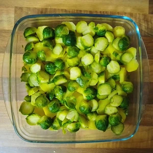
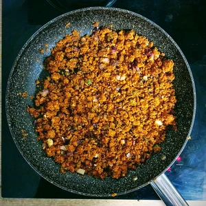
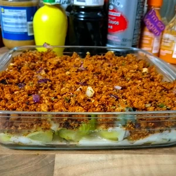
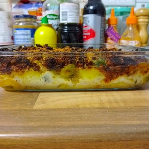
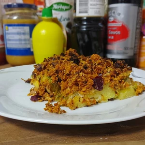
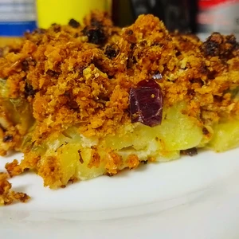

Um die Triologie der Rezepte mit Rosenkohl abzuschließen, gibt es noch ein Rezept für einen Kartoffel-Aulauf mit Hack.

<!-- more -->

# Zutaten
* 300g Kartoffel
* 300g Rosenkohl
* 1 Zwiebel
* 3 Knoblauchzehen
* Pflanzenöl zum anbraten
* 200g Hack ( [Okara](/articles/okara-2023-02-04/) oder [Haferhack](/articles/hafer-hack-2022-09-12/) )
* 1 EL Alsan
* 1 EL Mehl
* 200ml Milch ( [Sojamilch](/articles/soja-milch-2023-02-04/) oder [Hafermilch](/articles/hafermilch-2022-01-29/) )
* Hefeflocken oder veganen Käse
* 1 EL [Honig](/articles/loewenzahn-sirup-2019-04-22/)
* Handvoll Schnittlauchringe
* Muskatnuss
* Salz
* Pfeffer

Wascht den Rosenkohl und kocht diesen in Wasser mit Salz, bis dieser Bissfest ist. 
Währenddessen schält ihr die Kartoffeln und kocht diese ebenfalls in Salzwasser.

Zwiebel und Knoblauch werden kleingehackt und in einer Pfanne angebraten. Sobald die Zwiebel glasig sind, gebt etwas Honig darüber, bis das ganze leicht karamellisiert.
Nun kann das Hack zu den Zwiebeln und dem Knoblauch hinzugegeben werden, welcher mit angebraten wird. 

||||
:----:|:----:|:----:
|||

Die Kartoffeln und den Rosenkohl werden, sobald diese gekocht sind, abgegossen und mit kalten Wasser abgeschreckt, woraufhin die Kartoffel in Scheiben geschnitten werden und der Rosenkohl halbiert wird. Vergisst nicht, vorher den Strunk abzuschneiden. 
Die Kartoffelscheiben werden in einer Auflaufform verteilt und darüber kommt der Rosenkohl. Zum Schluss überdecken wir es mit dem Hack aus der Pfanne.

Wir fertigen jetzt noch eine Béchamelsauce an. Hierzu erhitzen wir die Margarine in einem kleinen Topf und schwitzen darin etwas Mehl an. Daraufhin wird Milch langsam hinzugegeben. Dabei wird das ganze gerührt. Das Ganze wird aufgekocht, bis es eine glatte Béchamelsoße ergibt. Würzt das ganze mit Muskatnuss, Salz und Pfeffer nach Belieben und gießt dies über den Auflauf. Streut etwas Schnittlauchringe darüber und streut veganen Käse oder Hefeflocken über den Auflauf.

Das ganze kommt für 30 Minuten bei 180 Grad Umluft oder 200 Grad Ober/Unterhitze in den Ofen.

||||
:----:|:----:|:----:
||

Hier zu kann ein Braten, Schnitzel, Frikadelle,... mit zum Beispiel Rotkohl serviert werden. Dieses Rezept reicht für vier Portionen.
