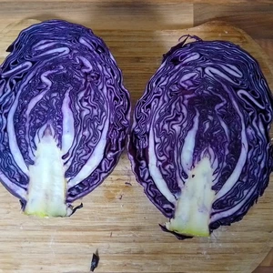
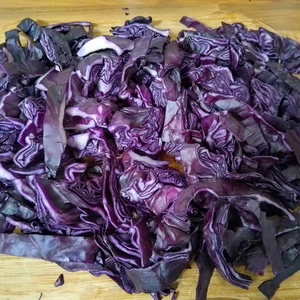
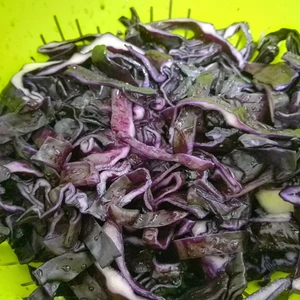
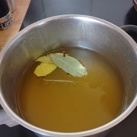
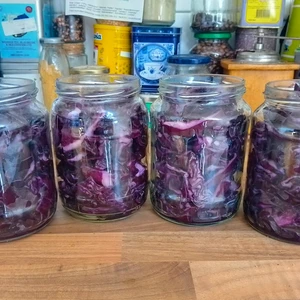
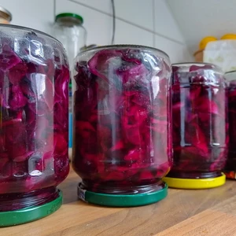

Rotkohl ist eines meiner Lieblingsbeilagen zu einem guten Sonntagsessen oder im Vöner. Dies gehört für mich einfach dazu. Was ich hingegen nicht mag, dass es Rotkohl entweder in solch Plastiktüten (dafuq) sich befinden, oder sich die Gläser bei mir sammeln.
Also wieso nicht die Gläser mit frischen selbst eingelegten Rotkohl befüllen?

<!-- more -->

# Zutaten
* 1.5 Kilogramm Rotkohl
* 6 Esslöffel Salz
* 1 Liter Wasser
* 300 Milliliter Apfelessig
* 150 Gramm Zucker (Optional)
* 2 Lorbeeren Blätter
* 4 Nelken

Die äußersten Blätter des Rotkohls ziehen wir ab und halbieren den Kohl. Dann schneiden wir den Strunk heraus und zerkleinern den Kohl. Entweder kann dieser in feine Streifen geschnitten werden, oder mit einer Reibe gehobelt werden.
Den Rotkohl geben wir in ein Sieb und bestreuen diesen mit Salz. Das Ganze wird ordentlich vermengt und über Nacht stehen gelassen.

||||
:---:|:---:|:---:|
 |  | 

Am Folgetag sterilisieren wir vier Gläser mit einem Fassungsvermögen von etwa 500 bis 600 Milliliter, in dem wir diese in einen Ofen bei 140 Grad für 15 Minuten hinein stellen.

Dann vermischen wir in einen Topf Wasser, dem Apfelessig und geben **optional** den Zucker hinzu. Zwar gibt der Zucker dem Rotkohl eine gewisse Süße, jedoch für jene die auf Industriezucker und ähnliches verzichten, können dies weglassen. Mir schmeckt es auch ohne Zucker. 
Zusätzlich kommen die Nelken und die Lorbeerenblätter hinzu. Verrührt das ganze und kocht die Flüssigkeit auf. Sobald der Sud kocht, stellt die Flamme herunter und lasst das ganze ziehen.

In der Zwischenzeit waschen wir den Rotkohl mit etwas Wasser ab und befüllen die Gläser damit. Diese sollen bis oben befüllt werden, drückt auch etwas nach damit der Platz optimal genutzt wird.
Dann gießen wir den Sud in die Gläser, verschließen diese und stellen die auf den Kopf. 

Zu einem sehen wir dann, ob die Gläser dicht halten, zum anderen sorgen wir dafür das diese ordentlich verschlossen sind und somit der Rotkohl lange haltbar ist.

Der Rotkohl muss jetzt mindestens 24 Stunden stehen, bevor wir diesen genießen können.

  
