Eigentlich wollte ich bereits im September diesen Kuchen als Rezept ausprobieren, aber leider kam etwas anders als gewollt und ich konnte erst jetzt das Rezept improvisieren und nieder schreiben. Ganz zufrieden bin ich damit nicht, da die Creme zu Beginn nicht cremig genug war und danach nicht fest wurde. Geschmacklich ist es aber Super. 

<!-- more -->
# Zutaten für die Creme
* 200 ml Schlagcreme
* 200 g cremige Kokosmilch
* 30 g Margarine
* 50 g Puderzucker

||||
:----:|:----:|:----:
[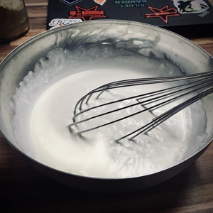](images/IMG_0740.webp) |[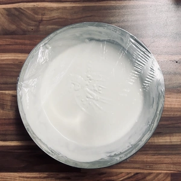](images/IMG_0741.webp)

Gebt alle Zutaten in eine Schüssel und schlagt diese mit einem Schneebesen für mindestens zehn Minuten. Deckt danach die Creme mit Frischhaltefoilie ab und stellt diese für mindestens zwei Stunden in den Kühlschrank.

||||
:----:|:----:|:----:|
[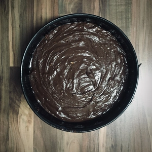](images/IMG_0747.webp)|[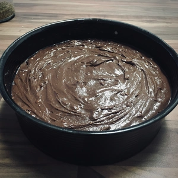](images/IMG_0748.webp)

# Zutaten Schokokuchen
* 300 g Mehl
* 300 g Zucker
* 60 g Backkakao
* 2 TL Natron
* 1/2 Packung Backpulver
* Prise Salz
* 1 Tütchen Vanillinzucker
* 125 g Margarine
* 320 ml Pflanzenmilch
* Vanille Aroma

Gebt Mehl, Zucker, Backkakao, Natron, Backpulver sowie Salz in eine Schüssel und vermischt die trocken Zutaten. Danach kommt die Margarine hinzu. Lasst die Margarine vorher etwas stehen, damit sich die Teigmasse leichter rühren lässt und diese sich somit auch besser verteilt. 

Nun gießt die Pflanzenmilch hinzu und rührt den Teig für zehn Minuten oder bis keine Klümpchen mehr vorhanden sind. Der Teig darf nicht zu flüssig werden, sonst läuft man Gefahr, dass der Teig sehr luftig wird und somit aufgeht und zusammenbricht. Deshalb sollte eine gewisse Festigkeit vorhanden sein. Schüttelt den Teig nach dem Rühren, in eine Springform.

|||||
:----:|:----:|:----:|:----:
[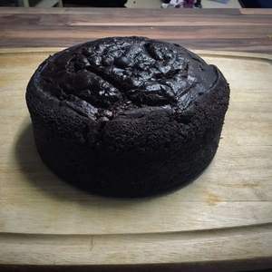](images/IMG_0754.webp)|[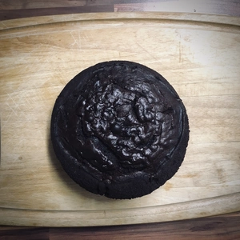](images/IMG_0755.webp)|[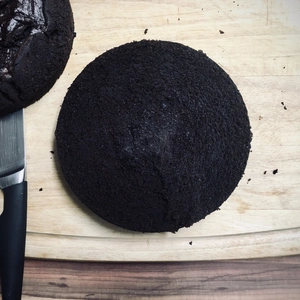](images/IMG_0757.webp)|[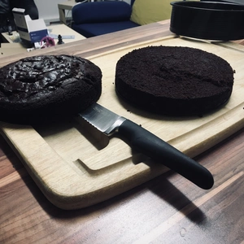](images/IMG_0758.webp)

 Meine hat einen Durchmesser von ca. 26 cm. Schiebt den Teig für etwa 60 Minuten in einen auf 175 Grad vorgeheizten Ofen. Macht eine Stäbchenprobe vor dem Herausholen um zu sehen, ob der Teig im inneren noch flüssig ist. War die Stäbchenprobe erfolgreich, dann kann der Kuchen zur Seite gestellten werden, damit dieser Abkühlen kann. Nach etwa dreißig Minuten konnte ich den Boden und Deckel mit einem Brotmesser aufschneiden. 
 
 |||||
:----:|:----:|:----:|:----:
[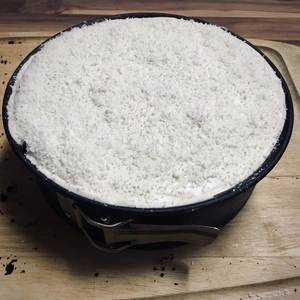](images/IMG_0760.webp)|[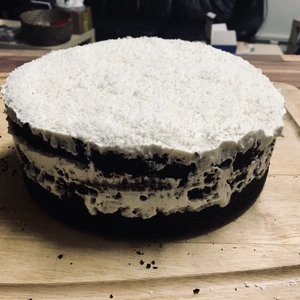](images/IMG_0761.webp)|[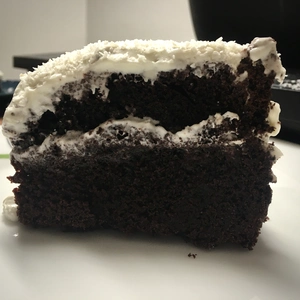](images/IMG_0764.webp)

Jetzt kann die Creme aus dem Kühlschrank auf den Boden vom Schokokuchen verteilt werden. Der Deckel vom Kuchen kann nun auf die Creme geschichtet werden. Der Deckel wurde von mir dünn abgeschnitten, damit eine gerade Schicht habe. Darauf kam erneut die Creme und zum Schluss Kokos raspeln. 

Da die Creme schnell wieder weich wird, wurde der Kuchen im Kühlschrank zwischengelagert, bzw. für Fünfzehnminuten im Tiefkühlfach fest gekühlt.