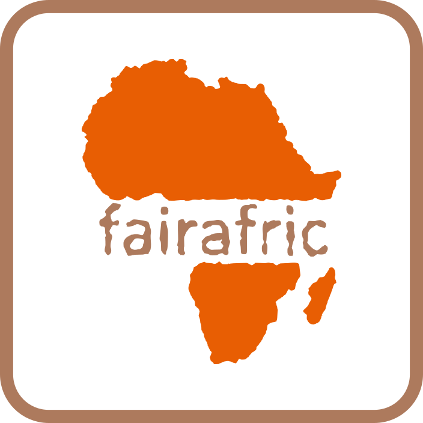
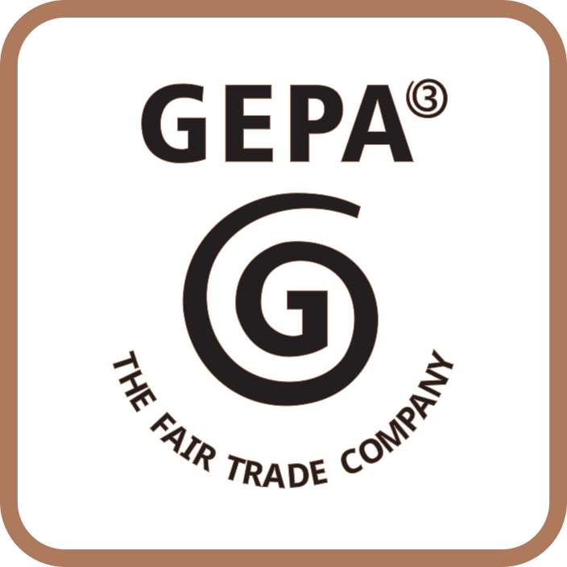
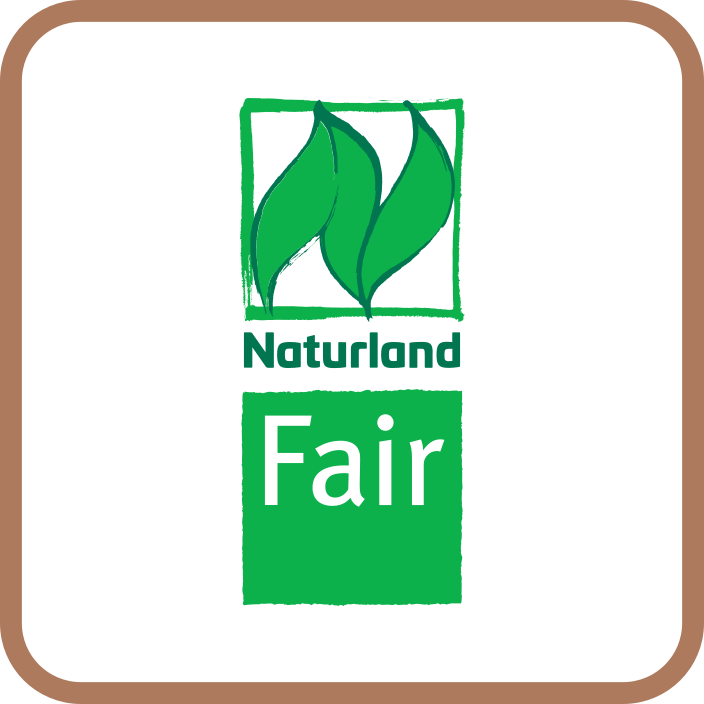

Wir essen gerne Schokolade in verschiedenen Formen, sei es als Tafel, Riegel, Praline oder als Getränk. Wir genießen und erfreuen uns darüber. Aber unser Wohlstand, Schokolade zu genießen beruht auf der Ausbeutung von Kakaobauern.
Das ist jetzt keine neue Erkenntnis, dass wir mit unserem Konsum Menschen ausbeuten, durch uns unter schlechten Bedienungen leben und nein Diesel-Dieter, durch deinen Kauf verschaffst du den Menschen keinen Arbeitsplatz.
Die beste Methode nicht heimische Produkte zu erwerben ist es Produkte zu kaufen, die im Ursprungsland produziert wurden, deren Wirtschaft stärkt und den Menschen ein würdevolles Leben verschafft.

<!-- more -->

Nun gibt es Unmengen an Siegel und Logos, welche dem Reinwaschen der eigenen Marke dienen. Wer gute Schokolade konsumieren will, sollte auf billige Massenware wie **Milka**, **Ritter Sport**, **Kinder** und **Nestle** verzichten. Diese sind qualitativ nicht nur minderwertig, gestreckt und mit Zucker voll gestopft, sondern ihre eigenen Siegel wollen den Kunden das Gewissen Reinwaschen, um mehr der Produkte zu konsumieren. 
Dabei ist der Verzicht auf generische und billige Massenware, nicht nur gesund, sondern hat einen psychologischen Effekt, bei dem der Genuss in einer Spirale verstärkt wird.
Für mich stechen drei Siegel hervor, wobei nur [fairafric](https://fairafric.com/) alle Kriterien erfüllt und [GEPA](https://www.gepa.de/) eine sehr gute alternative ist. [Naturland Fair](https://www.naturland.de/de/naturland/wofuer-wir-stehen/fair.html) bietet einen fairen Handel, jedoch keine Existenzsichernde Preise für die Landwirt*innen und die Herstellung im Anbauland ist ebenso nicht gegeben.

|||||
:----:|:----:|:----:|:----:
|||
Existenzdeckung|✅|✅|❌|
Mindestpreis|✅|✅|✅|
Faire Milchpreise|✅|✅|✅|
Bio Anbau|✅|✅|✅
Mitbestimmung|✅|✅|✅|
Herstellung im Anbauland|✅|❌|❌

* [Tabelle als PNG](web/Siegel.png)
* [Tabelle als SVG](web/Siegel.svg)

 

# Unsere Einflüsse
Unser Konsum und unser verhalten, hat einen direkten Einfluss auf das Leben von Menschen. Rohstoffe, die im globalen Süden produziert werden und erst in den Industrieländern veredelt werden, bereichern ausschließlich die Konzerne.
Wenn die Rohstoffe im Anbauland veredelt und zu Produkten verarbeitet werden, bleibt der Gewinn im Herkunftsland und mit unserem Erwerb sorgen wir, dass die Menschen ein würdevolles Leben führen können, sowie in Infrastrukturen, Bildung und Gesundheitsfürsorge investiert werden kann.

# Decolonize
Deutschland kolonialisiert mittels der Wirtschaft. Es ist ein Trugschluss, dass durch das Investieren in einen Rohstoff und Anbaufläche, dies dem Menschen zugutekommt. Tatsächlich wird damit in die Machtstrukturen der Konzerne investiert, da diese nur den Rohstoff beziehen und die Menschen im Anbauland von den gewinnen ausschließen, sogar druck auf die Bauern und Bäuerinnen ausüben.
Eine Dekolonisation funktioniert, in dem wir nicht die Menschen und das fruchtbare Land nur als Anbaufläche verstehen, sondern den Menschen die Möglichkeit der Schöpfung von Produkten übergeben. Somit liegt nicht nur der Anbau der pflanzen bei den Landwirt*innen, sondern auch die Produktion und Wissen bei diesen Menschen, welche dadurch unabhängig von unserer Ausbeutung sind und wir als Konsumenten hochwertige Produkte genießen können.
Nicht wir sollen über die Köpfe hinweg entscheiden, sondern die Menschen, welche für unsere Produkte hart arbeiten und deshalb sollte auch das Geld und Macht in ihren Händen liegen. Mit biologischem Anbau, Ausbau der Gesundheitsfürsorge, Bildung und Infrastrukturen. Für das Leben.

# Erwerb und Konsum
Und wo kaufe ich die Schokolade? Schokolade mit GEPA Siegel gibt es tatsächlich auch im Supermarkt, falls kein Weltladen in der Nähe besteht. 
Merklich ist der reale Verkaufspreis der Schokolade. Während Produzenten in Europa die Schokolade mit Fetten, Zucker und günstigen Füllmaterialien strecken und mit geringen Einkaufspreisen und Ausbeutung der Arbeiter*innen die Verkaufspreise drücken und durch die schiere Masse große Gewinne einfahren, stellen Produkte mit **GEPA** und **fairafric** Siegel die tatsächlichen Preise wieder, welche die Schöpfungskette und den Weg widerspiegeln.
Durch den Erwerb realer Schokolade, solidarisieren wir uns nicht nur mit den Menschen, sondern sorgen dafür, dass sich das Proletariat selber befreien kann. Ein fairer Konsum mit Genuss wird nicht nur was besonders für uns, es ist auch unsere Unterstützung der Arbeiter*innen, sowie ein Zeichen gegen Ausbeutung, billig Löhne, gegen die Zerstörung von unseren Planeten und der Rückkehr zu realen Preisen.
benso hören wir auf Konzernen mehr Macht zugeben, welche sich gegen die Menschen stellen, wie zum Beispiel Nestle, welche Trinkwasser als Menschenrecht durch Privatisierung entfernen wollen. 

# Quellen und weiterführende Links

* [Decolonize Chocolate 1 - YouTube](https://www.youtube.com/watch?v=o5Z8QiCefZs) by fairafric
* [Decolonize Chocolate 2 - YouTube](https://www.youtube.com/watch?v=5P7YCTPzCKU) by fairafric
* [Re: Schokolade ohne Reue - YouTube](https://www.youtube.com/watch?v=OQFwUxbqfs0) by arte Reportage
* [Re: Schokolade, fair und nachhaltig - YouTube](https://www.youtube.com/watch?v=x6CPBil73vM) by arte Reportage
* [Ghana Grows Our Cocoa, So Why Can’t It Make Chocolate? - YouTube](https://www.youtube.com/watch?v=5X7wAKMNBXI) by Business Inside
* [Aktiv Für faire Schokolade - PDF](https://www.inkota.de/sites/default/files/2025-01/2024_inkota_aktionshandbuch_make_chocolate_fair_final_web.pdf) by Inkota
  
