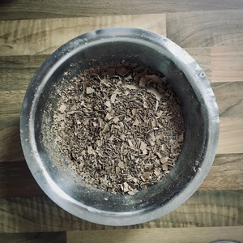
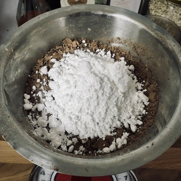
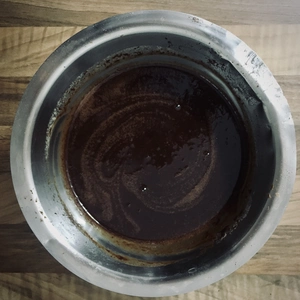
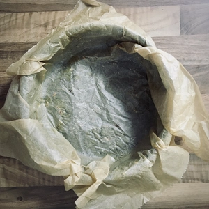
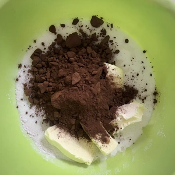
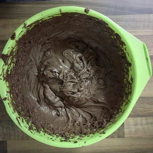
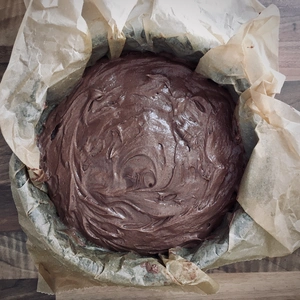
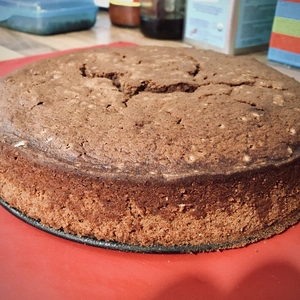
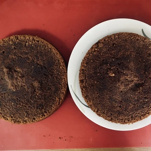
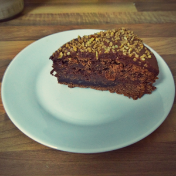

Gegebenenfalls erinnert sich, wer daran, dass ich vor längere ein Rezept für eine [Schoko-Kokos-Torte](/articles/schokotorte-2023-04-02/) aufgeschrieben habe. 
Die Kokos Torte kann entsprechend auch als Schoko Torte gebacken werden. Hierzu müssen nur kleine Änderungen vorgenommen werden. Das Rezept ist ausgelegt auf eine Springform mit 20 cm Durchmesser.

<!-- more -->
# Zutaten
* 300g Mehl
* 280g Zucker
* 60g Backkakao
* 2 TL Natron
* 1/2 Packung Backpulver
* Prise Salz
* 1 Tüte Vanillezucker
* 125g Margarine
* 320ml Pflanzenmilch

# Zutaten Sahne Creme
* 200 ml Schlagcreme
* 200g Schokolade zum Raspeln
* 30 g Margarine
* 50 g Puderzucker

# Deko
* Haselnusskrokant
* Schokoglasur

||||
:---:|:---:|:---:
||

Zuerst muss der Creme begonnen werden, da diese im Kühlschrank stehen muss und entsprechend währenddessen der Kuchen zubereiten werden kann.

Die Schokolade wird klein geraspelt und mit Puderzucker in eine Schüssel gegeben. Erhitzt 20g Margarine und lasst diese aufkochen, bevor die geraspelte Schokolade hinzugegeben wird. Dann kommt die Schokolade hinzu und für zehn Minuten geschlagen, bevor die Schlagcreme für mindestens zwei Stunden in den Kühlschrank kommt. 

|||||
:---:|:---:|:---:|:---:
|||

Für den Tortenboden, sprich den Kuchen, muss die Springform mit Backpapier ausgekleidet werden und der Ofen auf 200 Grad Ober- und Unterhitze vorgeheizt werden.
Mehl, Zucker, Kakao, Natron, Backpulver, Salz und Vanillezucker vermischen. Die Margarine wird in kleinen Blöcken hinzugegeben und zum Schluss die Milch. Alle Zutaten werden zu einem Teig gut durchmischt bevor dieser in die Springform gelangt.
Der Tortenboden bleibt bei 200 Grad im Ofen für Fünfzig bis sechzig Minuten. Nach der Backzeit lasst den Boden abkühlen, damit dieser in der Höhe halbiert werden kann.

Nehmt nun die Creme aus dem Kühlschrank und schlagt diese für eine Minute, bevor ihr diese auf den Tortenboden aufstreicht.

Bereitet die Schokoladenglasur nach Anleitung zu und gießt diese über die Torte. Dekoriert diese zum Schluss mit den Haselnusskrokant und stellt die Torte nochmals für eine Stunde in den Kühlschrank, damit Glasur und Creme sich verfestigen.

|||
:---:|:---:
|
