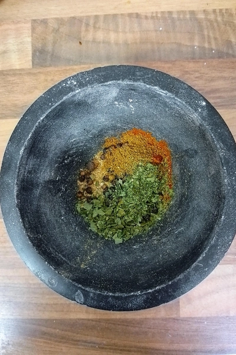
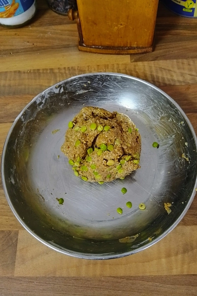
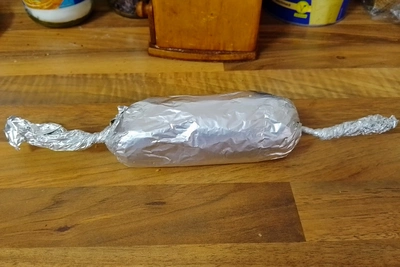
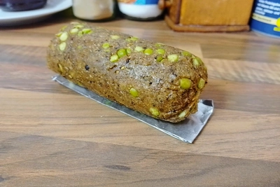

Immer wenn ich Hafermilch mache, bleiben immer die ausgepressten Haferflocken übrig. Normalerweise mache ich daraus ja Bratlinge, aber da ich keinen Bedarf hatte, wurde dieses Mal daraus Wurst, die ich als Aufschnitt benutzen kann.

<!-- more -->

# Zutaten
* 100 Gramm ausgepresste Haferflocken
* 100 Gramm Seitan
* 1 Teelöffel Fenchel
* 1 Teelöffel Knoblauchgranulat
* 1 Teelöffel [Gemüsebrühenpulver](/articles/gemusebruhe-2024-01-28/)
* 1 Teelöffel Pfeffer
* 2 Stück Piment
* 1 Teelöffel Kümmel
* 1 Teelöffel Rauchpaprika
* 1 Teelöffel Bärlauch
* 1 Prise Salz
* 6 Zentiliter Wasser
* 1 Schuss Pflanzenöl

Heizt schon mal den Ofen auf 200 Grad auf und währenddessen zermahlen wir die Gewürze in einem Mörser, falls diese noch nicht verarbeitet sind.

Danach werden alle Zutaten miteinander verknetet. Das Wasser geben wir nach und nach immer hinzu, so wie wir es benötigen, damit die Füllung verknetet werden kann.

Formt dann eine Wurst daraus und rollt diese in Alufolie ein. Die Enden zwirbeln wir zusammen und backen nun das ganze bei 200 Grad Ober- und Unterhitze für mindestens 30 Minuten.

Damit wäre die Wurst auch schon Fertig.
Nicht verwundert sein. Die Erbsen waren teil der [Hafermilch](/articles/hafermilch-2022-01-29/), da ich den Geschmack dieser in meiner Milch schätze.

Der Seitan und die Haferflocken dienen hierbei nur als Formgeber, der Geschmack kommt von den Gewürzen. Falls ihr Sucuk machen wollt, könnt ihr einfach mehr Knoblauch hinzugeben. Besonders kommt dieser gut, wenn es frisch geriebener Knoblauch ist.

