Die Tage hatte ich wieder Lust bekommen, etwas besonderes zu kochen. Weg von meiner Standardkost und etwas zaubern was viele Aromen zu einem Schmaus verwandelt.
Daraus wurde eine Mole aus Schokolade und Chilis, mit Reis und gegarten, Tomaten aus dem Ofen und Seitan geschnetzelten.
<!-- more -->

# Zutaten Sesampaste
- 50 Gramm Sesam
- 1 EL Pflanzenöl
- Prise Salz

# Zutaten Erdnusscreme
- 90 Gramm gesalzen Erdnüsse
- 10ml Pflanzenöl
- 1EL Zucker

# Zutaten Mole
- 400 Milliliter Wasser
- 10 getrocknete Pikito oder Ancho Chilis
- 1 Zwiebel
- 4 Knoblauchzehen
- 20 Gramm Zucker
- 15 Gramm ungesüßten Kakaopulver
- 40 Gramm Schokolade
- 1 Esslöffel Oregano
- 1/2 Teelöffel Kreuzkümmel
- 1/2 Teelöffel Zimt
- 4 Esslöffel Maismehl
- Salz und Pfeffer nach Belieben
- Optional Orangenpulver

# Zutaten Seitan
- Seitanpulver
- [Gemüsebrühe](https://www.open-sauce.de/articles/gemusebruhe-2024-01-28/)
- Paprikapulver
- Rauchsalz
- abgekühlten Schwarztee

# Beilagen Gemüse
- Costoluto fiorentino Tomate (oder eine andere feste Tomate) 
- Paprika
- Halbe rote Zwiebel
- Öl zum Anbraten
- Olivenöl
- Salz
- Essig
- Lauch
  
Den Zutaten kann entnommen werden, dass wir viel vor uns haben, wobei der größte Teil dessen alles für die Schokoladen Mole ist.

Zuerst fangen wir bei der Sesampaste an. Röstet auf kleiner Flamme den Sesam in einer Pfanne ohne Öl an. Danach gebt ihr diese in einen hohen Behälter für einen Stabmixer oder in eines für den Standmixer. Danach gibt ihr das Pflanzenöl und die Prise Salz hinzu. Dieses wird nun püriert, bis eine homogene Masse entsteht. Falls es etwas klebt oder nicht alles püriert werden kann, helft mit einem Stäbchen oder Löffel nach. So dass die Messer vom Mixer wieder an die Zutaten ran kommen.

[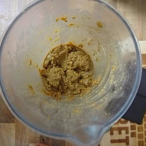](web/02.webp)

In derselben Pfanne rösten wir jetzt auch die Erdnüsse. Achtet darauf, dass diese nicht anbrennen und wendet diese immer wieder, bis die ersten Nüsse Farbe haben. Diese kommen mit dem Pflanzenöl und Zucker zur Sesampaste und werden ebenso püriert, bis diese eine Creme ergeben. 

Jetzt kommen wir zur Mole. Dabei bringen wir die 400ml Wasser zum Sieden und braten währenddessen die Chilis in einer Pfanne, ebenso ohne Öl, für einige Minuten in einer Pfanne an. Immer wenden, sowie darauf achten, dass die diese nicht anbrennen und schwarz werden. Sobald das Wasser kocht, stellt dieses vom Herd. Die Chilis werden dann in das Wasser gelegt, damit diese einweichen. 

|||||
:----:|:----:|:----:|:----:
[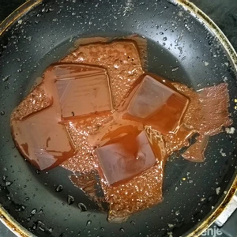](web/03.webp)|[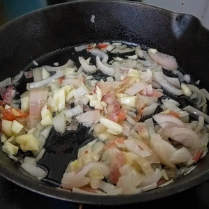](web/04.webp)||[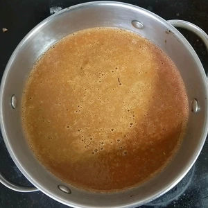](web/06.webp)

Die Zwiebel werden klein gehackt und in einer Pfanne mit Öl angebraten. Nach fünf Minuten kommen die vier Knoblauchzehen, ebenso klein gehackt, zu den Zwiebel. Sobald die Zwiebel glasig sind, kommen diese mit dem Knoblauch, dem Wasser und Chilis zur Sesampaste und Erdnusscreme. Das Ganze wird nun ebenso püriert, bis wir eine Soße erhalten. Diese wird jetzt in einem Topf aufgekocht und danach auf kleiner Flamme für zwanzig Minuten gekocht. Abgeschmeckt wird es zu Schluss mit Salz und Pfeffer. Orangenpulver ist optional, gibt aber der Mole eine frische und fruchtige Note.

||||
:----:|:----:|:----:
[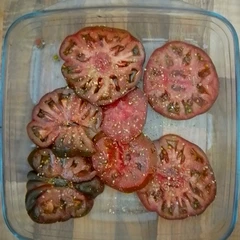](web/07.webp)|[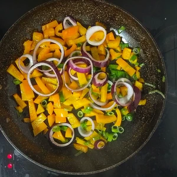](web/08.webp)|[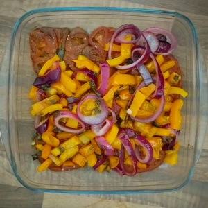](web/09.webp)

Seitanpulver mit Gemüsebrühe, Paprikapulver und Rauchsalz vermengen. Als Flüssigkeit wird Schwarztee dazugegeben und dann verknetet. Macht daraus einen Fladen und bearbeitet diesen mit einem Küchenhammer oder Rundholz. Zieht und zerrt den Seitanteig bis dieser länglich ist. Verknotet diesen und wiederholt den vorherigen Prozess. Schneidet Filetstücke heraus und dämpft diese in einen Bambuskorb oder kocht diese in nicht siedeten Wasser, bis die Oben schwimmen. Danach werden diese regulär in einer Pfanne mit Öl angebraten. Ihr könnte diese noch nach Belieben würzen. 

Schneidet die Tomate in Scheiben und legt diese in eine Auflaufform aus. Würzt diese mit Salz und tropft etwas Olivenöl über diese.
Die Tomaten kommen für zwanzig Minuten in einen vorgeheizten Ofen bei 180 Grad Ober- und Unterhitze. Währenddessen können wir gewürfelte Paprika, gehacktes Lauch und Zwiebelringe in einer Pfanne mit Öl anbraten, bis die Paprika weich und die Zwiebel glasig sind. Löscht diese mit Essig und lasst diese dann kurz köcheln. Danach kommen diese zu den Tomaten in den Ofen und werden für zehn Minuten gegart.

Kocht dazu noch Reis als Beilage, oder nehmt Tortillas Chips hinzu. 

Der Aufwand lohnt sich und ist geschmacklich ein Genuss.

|||
:----:|:----:
[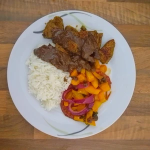](web/10.webp)|[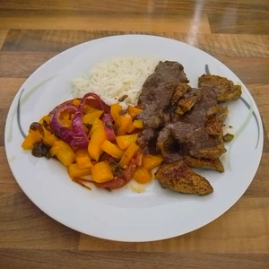](web/11.webp)

## Alternativ mit Tofu

### Zutaten Marinade
- [Gemüsebrühe](https://www.open-sauce.de/articles/gemusebruhe-2024-01-28/)
- Paprikapulver
- Rauchsalz
- Salz
- Pfeffer
- schwarzer tee
- Kümmel

Alternativ zu Seitan, kann auch Tofu genutzt werden. Hierzu muss das Tofu ausgepresst werden, so dass dieser keine Flüssigkeit mehr aufweist. Dazu legt ihr den Tofublock auf ein Küchentuch und beschwert dieses. Bereitet eine Marinade vor, in welcher der Tofu Geschmackziehen kann. Mischt die Gewürze und gebt den schwarzen Tee hinzu. Legt den Tofublock in die Flüssigkeit und lasst diesen für einen Tag ziehen. Diesen Würfelt ihr am Folgetag und bratet diesen an.

||||
:----:|:----:|:----:
[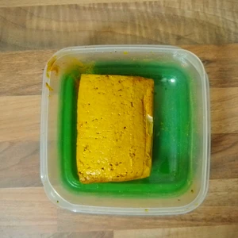](web/tofu01.webp)|[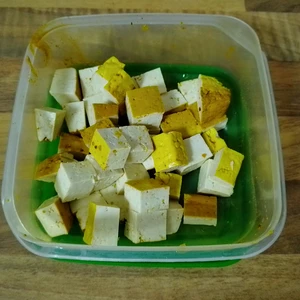](web/tofu02.webp)|[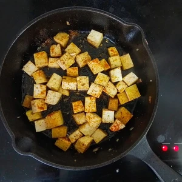](web/tofu03.webp)
