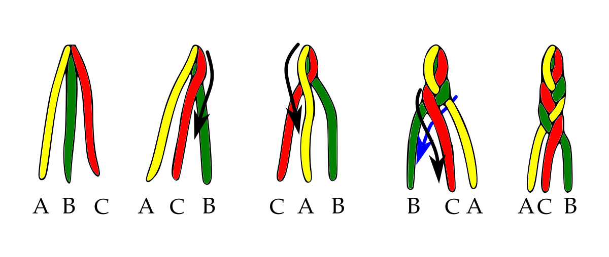

Zu Ostern konnte ich nicht schlafen und habe dadurch die Motivation erhalten, wider etwas zu backen und zu experimentieren, wodurch ein simples Rezept für einen Hefezopf entstand.
<!-- more -->

# Zutaten
* 100 Milliliter vegane Milch
* 4 Gramm Trockenhefe
* 200 Gramm Weizenmehl
* 1 Esslöffel Margarine
* Eine Prise Salz
* Zwei Esslöffel Zucker
* Einen Teelöffel Natron

Die Trockenhefe wird in lauwarmer Milch mit etwas Zucker aufgelöst, um gerührt und für mindestens 15 Minuten stehen gelassen.
Danach wird das Mehl mit Margarine, Salz und zwei Esslöffel Zucker verknetet und dabei langsam die Milch hinzugegeben.
Der Teig wird so lange geknetet, bis eine glatte Kugel entstanden ist und für eine Stunde zugedeckt stehen gelassen, damit der Teig arbeiten kann.

Bevor wir den Teig weiter verarbeiten, können wir das Natron in Wasser auflösen. Dies benötigen wir nachher zum Bestreichen des Hefezopfs.

Aus dem Teig formen wir drei Kugeln und rollen diese zu langen Strängen aus. 
Diese werden nebeneinander gelegt und an einem Ende zusammen gedrückt.
Der rechte Strang wird über jenen in der Mitte gelegt. Danach wird der linke Strang über den mittleren Strang gelegt, der zuvor der rechte war. 
Nun nehmen wir den Strang der rechts liegt und legen diesen über den mittleren Strang. 
Das wiederholen wir so lange bis der Zopf geflochten worden ist und das Ende drücken wir ebenfalls zusammen.

Zum Abschluss wird der Zopf mit dem Natronwasser bestrichen und wer will, kann noch Hagelzucker darüber streuen.
Der Hefezopf wird für 15 bis 20 Minuten bei 200 Grad Ober-/Unterhitze gebacken.

  
