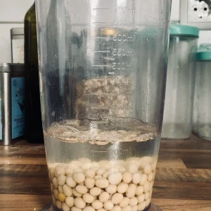
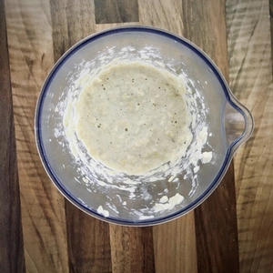
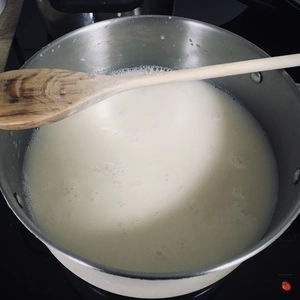
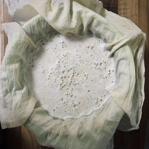
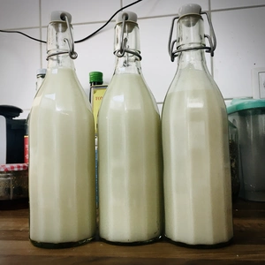

Neben der [Hafermilch](/articles/hafermilch-2022-01-29/), ist es eine Leichtigkeit Sojamilch selber zu produzieren. Hierfür werden lediglich nur 100g Sojabohnen und 1L Wasser zum Aufkochen benötigt.
Die Sojabohnen welche mindestens über die Nacht und bis zu 24 Stunden quellen müssen, werden hierzu mit Wasser bedeckt.
Am nächsten Tag wird das Wasser abgegossen und die Bohnen ausgewaschen. Gebt etwas Frisches und kaltes Wasser hinzu, damit die Bohnen nun püriert werden können. Dies geht mit einem Stand- oder Stabmixer ganz gut. Sollte der Vorgang etwas schwerfällig laufen, muss nur etwas mehr Wasser hinzugefügt werden.
Die entstandene Masse wird mit einem Liter Wasser, in einem Topf zum Kochen gebracht. Sobald das Wasser kocht, wird der Herd auf eine kleine Flamme heruntergestellt und die Sojamilch köchelt für weitere 10 Minuten.

|||
:---:|:---:
|

**Achtung**: Die Sojamilch könnte überkochen, weshalb diese immer umgerührt werden muss.

|||
:---:|:---:
|

Nach den 10 Minuten nehmt ihr ein Passiertuch, legt dieses auf ein Sieb (optional, ist aber eine gute Hilfe) über einer Schüssel und gießt den Inhalt aus dem Topf ins Tuch. Somit trennen wir das [Okara](/articles/okara-2023-02-04/) (die pürierten Sojabohnen) von der Milch. Drückt den Inhalt aus und bedenkt, dass der Inhalt weiterhin heiß sein kann.

Die Milch ist im Kühlschrank bis zu fünf Tage haltbar und das [Okara](/articles/okara-2023-02-04/) kann direkt weiter verarbeitet werden.

