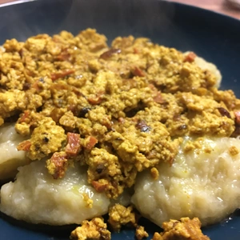
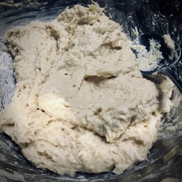
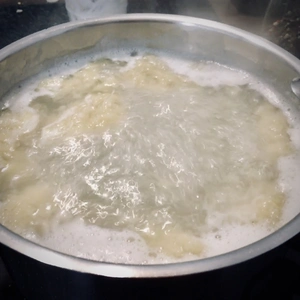
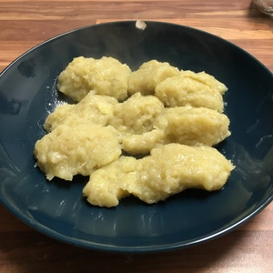
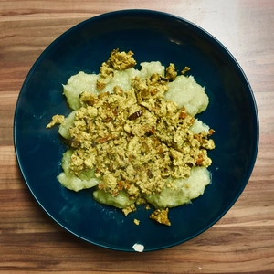

Szare Kluski ist ein weiteres traditionelles Gericht der großpolnischen Küche und sehr einfach zuzubereiten. Man benötigt nicht nur Kartoffeln, Stärke und Salz. Meine Mutter hat Szare Kluski immer mit Rührei gemacht, weshalb meine Variante mit [Scrambled Tofu](/articles/nudeln-mit-scrambled-tofu-2020-09-24/) zu bereitet wird.

<!-- more -->

# Zutaten Szare Kluski
* 400g Kartoffeln
* 85g Weizenmehl
* ½ EL Mais Stärke oder ¾ Kartoffelstärke
* Kochendes Wasser mit Salz

Die Kartoffeln werden geschält und roh fein gerieben. Danach kommt das Weizenmehl mit der Stärke hinzu. Die Zutaten werden vermischt und verkneten. Zur Portionierung wird ein Esslöffel genommen und in das kochende Wasser gelegt. Da die Szare Kluski schwer sind, setzen sich diese am Boden des Topfes ab. Deshalb müssen die Kluski umgerührt werden. Sobald diese oben schwimmen, müssen die Szare Kluski noch für zehn Minuten kochen. Solange können wir das Scrambled Tofu zu bereiten.

|||
:----:|:----:
|

# Zutaten Scrambled Tofu
* 1 TL Kala Namak
* 1 TL Kurkuma Gewürz
* 2-3 EL Soja Joghurt (Ungesüßt)
* 175g Räucher Tofu
* veganer Speck
* Margarine oder Öl zum Anbraten

|||
:----:|:----:
|

Die Margarine oder Öl wird in einer Pfanne erhitzt und darin der vegane Speck (optional auch eine gehackte Zwiebel) angebraten. Daraufhin wird ein Block Tofu in kleinen Stücken hinzugegeben und mit Sojajoghurt verrührt, sowie gewürzt. Zerdrückt und verrührt das Tofu, solange bis die Konsistenz nach Wunsch erreicht wurde. Je länger das Scrambled Tofu in der Pfanne ist, desto fester wird es.

Die Szare Kluski werden mit dem Scrambled Tofu zusammen serviert.
