Durch eine Reportage auf ARTE, über eine Familie in der Steppe der Mongolei, wurde ich inspiriert dieses Rezept niederzuschreiben. Die Zubereitung ist nicht schwer, da wir nur einen Teig zubereiten, eine Füllung nach Wahl zubereiten und die Teigtaschen in schwarzen Tee kochen.

[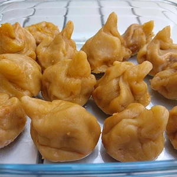](web/IMG_20250812_190422~2.webp)
<!-- more -->

# Zutaten Teigtaschen
* 250g Mehl
* 150ml Wasser
* 1 gestrichener Teelöffel Salz
* Ein Schuss pflanzen Öl

# Zutaten Füllung
* 200g Naturtofu
* eine Möhre
* eine kleine Zwiebel
* Knoblauch
* etwas Koriander
* etwas Kümmel
* etwas Paprika Edelsüß
* etwas Gemüsebrühen-Pulver
* Pflanzen Öl

# Sonstiges
* großen Topf mit Schwarztee

# Dip
* 100ml dunkle Sojasauce
* 1 EL Sesam
* 1 Schuss Essig

[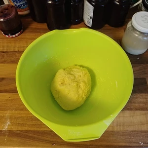](web/IMG_20250812_174658~2.webp)

Wir fangen mit der Füllung an.
Der Tofu wird in kleine Stücke zerbröselt und mit den Gewürzen in einer Schüssel vermengt. Die Möhren werden klein gerieben oder mit einem Sparschäler in feine kleine Streifen geschnitten. Die Zwiebel und den Knoblauch hacken wir in kleine Würfel. Tofu, Möhren und Zwiebel werden nun in einer Pfanne angebraten.
Wir können jetzt in einem großen Topf, schwarzen Tee aufkochen, in welchen wir dann die Teigtaschen kochen lassen.

||||
:----:|:----:|:----:
[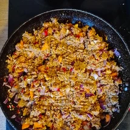](web/IMG_20250812_175131~2.webp)|[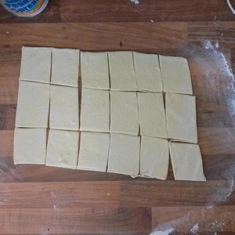](web/IMG_20250812_175857~2.webp)|[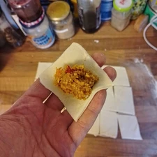](web/IMG_20250812_175935~2.webp)|

Weiter geht es zum Teig.
Hierzu vermischen wir Mehl, Wasser, Salz und Öl und kneten den Teig, bis dieser eine Kugel ergibt. Der Teig darf nicht trocken und bröselig sein, sonst lässt sich dieser nicht ausrollen.
Der Teig wird ausgerollt und in Quadrate geschnitten. Dabei darf der Teig nicht zu dünn werden, da diese sonst beim Kochen aufgehen werden. Befüllt die Quadrate mit einem gehäuften Teelöffel der Füllung und zieht die Ecken vom Teig zur Mitte, verzwirbelt diese und verdreht den Zipfel. Die Füllung drückt auf den Boden vom Teig, wodurch der Teig an Stabilität verlieren kann. Deshalb sollten die Taschen entweder sofort in den schwarzen Tee zum Kochen gelegt werden, oder auf einem Backpapier vorübergehend geparkt werden.

||||
:---:|:---:|:---:
[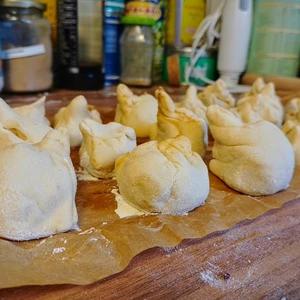](web/IMG_20250812_181315~2.webp)|[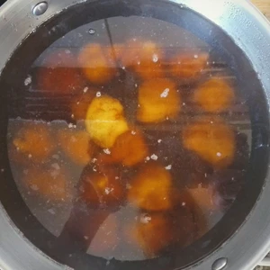](web/IMG_20250812_181625~2.webp)

Die Teigtaschen werden dann in den kochenden schwarzen Tee gelegt. Fertig sind diese, sobald die Teigtasche oben schwimmt. 

||||
:---:|:---:|:---:
[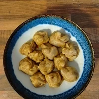](web/IMG_20250812_183225~2.webp)|[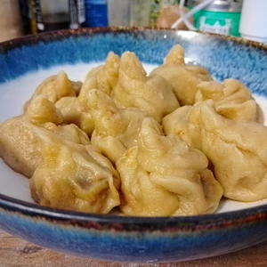](web/IMG_20250812_183234~2.webp)|[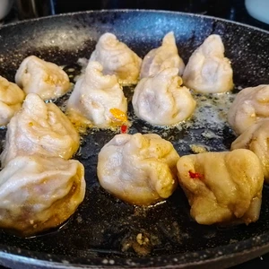](web/IMG_20250812_185645~3.webp)|

Optional können die Teigtaschen nun in einer Pfanne gebraten werden, spätestens am nächsten Tag, wenn welche übrig geblieben sind.

Für den Dip wird der Sesam in einer Pfanne ohne Öl geröstet und mit der Sojasauce sowie einem kleinen Schuss Essig vermischt.
Alternativ kann auch ein simpler Dip aus Tomatenmark, Sojasauce und Honigersatz gemacht werden.

[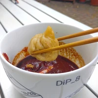](web/IMG_20250812_190728~2.webp)
