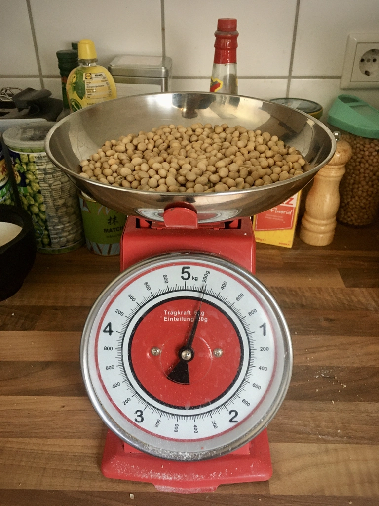
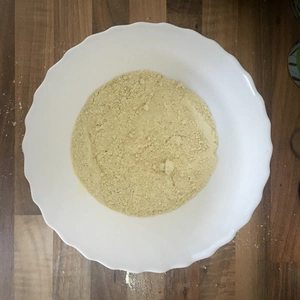
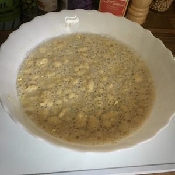
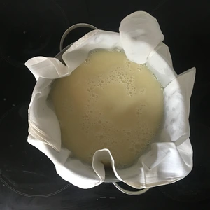
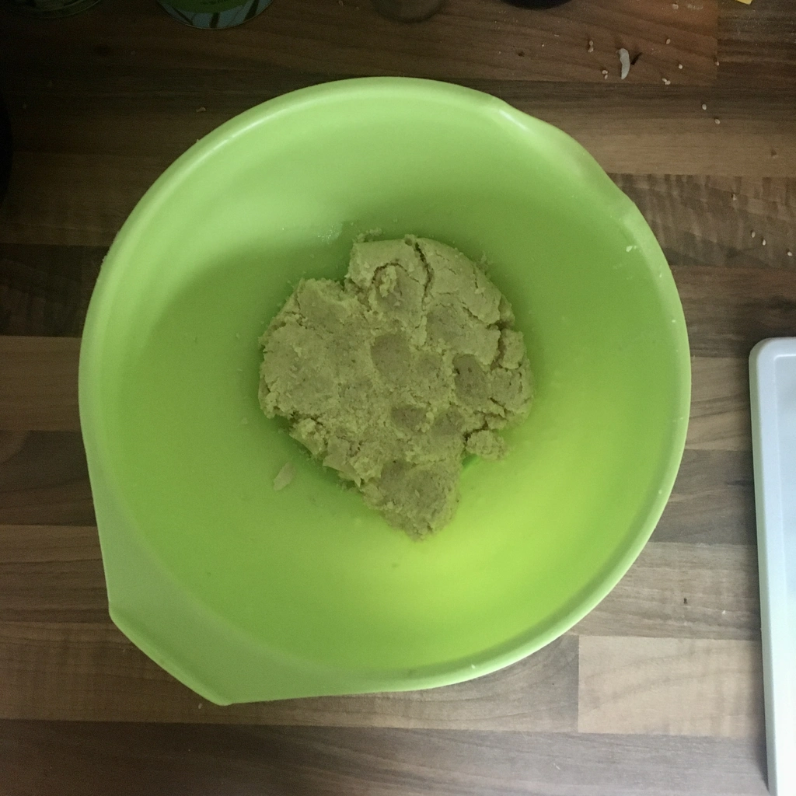
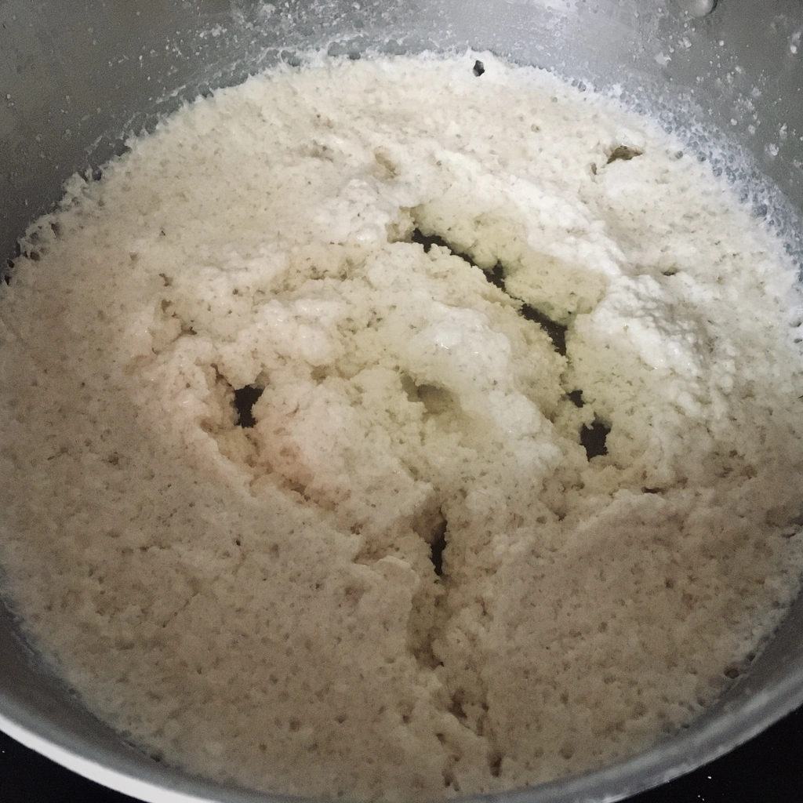
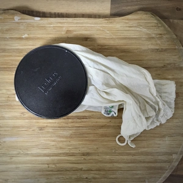
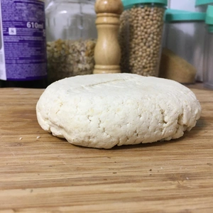

Ich habe viele Rezepte ausprobiert, um Tofu selber zu machen und es hat mich viel Zeit und Sojabohnen gekostet. Dies war aber jenes mit dem besten Ergebnis für mich.

<!-- more -->

# Zutaten
* 200g Sojabohnen
* 1,2 L Wasser
* 1 gestrichener Teelöffel Nigari
* 1 Esslöffel 'Walnuss und Essig' oder Zitronensaft (optional)

||||
:--:|:--:|:--:
||

Vorerst müssen wir Sojamilch herstellen und anders als im bestehenden Rezept, wurden für die Zubereitung die Sojabohnen geschrottet bzw. zu Mehl verarbeitet und dann für 30 Minuten in Wasser quellen gelassen.
Kleidet dann ein Topf mit einem Siebtuch aus oder nutzt ein Nussmilchbeutel, durch welche wir die Flüssigkeit vom Mehl teilen werden.
Drückt alles ordentlich aus, das Okara im Tuch wird in eine Schüssel mit 180ml Wasser geknetet und die restliche Milch nochmals ordentlich ausgedrückt, damit wir soviel von der Sojamilch erhalten, wie es möglich ist.

Legt das [Okara](/articles/okara-2023-02-04/) zur Seite, da ihr daraus noch Bratlinge machen könnt. 

Die Sojamilch wird auf mittlerer bis hoher Flamme erhitzt. Dies kommt etwas auf euren Herd an. Auf meinem E-Herd war es Stufe 7 von 9. 
Das Nigari wird in 120ml heißen Wasser aufgelöst. Sobald die Sojamilch kocht, kommt die Hälfte der aufgelösten Nigariflüssigkeit in die Sojamilch und welche ich zu Boden sinken ließ. Dann kommt die zweite Hälfte hinein, sowie ein Esslöffel 'Walnuss und Essig' oder Zitronensaft für den Geschmack, dabei wird die Milch gerührt. 
Sobald die Sojamilch zu gerinnen beginnt, kann ein Deckel auf den Topf und die Milch wird auf mittlerer Flamme für 20 Minuten gekocht. Nach dieser Zeit wird der Herd ausgeschaltet und die Sojamilch wird für weitere 15 Minuten auf der Resthitze stehen gelassen.
Danach kann der Tofu ausgeschöpft werden, in einen Nussmilchbeutel oder Siebtuch gelegt werden und die Flüssigkeit ausgepresst werden.

Zu einem kann hierfür eine Tofupresse benutzt oder ein schwerer Gegenstand auf das Tuch gelegt werden.
Wie fest eurer Tofu werden soll, entspricht der Flüssigkeit, die ausgepresst wird. 

|||
:--:|:--:
|

Um eurer Tofu im Kühlschrank zu lagern, wird ein Behälter mit Wasser gefüllt, ins welches das Tofu gelegt wird. 
