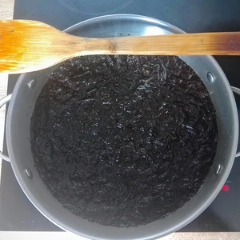

In vielen Südostasiatischen Rezepten wird die Hinzugabe von Fischsoße erwähnt, da diese nicht vegan ist und ich von Kindesalter an Fisch als meinen Erzfeind ansehe (noch nie kam was gutes aus dem Meer hervor), musste ich dies veganisieren.

<!-- more -->

Dies ist wieder ein einfaches Basic Rezept, welch ohne großer Komplexität gemacht werden kann.

# Zutaten
* 25 Gramm getrocknete Algen oder 10 Gramm Nuri-BLätter
* 1 Liter Wasser
* 3 Teelöffel Zucker
* 150ml Sojasoße
* Pfeffer
* Prise Salz
* Optional 0.5 Teelöffel Miso-Paste

Die Algen bzw. Nuri-Blätter zerkleinern und in einem Topf mit Liter Wasser aufkochen lassen. 
Nach einer Viertelstunde kommen Pfeffer, Salz, Sojasoße, Zucker und optional die Miso=Paste hinzu. Umrühren und für weitere Fünf Minuten kochen lassen.
Die Algen bzw. Nuri-Blätter sollten sich zum großen Teil aufgelöst haben. Die Flüssigkeit wird durch ein Sieb geschüttelt und die reine Flüssigkeit wird für weitere Dreißig Minuten gekocht.
Zum Schluss sollten etwa 750ml No-Fischsoße herauskommen, zum Würzen und Verfeinern.
Im Kühlschrank lässt sich die No-Fischsoße bis zu vier Wochen lagern.
