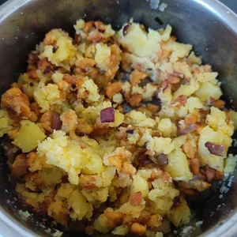
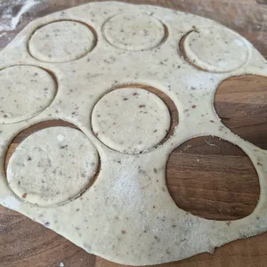

Wareniki ist ein Gericht der slawischen Küche und traditionell mit der Ukraine verbunden, in welcher diese als Nationalgericht zählt und zugleich identisch zu polnischen Pierogi sind. Die in Salzwasser gekochten Teigtaschen können individuell befüllt werden. Für dieses Rezept werden die Wareniki (mit V geschrieben, weil die Zubereitung Vegan ist) mit Kartoffel, Hack und Zwiebel gefüllt. Das folgende Rezept ergibt 12 Wareniki (kommt auf die ausgestochene größe an).

**Für die Füllung benötigen wir:**

- 100g Kartoffel
- 25g Soja Granulat
- 1/4 Rote Zwiebel (ohne dem Soja Granulat 1/2 Zwiebel)

**Der Teig besteht aus:**

- 100g Weizenmehl
- 1 Schuss Sonnenblumenöl
- 50 ml Kartoffelwasser
- 1 Prise Salz
- 1 Eierersatz
    - Zum Beispiel 1 TL Leinsamen mit 3 TL heißen Wasser, für 5 Minuten quellen lassen

**Optional** werden noch Gewürze nach Wahl für das Hack benötigt, sowie Margarine damit die Wareniki nicht aneinander kleben.

Die Kartoffel für die Füllung werden geschält und im Ganzen gekocht, bis diese zerstampft werden können. Das Soja Granulat wird mit Brühe oder Salz aufgekocht und danach durch ein Sieb abgetropft. Die 1/4 Zwiebel wird kleingehackt sowie mit dem Soja Granulat angebraten. Das Hack mit den Zwiebeln kann mit Pfeffer und Paprikapulver gewürzt werden. Gebt das Hack zu den zerstampften Kartoffeln hinzu und verrührt diese Mischung und gebt eine Prise Salz für den Geschmack hinzu. Damit ist die Füllung fertig.

||||
:----:|:----:|:----:
|

Für den Teig müssen wir einen Eierersatz vorbereiten. Ich nehme hierzu Leinsamen, welche ich, mithilfe eines Mixers, zu Mehlschrot verarbeitet habe. Hinzu kamen drei Teelöffel heißes Wasser. Diese Mischung habe ich umgerührt und fünf Minuten stehen lassen. Währenddessen kann zu den 100g Weizenmehl, die Prise Salz gegeben werden, sowie der Schuss Öl. Gebt dann den Eierersatz hinzu, sowie 50ml vom Wasser, im welchen die Kartoffel vorhin kochten. Verkneten dies zu einem Teig, welchen ihr für 10 Minuten stehen lässt. Danach kann der Teig auf einer bemehlten Oberfläche auf eine dicke von 2mm ausgerollt, sowie mit einem Glas ausgestochen werden.

||||||
:----:|:----:|:----:|:----:|:----:
|||

Befüllt den Teig und klappt eine Hälfte über die andere. Drückt die überlappenden Enden zusammen. Die Teigtaschen legt ihr nun in einen Topf mit kochenden Salzwasser und wartet bis diese Oben schwimmen. Damit sieht ihr, welche der Wareniki fertig sind. Holt die fertigen Teigtaschen raus (Achtung, diese sind sehr glitschig) und gebt ein kleines Stück Margarine darüber, damit die Teigtaschen nicht aneinander kleben. Damit sind die Wareniki fertig und wenn mehr gemacht wurden als man an einem Tag verzerren kann, können diese am folge Tag in geschmolzener Margarine in einer Pfanne angebraten werden.

||||||
:----:|:----:|:----:|:----:|:----:
|
