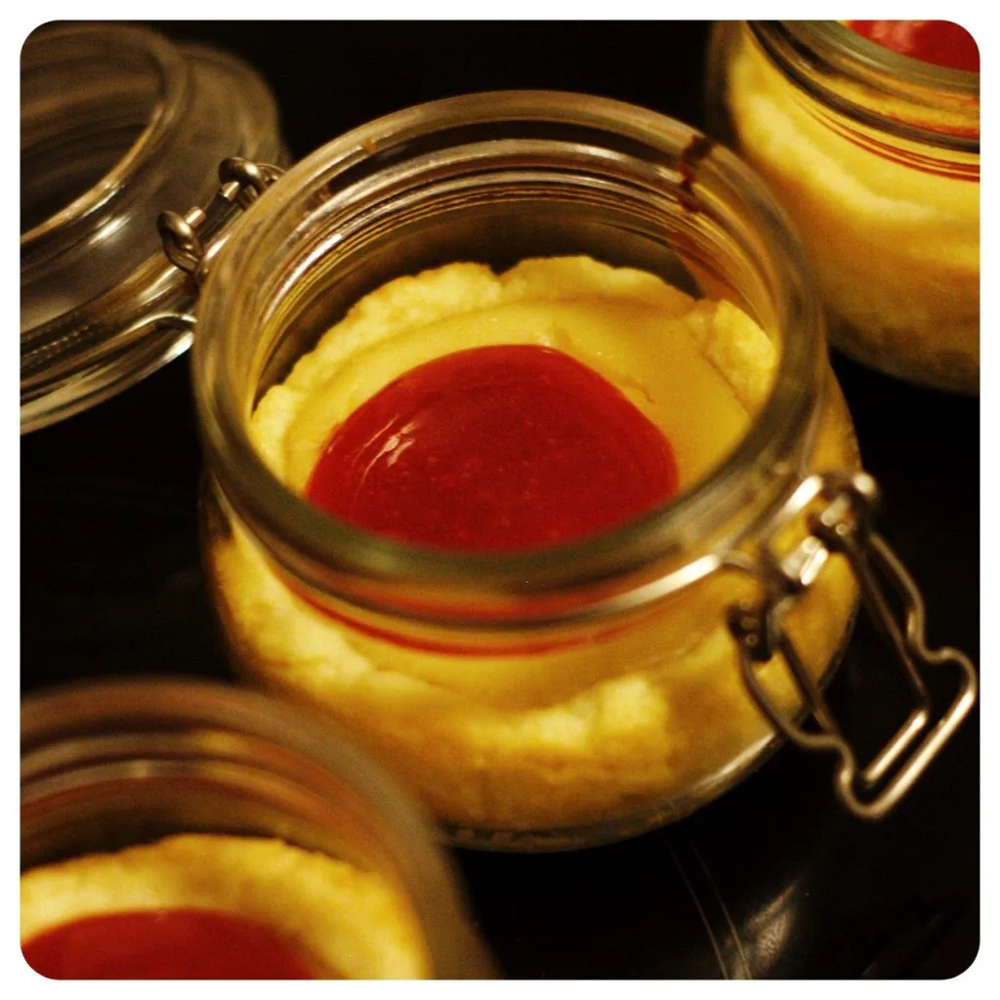

Bei uns in der Familie gibt es wohl nur eine Art des Kuchens. Auch wenn wir gerne backen und noch lieber Kuchen essen, ist es doch der Käsekuchen den wir favorisieren. Zumindest ist es eine Pflicht zu gewissen Anlässen, dass ein Käsekuchen auf dem Tisch steht. Da ich gerne auch eine vegane Variante backen wollte und ein Rezept suchte, welches ich auch als Küchlein oder Muffin zubereiten kann, bin ich zum Schluss bei einen American Cheesecake gelandet. Der Teig ist dabei ein einfacher Mürbeteig, die Füllung besteht aus Seidentofu und Soja Joghurt, die optionale Soße kann man sehr flott aus Marmelade zaubern. Da ich den Cheesecake gerne transportieren wollte, nahm ich erneut die kleinen Einmachgläschen von IKEA. Diese sind echt super zum Backen und selbst in der Spülmaschine machen die mir keine Sorgen.

Fangen wir doch mit dem Mürbeteig an, da dieser im Kühlschrank ruhen muss. Stellt auch schon mal etwas Wasser in den Kühlschrank, da man für den Mürbeteig kaltes Wasser benötigt.

## Zutaten:

- 300 g Mehl Typ 405
- 200 g Margarine
- 100 g Zucker
- 2 EL kaltes Wasser

Gebt das Mehl und den Zucker in eine Schüssel und bröckelt die Margarine hinzu. Gebt dazu 2 Esslöffel kaltes Wasser und knetet händisch die Zutaten zu einen schönen Teig.

Sobald der Teig zu einer Kugel geformt werden kann, wiegelt diese in eine Frischhaltefolie ein und da der Mürbeteig es gerne hat, gekühlt zu werden, stellt den Teig für 30 Minuten in den Kühlschrank.

Die **Füllung** welche den Käsekuchen auch ausmacht, muss natürlich auch vorbereitet werden. Ihr braucht neben den Zutaten ein  hohes Behältnis und ein Stabmixer oder vergleichbares um alle Zutaten zu einer cremigen Soße zu verrühren. Mit einen Rührgerät sollte es auch klappen.

## Zutaten:

- 250 g Sojajoghurt
- 200 g Seidentofu
- 60 g Margarine
- 40 g Maisstärke
- 30 g Agavendicksaft
- 80 g Rohrrohrzucker
- Vanille Aroma
- 1 EL Zitronensaft

All die Zutaten nach und nach in ein hohes Behältnis geben und den Inhalt zu einer cremig Soße vermischen. Den Geschmack kann man durch den Agaven Dicksaft für die Süße anpassen. Stellt das Behältnis in den Kühlschrank, während ihr euch der Soße widmet.

Für die **Soße** habe ich mir was sehr simples ausgedacht. Zwar kann man aus frischen oder gefrorenen Beeren eine besser schaffen, jedoch wollte ich auch die Marmelade loswerden. Im Grunde habe ich diese mit nur verdünnt und die Süße leicht entfernt.

## Zutaten:

- 300 g Himbeeren Marmelade
- 3 EL Wasser
- 1 Schuss Zitronensaft

Da die Himbeeren Marmelade mit Stückchen war, habe ich diese mit dem Stabmixer püriert. Auch diese stelle ich in den Kühlschrank.

Stellt den Ofen schon mal auf 180 Grad Ober- und Unterhitze, denn in der Zwischenzeit können wir uns um den Teig und die Einmachglässchen kümmern.

Holt den Teig aus dem Kühlschrank und entpackt diesen aus der Frischhaltefolie. Rollt dann den Teig auf einer bemehlten Oberfläche aus, so dass ihr euch kleine Flächen von entnehmen könnt und kleidet damit die Einmachgläschen aus. Mit dem Finger könnt ihr den Teig noch etwas formen und verteilen.

 

Sobald ihr alle Gläschen mit dem Teig ausgekleidet habt, könnt ihr die Creme eingießen, bis ihr den Rand des Teiges erreicht. Ich habe die Gläschen nur bis zur Hälfte gefüllt, damit noch etwas Soße hinzukommen kann.

Schiebt die Gläschen in den Ofen. Nach 30 bis 40 Minuten sollten die Cheesecakes fertig sein. Zu erkennen an der Oberfläche der Creme, welche austrocknet und eventuell leicht reißt. Der Teig sollte an der Glaswand auch etwas Farbe erhalten haben. Wartet bis die Cheesecakes abgekühlt sind und serviert diese mit einen Kleks der Himbeeren Soße.

Eine Alternative zur Einmachgläschen Version mit Soße on top, sind die Muffins. Hierfür vermischt die Füllung mit der Himbeeren Soße. Kleidet die Muffin Förmchen bis zum Rand mit dem Mürbeteig aus und kippt die vermischte Füllung in die Muffins. Diese stellt ihr ebenfalls für 30 bis 40 Minuten in den Ofen. Auf dieser Weiße lassen sich die Cheesecakes leicht transportieren und direkt mit der Hand verspeisen.

Zum Schluss bleibt mir euch noch ein "Gudden" zu wünschen.

