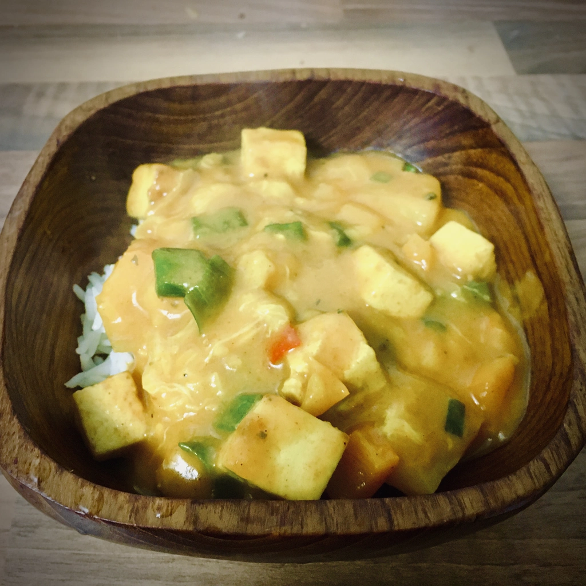

Zwar besteht bereits ein Rezept für ein [Ananas-Bananencurry](/articles/banana-pineapple-curry-mit-reis-in-schnell-2018-12-18/) auf dem Blog, aber dieses neue Rezept ist komplexer und somit auch geschmacklich viel intensiver.

<!-- more -->

# Zutaten Curry
* 200g Natur Tofu (gewürfelt)
* 1 EL Maisstärke
* 2 EL Kokosöl
* 2 Charlotte (gewürfelt)
* 2 Knoblauchzehen (gehackt)
* 1 EL Ingwer (gehackt)
* 150 ml Kokosmilch
* 1 TL Kurkuma
* 1 TL Paprikapulver
* 1 TL Chilipulver
* 200g Ananas (gewürfelt)
* 1 Banane
* Salz und Pfeffer nach Bedarf
* Reis nach Belieben
* 2 EL Grüne Zwiebel (gehackt)
* 1 Gelbe oder Orange Paprika
* 1 Chilischoten

# Zutaten Würzmischung
* 1/2 EL Karadom
* 1 TL ganze Pfefferkörner
* 1 TL Kümmel
* 1 TL Muskat
* 1/2 EL Zimt
* 1/2 EL Kürbiskerne
* 1 TL Chiliflocken
* 4 Lorbeeren Blätter

Zuerst wird die Gewürzmischung vorbereitet. Hierfür werden Karadom, Pfefferkörner, Kümmel, Muskat, Zimt, Kürbiskerne, Chiliflocken und Lorbeerblätter in einem Mörser zerstampft bis wir ein grobes Pulver erhalten.

Danach drücken wir den Tofu aus, in dem wir einen schweren Gegenstand auf den Tofu stellen und diesen selber auf ein Küchentuch, damit die Flüssigkeit aufgezogen wird. 
Nachdem ausdrücken wird der Tofu gewürfelt und mit einem Esslöffel bestreut und gut verteilt. Nun kann der Esslöffel Maisstärke darüber gestreut werden und auf alle Tofuwüfel verteilt werden. Ich schüttle hierfür die Schüssel und lass die Tofuwürfel in den Gewürzen und Stärke sich selber wälzen. Wenn alle Tofu würfel mit Stärke und Gewürzen bedeckt sind, werden die Tofuwürfel in Kokosöl angebraten, bis diese von allen Seiten knusprig sind.
Während der Tofu anbrät, kann Reis gekocht werden.
Sobald der Tofu fertig ist, wird dieser aus der Pfanne genommen und zur Seite gelegt. Im restlichen Öl braten wir die Charlotte an. Sobald die Charlotte Farbe bekommen haben, kommt der Ingwer, der Knoblauch und die Chilis hinzu, welche für ein bis zwei Minuten mit anbraten, bevor die Paprika in die Pfanne hinzugegeben wird. Diese wird ebenfalls für ein bis zwei Minuten angebraten.

Jetzt streuen wir über das Gemüse in der Pfanne einen Esslöffel unserer Gewürzmischung, Kurkuma, Paprika- und Chilipulver. Rührt und verteilt die Gewürze und lasst diese ebenso kurz anbraten.
Die Ananas wird gewürfelt und die Bananen in Scheiben geschnitten, diese kommen nun ebenso in die Pfanne. Über das Ganze wird zum Schluss die Kokosmilch gegossen und mit Salz sowie Pfeffer abgeschmeckt.

Das Curry wird für ca. fünf Minuten mit einem Deckel auf der Pfanne gekocht, bevor das Tofu und die grüne Zwiebel ins Curry gegeben werden. Lasst diese ebenfalls kurz mit kochen.

Jetzt ist das Curry servierfertig.
