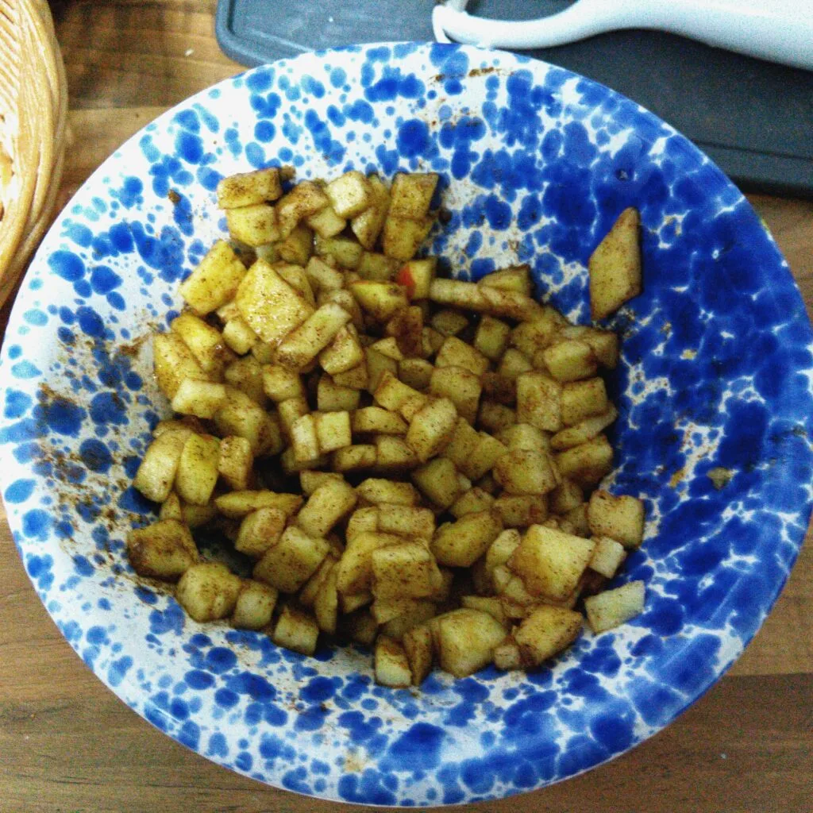
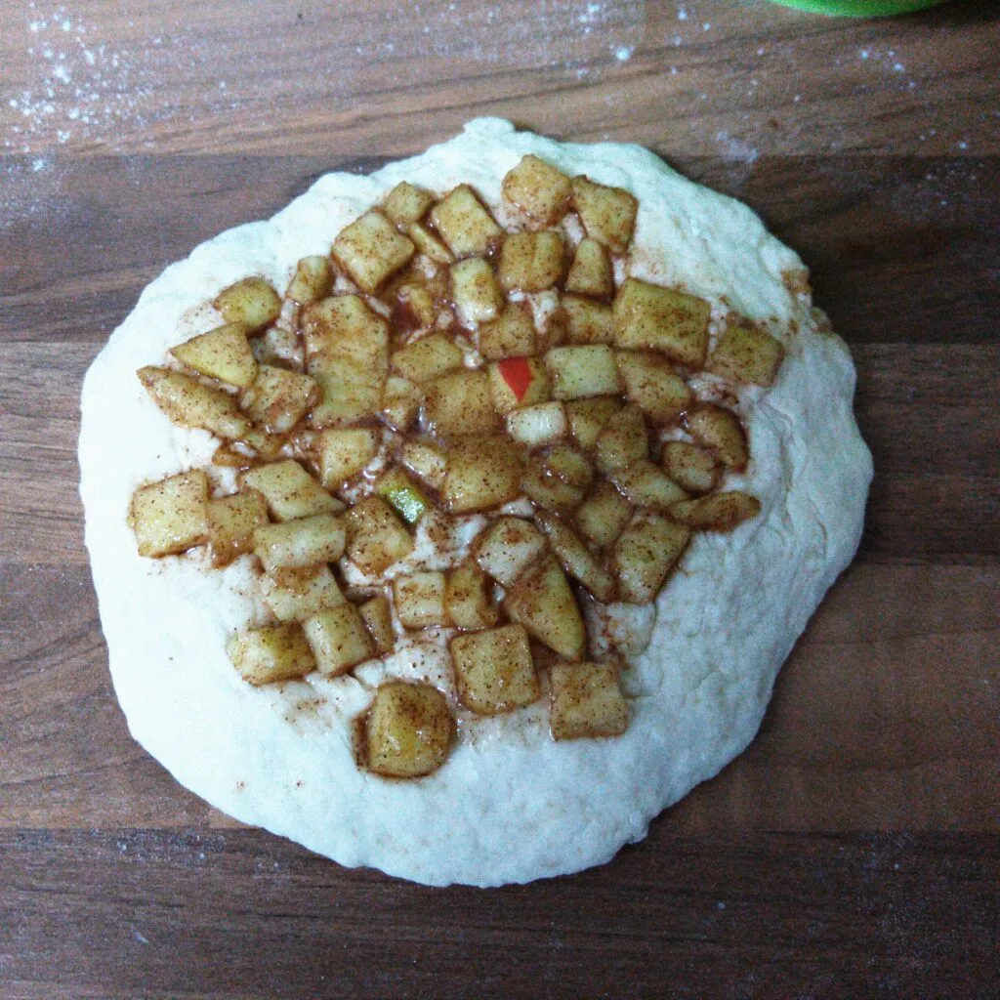

Ein nicht mehr so knackiger Apfel kann immer noch zu einem guten Stückchen aufgewertet werden. Das wird nicht viel an Zutaten oder Zeit benötigt.

Wir benötigen:

- Ein Apfel
- 2 TL Löwenzahn-Sirup
- 4 TL einer Zucker-Zimit Mischung

Schellt den Apfel und schneidet diesen in Würfel. Gebt danach den Honig hinzu. Vermischt das ganze mit der Zucker-Zimt Mischung und legt das ganze erstmal zur Seite.

Für den Teig:

- 200g Mehl (Typ 405)
- 8g Backpulver
- 100ml Wasser
- Öl zum fritieren

||||
::|::|::
||

Knetet den Teig, bis dieser eine Feste Kugel wird. Halbiert diesen und rollt daraus einen Fladen mit ca. 14 cm Durchmesser und 5mm Dicke. Belegt diesen mit den Apfelwürfeln und legt den Fladen in eine Pfanne mit heißem Öl, damit der Fladen nicht an backt. Sobald der Boden fest und Braun wird, wendet ihr vorsichtig den Fladen. Nach wenigen Minuten, wenn auch die obere Seite fest wurde, nehmt den Berliner aus der Pfanne und legt diesen auf ein Küchentuch, damit das Öl vom Berliner abläuft. Zum Schluss streut bei Bedarf etwas Puderzucker darüber. Schon ist der Nachtisch fertig.
