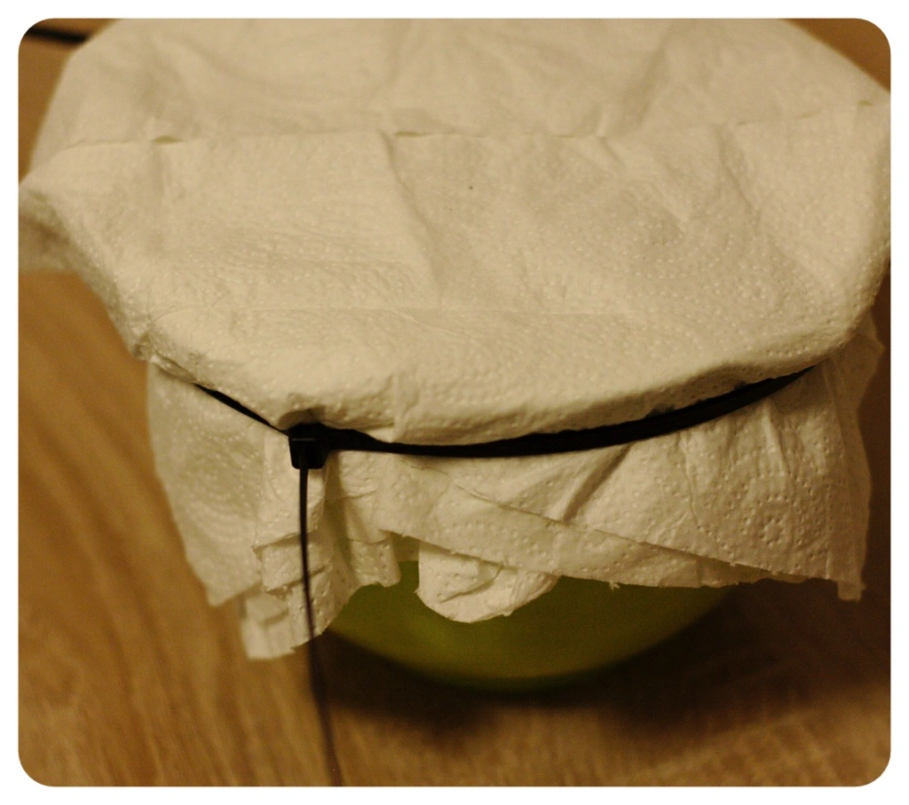
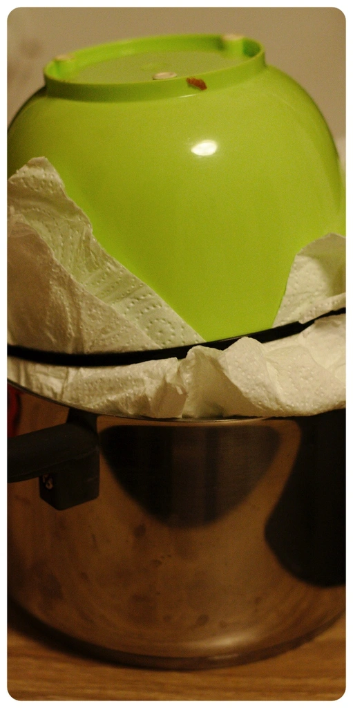

Für den Herbst 🍂 und Winter ❄️ passen Äpfel und Zimt super zusammen, deswegen zaubere ich gerne kleine passende Muffins. Der Aufwand für das Topping ist kleinwenig größer, da man den Saft von den Äpfel trennen musst und dies nimmt etwas Wartezeit auf sich, aber währenddessen kann man ja alles weitere vorbereiten. Für ca 15 Muffins benötigt man folgende Zutaten:

## Zutaten Teig:
- 180 g Mehl (Typ 405)
- 60 ml Sonnenblumenöl
- 100 g Zucker
- Prise Salz
- Schuss Zitronensaft
- ca. 120 ml Sojamilch
- Halbe Packung Backpulver

Für das Toppig aus Apfel Zimt benötigt man:

## Zutaten Toppig
- Zwei rote Äpfel
- Zimt
- 1 El Agaven Dicksaft

Die Äpfel waschen und in eine Schale grob reiben. Ein Esslöffel Agaven Dicksaft (oder einen anderen Honigähnliche Sirup) hin zu geben und mit einer ordentlichen Ladung Zimtgewürz überdecken. Danach alles vermischen und austropfen lassen. Ich habe hierfür die Schale mit etwas Küchenrolle abgedeckt und mit Kabelbindern befestigt, sowie das Ganze auf den Kopf gestellt.

|||
::|::
|

Nun kann man alle trockenen Zutaten für die Muffins vermischen und darauf das Sonnenblumenöl, sowie die Sojamilch und den Schuss Zitronensaft hinzugeben. Das ganze wird nun verrührt, bis es einen angenehmen dickflüssigen Teig ergibt. Diesen kann man nun zu 1/3 in die Muffin Förmchen gießen. Den Ofen heizt man auf 220 Grad Ober- und Unterhitze vor. Währenddessen kann sich wieder um das Toppig aus Apfel-Zimt kümmern. Um den restlichen Saft raus zu drücken, gibt man nun die Apfel-Zimt Masse in ein Mulltuch/Mullbinde oder alternativ auch in ein Küchentuch. Nun kann man das Tuch zu drehen und damit den restlichen Saft rauspressen. Das Toppig kann man jetzt auf die Muffins legen und in den Ofen schieben. Nach ca. 25 Minuten sollten die Muffins fertig sein. Stäbchenprobe nicht vergessen. Dann bleibt nur noch ein frohes naschen zu wünschen.

 
