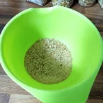

Da ich meistens noch etwas Brot übrig habe, stellte sich mir die Frage, was ich mit dem alten und trockenen Brot mache? Da fiel mir ein alter Beitrag auf Arte ein, im welchen gezeigt wurde, wie Bäcker Rezepte ausprobieren, um Brot zu recyclen. Dem habe ich mich auch angenommen und fand eine für mich funktionierende Lösung.

## Zutaten

- 100g geriebenes/gemahlenes altes Brot
- 450g Vollkorn Dinkelmehl Typ 630
- 70g Sauerteig
- 2 TL Salz
- 4g Trockenhefe
- 350 ml [Hafermilch](/articles/hafermilch-2022-01-29) 

Die [Hafermilch](/articles/hafermilch-2022-01-29)  sollte Zimmertemperatur haben. Zu dieser gibt man die Trockenhefe hinzu und verrührt diese, bis sich die Hefe aufgelöst hat. Lasst die Milch nun Augenblick stehen und widmet euch dem Teig. Die 100g altes Brot habe ich bereits im Vorfeld mit einer Reibe zerkleinert und die harte Kruste mit einem Stößel klein zerstoßen. Das alte Brot wird dem Mehl hinzugegeben, danach kann das Salz hinzu. Falls gewünscht, kann da noch Brotgewürz hinzugefügt werden. Das Ganze wird nun vermischt und eine Mulde gebildet, worein der Sauerteig gekippt wird. Verknetet den Teig etwas und gebt nach und nach die Milch hinzu. Der Teig wird zehn Minuten geknetet und sollte sich ohne Probleme aus der Schale lösen können. Formt aus dem Teig ein Laib und schneidet es oben ein. Bemehlt die Oberfläche des Laibes und lasst diesen für mindestens eine Stunde, an einem warmen Ort gehen. Ich benutze hierzu immer mein Serverrack, mit passiv gekühlten Geräten. Zum Schluss kommt das Laib Brot in ein auf 220 Grad vorgeheizten Ofen. Darin wird der Laib für 50 Minuten bei Ober- und Unterhitze gebacken. Das Brot braucht einen Augenblick zum Abkühlen.

Wie knusprig und gleichzeitig Soft das Brot wird, kann man beim Aufschneiden und drücken testen:

<video width="100%" height="auto" controls>
 <source src="wp-1650275484091.mp4" type="video/mp4">
Your browser does not support the video tag.
</video>
