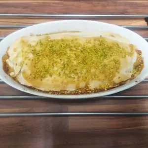
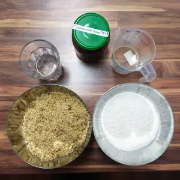
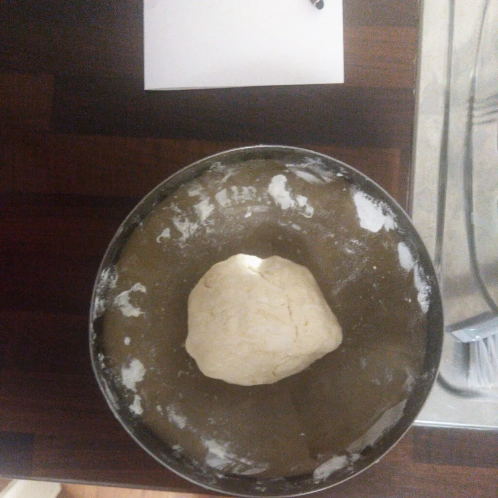
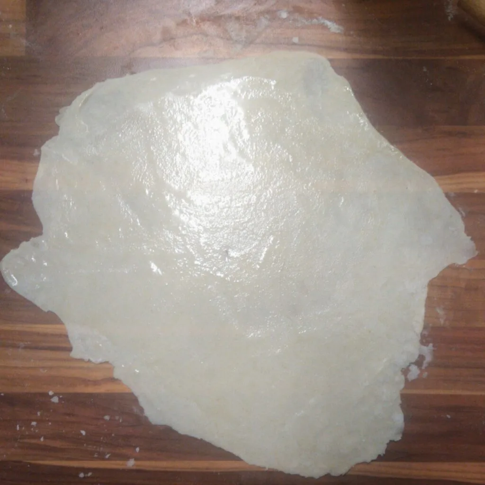
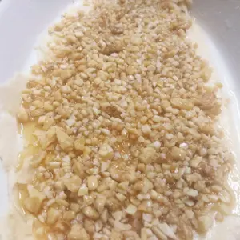
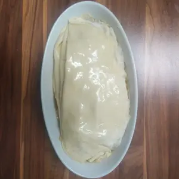
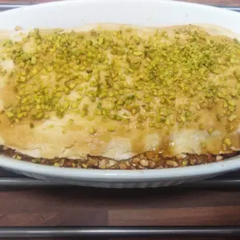
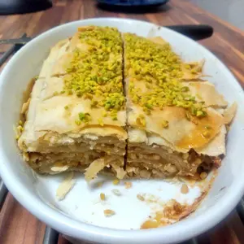

Vor nicht allzu langer Zeit habe ich in meinen Hackspace Blätterteig (Filoteig), gefüllt mit Nüssen und [LöwenzahnSirup](/articles/loewenzahn-sirup-2019-04-22) gemacht. Daraus entstand entsprechend ein Baklava nach meiner Art. Durch den eingeschränkten Einsatz des Löwenzahnsirups, triefte das ganze auch nicht so stark vor süße.

<!-- more -->
|||
::|::
|

## Zutaten

- 300g Mehl
- Prise Salz
- 80g Nüsse nach Wahl (Wallnüsse, Hasselnüsse, Mandeln,..)
- gehackte Pistanzien
- Honig Ersatz (Agaven Dicksaft, Löwenzah Sirup, ..)
- 150 ml Wasser
- 2TL Essig
- 30ml Pflanzen Öl
- 10g Maragine

Ihr braucht noch eine Auflaufform, welche ihr einfetten müsst. Die Nüsse könnt ihr kleinhacken, schreddern, mahlen oder walzen, bis diese sehr fein bzw. in kleinste Stücke verkleinert wurden. Die Margarine erhitzt ihr leicht, bis diese schmilzt. Gebt die geschmolzene Margarine zu Mehl, Salz und Essig hinzu, verrührt zum Schluss das ganze. Gebt nun das Pflanzen ¨Öl hinzu und etwas Wasser. Vermengt den Teig und gebt nach und nach etwas Wasser hinzu, bis dieses verbraucht ist. Knetet den Teig für 10 Minuten und formt eine Kugel daraus. Der Teig sollte nicht mehr an den Fingern kleben und elastisch zum Ausrollen sein. Ölt die Teig-Kugel leicht ein und lasst diesen für 30 Minuten abgedeckt gehen.

Während der Teig geht, kann der Backofen auf 200 Ober/Unterhitze vorgeheizt werden.  

Zupft danach etwa acht Stücke aus dem Teig heraus und rollt diese hauch dünn auf einer bemehlten Oberfläche aus. Damit der Blätterteig nachher im Ofen auch knusprig wird, ölt die Oberfläche des Blätterteiges ein.

Legt die erste Schicht Blätterteig in die Auflaufform und belegt diese mit Nüssen. Nun kommt der Honigersatz darüber. Die Menge kommt auf die gewünschte Süße an. Ich empfehle den Honigersatz mit heißen Wasser etwas zu verflüssigen, sollte dieser sehr Dickflüssig sein. Begießt die Nüsse mit dem Honigersatz. Ich habe lediglich grob über alles mit 1 oder 2 Esslöffeln gegossen.

|||
::|::
|

Nun folgt die nächste Schicht Blätterteig. Diese wird wieder dünn ausgerollt und eingeölt. Legt den Blätterteig über die Nussschicht und streut eine weitere Schicht Nussmischung darüber. Vergesst nicht, den Honigersatz darüber zu gießen. Das macht ihr, solange bis ihr euch zur letzten Schicht vorangearbeitet hat.

Damit die Pistazien im Ofen nicht beim Backen dunkel werden, warten wir noch mit dem bestreuen. Schiebt die Auflaufform in den Ofen und backt das ganze für 20 Minuten. Sobald der Teig anfängt zu bröselig zu werden und Gold Braun ist, können die Pistazien auf die klebrige Oberfläche streuen. Sollte der Honigersatz sich bereits verfestigt haben, könnte ihr noch klein wenig verdünntes Löwenzahsirup (oder anderes) darüber gießen und danach die Pistazien darüber schütten. Lasst den Baklava im ausgeschalteten Ofen und offener Tür, für ca. 10 Minuten.

|||
::|::
|

In meinen Fall waren die Nüsse etwas grober, da ich im Hackspace keine leise Möglichkeit fand, diese zu verkleinern. In meinen Fall habe ich diese in ein Küchentuch eingerollt und mit einem Nudelholz klein gewalzt. Der Blätterteig ist gut geworden, wenn dieser bröselt. Lasst es euch schmecken.
