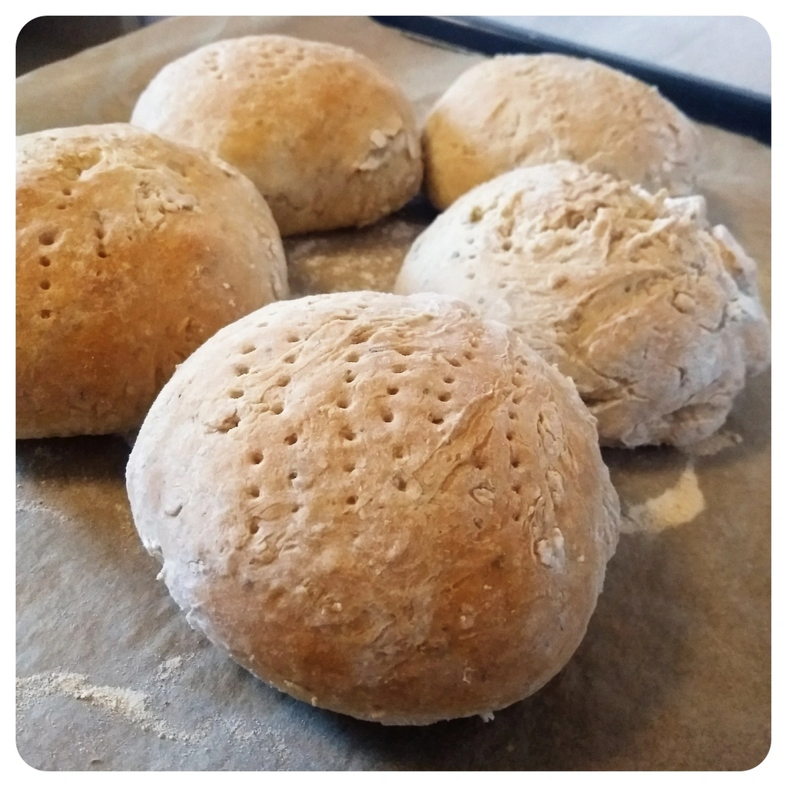
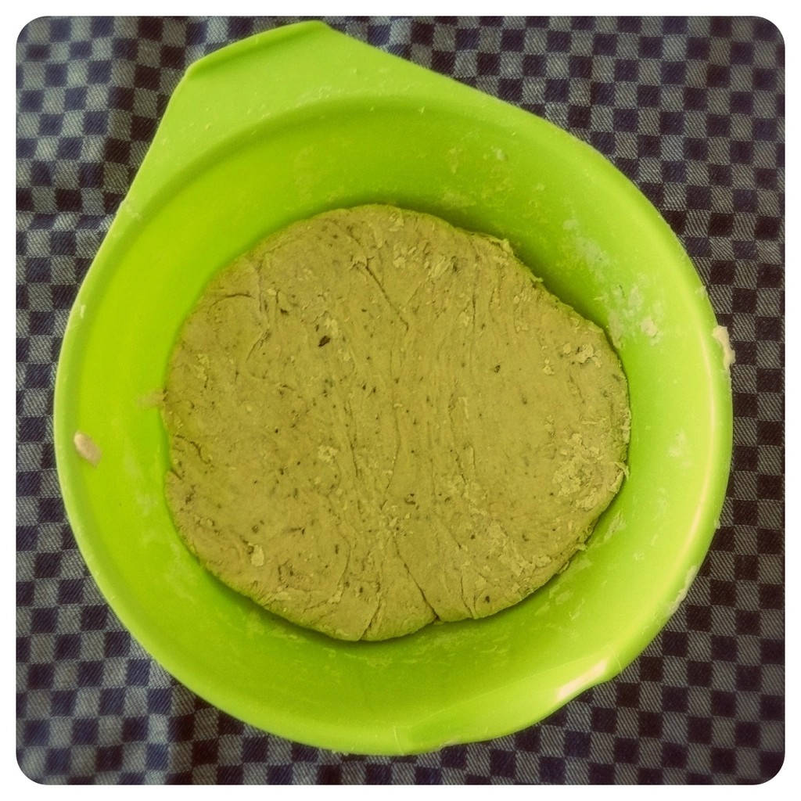
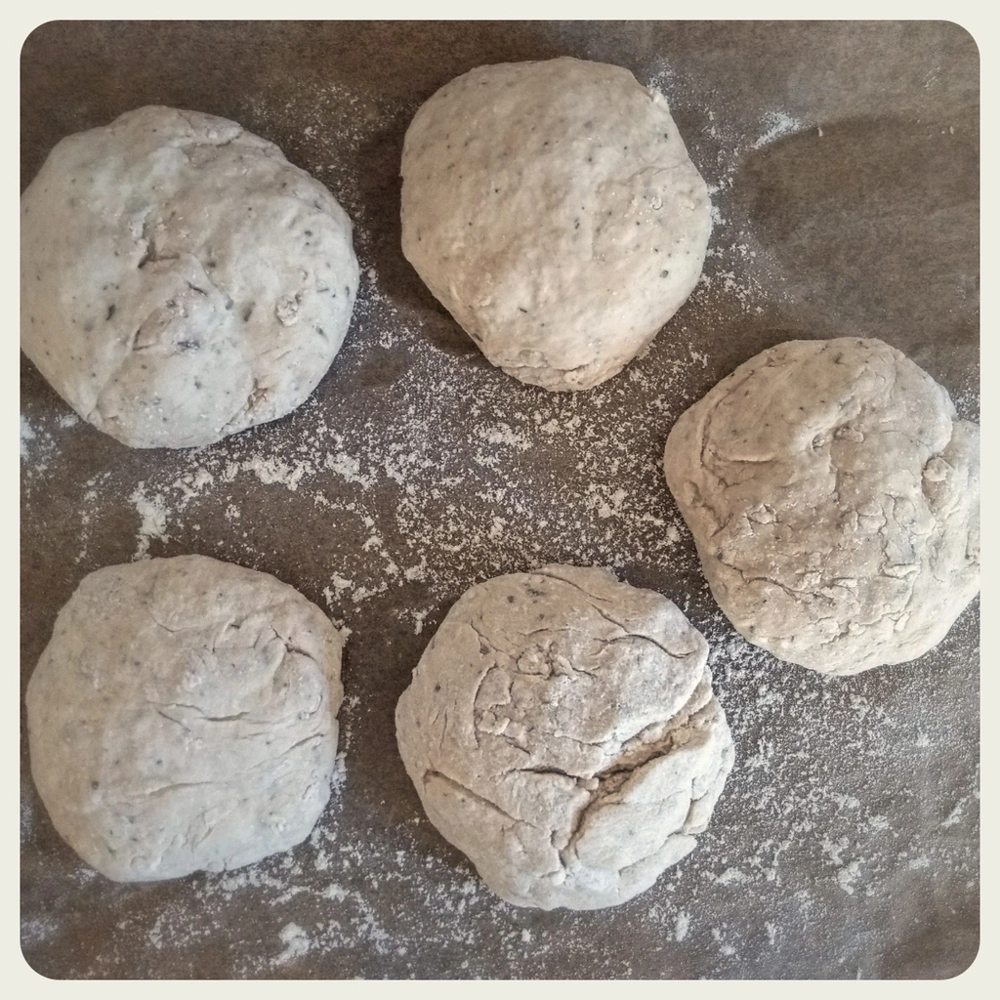
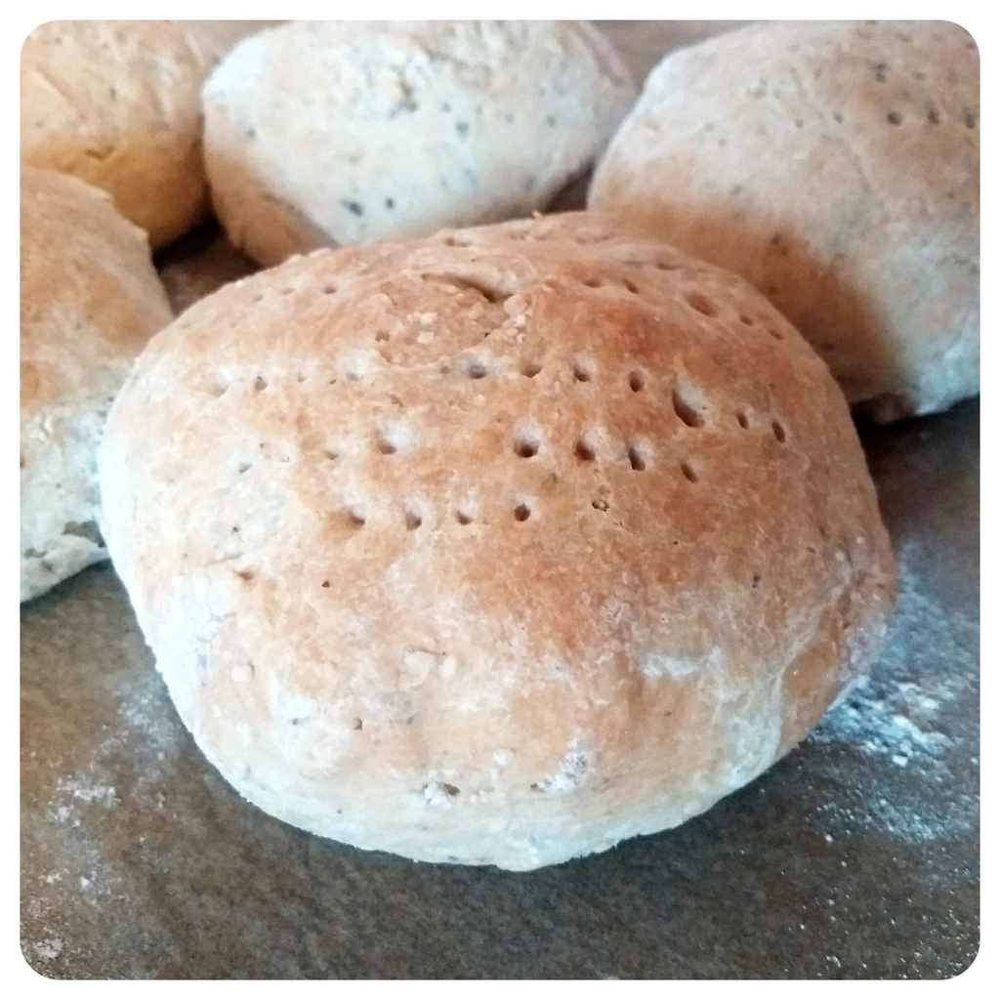
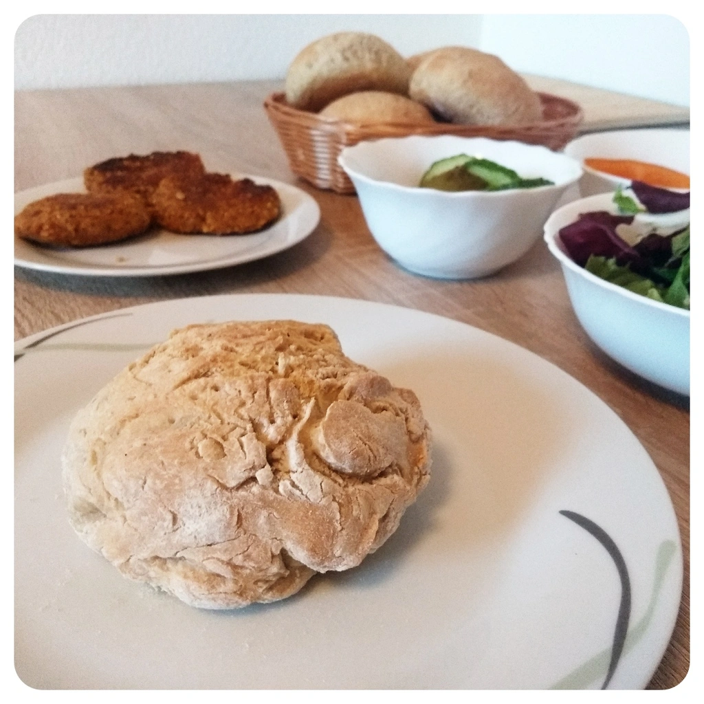
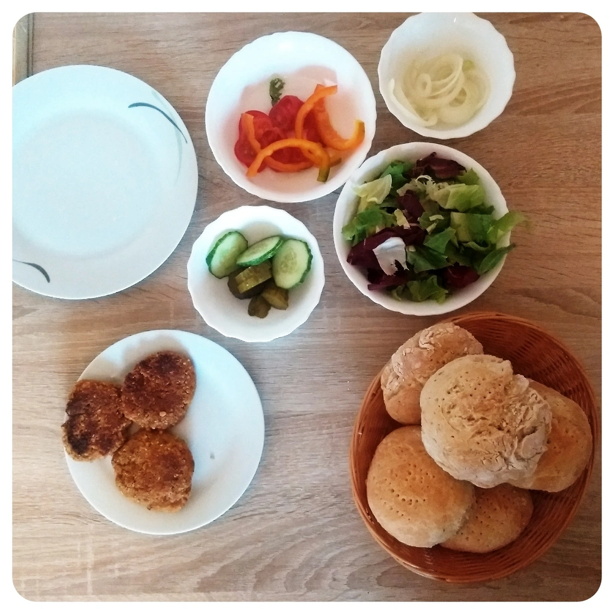
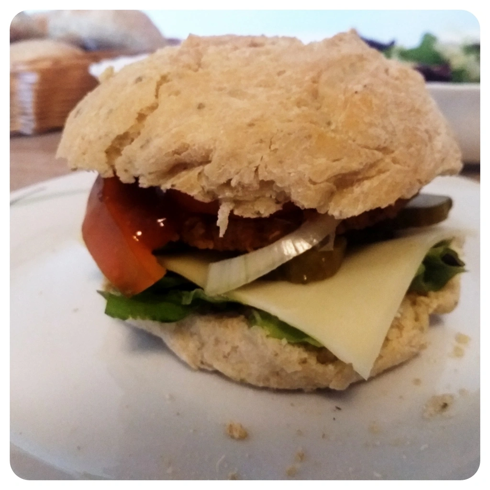

Da ich gerne Burger esse, aber mir die Bürgerbrötchen nie zusagen, weil die fertigen Aufback-Burgerbrötchen so weich und labberig sind, sowie nach nichts schmecken, habe ich hierfür ein Rezept für ein Fladenbrot angepasst.

## Zutaten:

- 500g Mehl Typ 550
- 2 Päckchen Trockenhefe
- 1 TL Backpulver
- 1 TL Salz
- Kräuter der Provinz
- 2 EL Olivenöl
- 330ml lauwarmes Wasser

Mehl, Salz, Trockenhefe, Backpulver und die Kräuter in eine Schüssel legen und die Schüssel rütteln bis die Zutaten durchmischt sind. Eine kleine Kulle bilden,Olivenöl hinzu geben und zudecken. Nun etwas vom lauwarmen Wasser hinzu geben, Teig kneten, wieder etwas vom Wasser hinzu geben und kneten. Dies macht man solange bis das Wasser verbraucht ist. Den Teig solange kneten und schlagen bis die ganzen trockenen Zutaten zu einen Trugklumpen verbunden haben.

Die Schüssel mit dem Teig mit einen Küchentuch abdecken und 30 Minuten in einen warmen Raum gehen lassen.

Nach dem gehen lassen, den Teigklumpen mit etwas Mehl bestreuen und die Hände einmehlen. Jetzt soviel vom Teig entnehmen wie gros man die Brötchen haben möchte und diese dann formen, sowie auf ein mit Backpapier belegten Blech legen. Ist dies geschehen, kann man den Ofen vorheizen auf 230° Ober/Unterhitze und den Teig solange gehen lassen. Sobald der Ofen soweit ist, kann man mit einer Gabel in die Brötchen paar mal rein pieksen und dann mit Olivenöl bestreichen. Falls man möchte, kann man auch Sesamkörner hinzu geben.

Die Brötchen für ca. 20 bis 30 Minuten in den Ofen schieben. Fertig sind die Brötchen, sobald die Kruste abgehärtet und eine leichte Bräune erreicht haben. Vor dem verzerren abkühlen lassen.

Wenn ihr die Brötchen groß genung formt, passt mehr Belag darauf. Lasst es euch schmecken.

|||||
::|::|::|::
||
|
