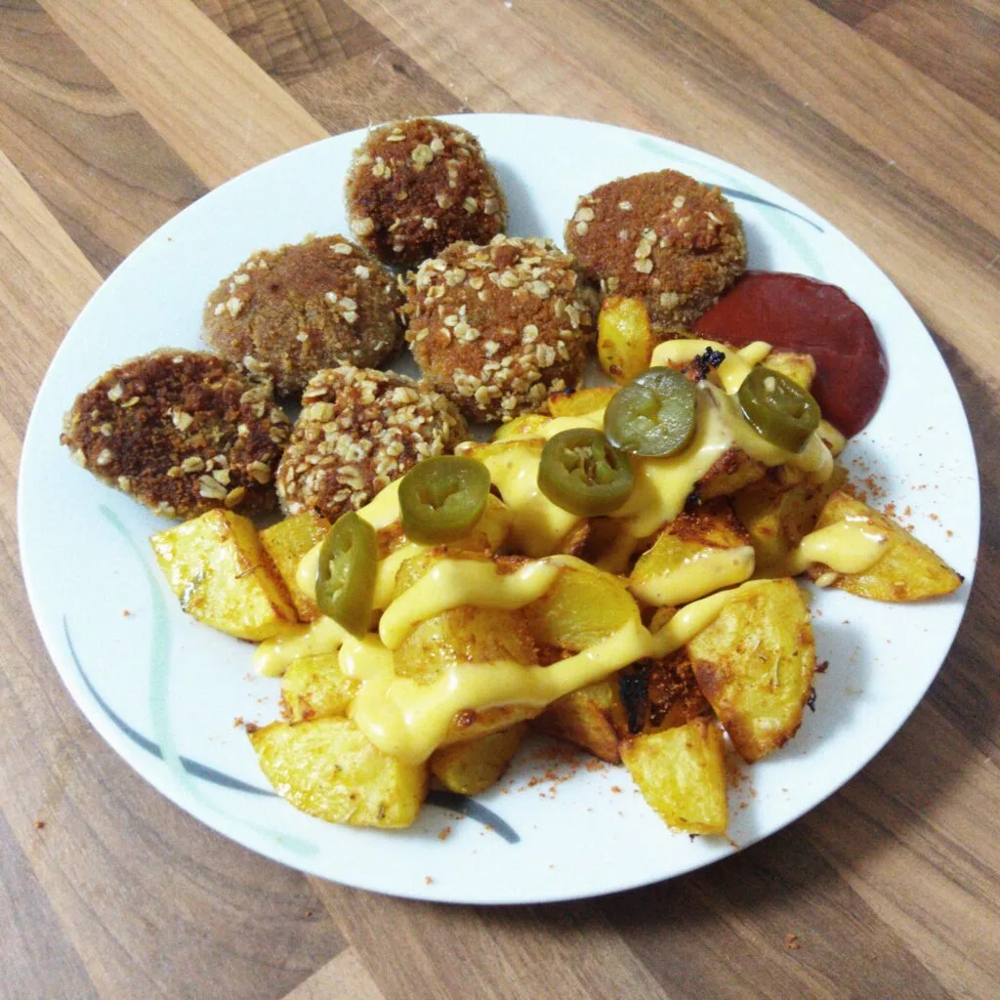
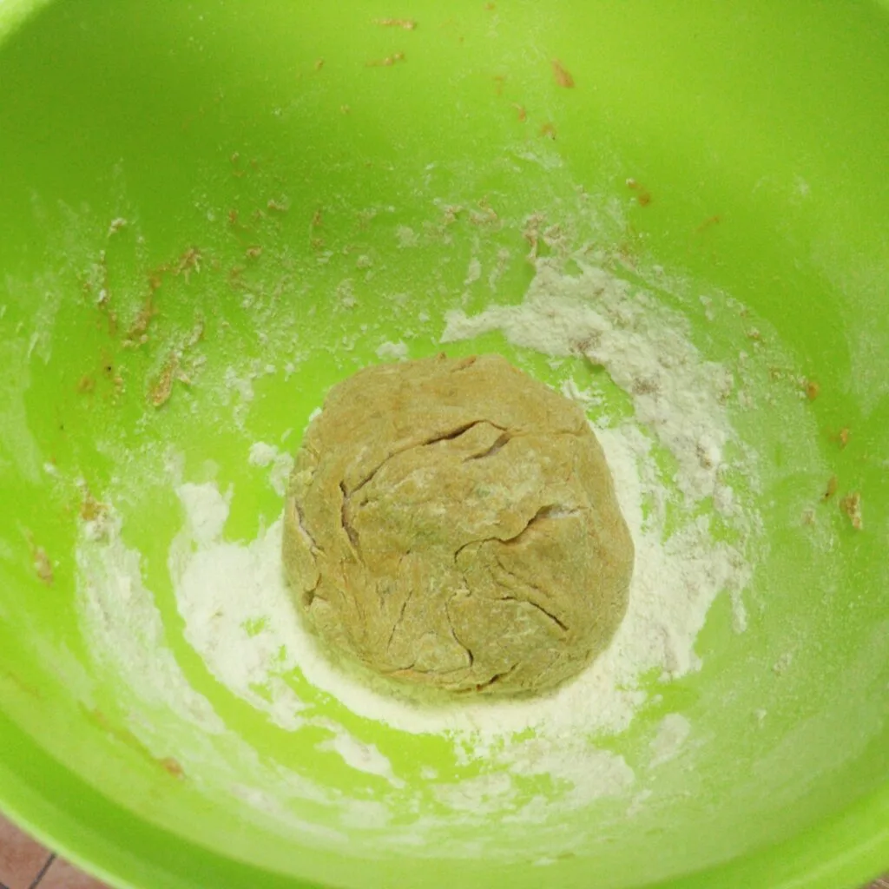
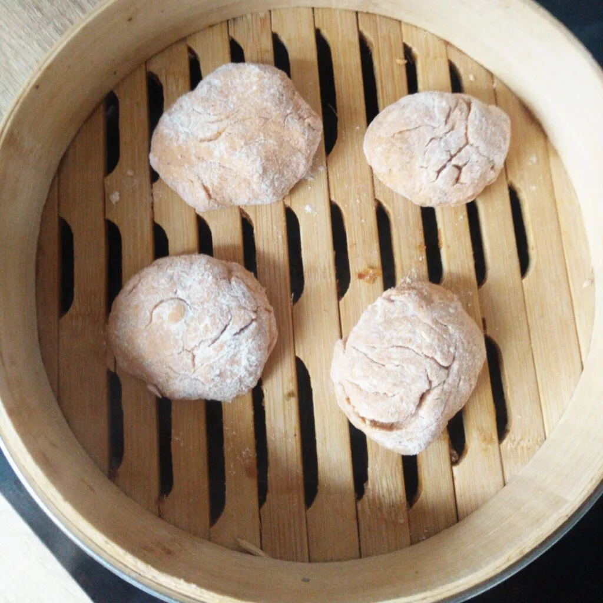
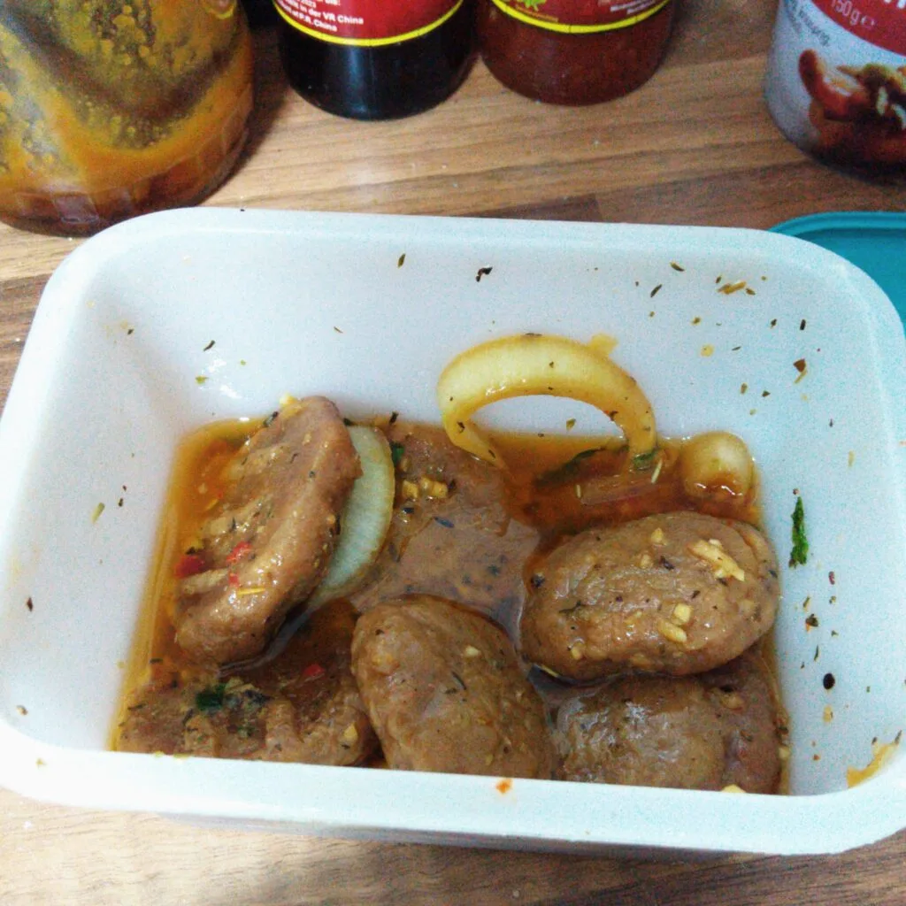
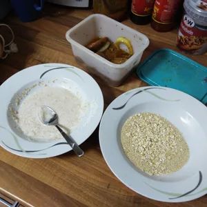
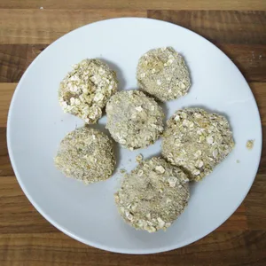
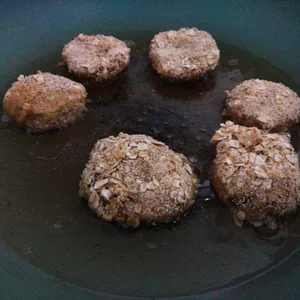
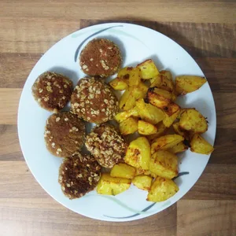

So ein Bambus-Dampfkorb ist nicht nur für Reis und Gemüse gut, damit kann man aus Weizenmehl auch Nuggets zu bereiten, welche bestens zu Kartoffelecken passen. Der Aufwand ist hierzu nicht groß, auch wenn es nach viel aussieht, lediglich das Dampfen beansprucht Zeit. Insgesamt beansprucht dies 1,5 - 2 Stunden. So einen Bambus-Dampfkorb bekommt man unter anderem günstig bei einem Markt mit asiatischen Waren.

## Zutaten

Für ca. acht Nuggets werden folgende Zutaten benötigt:

- 100 g Weizenmehl (Typ 405)
- 1 EL Süßpaprika Pulver
- 1 EL Mischung aus Thymian, Basilikum und Petersilie
- 1 Prise Salz
- 50ml Wasser

Hinzu kommt noch eine Marinade nach Wahl, in welche die Nuggets nachher eingelegt werden. Ich entschloss mich für etwas mit BBQ Geschmack. Dafür benötigt man:

- 1 EL Tomatenmark
- Ein Schuss dunkle Soja Sauce
- 1 TL [LöwenzahnSirup](/articles/loewenzahn-sirup-2019-04-22)/Agaven Dicksaft oder Honig
- 1/2 Zwiebel
- 1 TL Gewürzkräuter nach Wahl
- 1 EL Pflanzen¨-Öl
- 1 EL Wasser

Zum Schluss müssen die Nuggets noch paniert werden. Damit alles hält, kann hierzu eine Mischung mit Ei-Ersatz erworben werden oder man verrührt ein Esslöffel Mehl, mit einem Teelöffel Stärke und zwei Esslöffel Wasser zusammen. Für die Panade nehmt zum Paniermehl noch kernige Haferflocken.

## Rezept

Nehmt einen Topf, auf welchen der Bambuskorb passt und befüllt den zu 75% mit Wasser. Bringt das Wasser zu kochen. Währenddessen könnt ihr die Nuggets vorbereiten.

Vermischt das Mehl, die Gewürze und das Salz und gebt zum Schluss das Wasser hinzu. Verknetet den Teig zu einer Kugel, dabei darf der Teig ruhig etwas trocken wirken, dieser darf nur nicht bröseln. Gut ist der Teig, wenn sich daraus Stücke entnehmen lassen und diese zu kleinen Kugel geformt werden können. Sollte der Teig zu trocken sein, gebt etwas Wasser hinzu. Sollte es hingegen zu Feucht sein, bemehlt den Teig und knetet weiter.

Nun können daraus kleine Kugel geformt und etwas eingedrückt werden. Ich tat dies mit bemehlten Händen. Die Nuggets legt ihr in den Bambuskorb. Da diese Körbe Stapelbar sind, kann man das Rezept wunderbar skalieren.

Den Bambuskorb stellt ihr über den Topf und dämpft die Nuggets für 25 Minuten, wendet diese und dämpft diese für weitere 25 Minuten.

Während die Nuggets ihr Dampfbad genießen, können wir die Marinade vorbereiten. Vermischt alle Zutaten zu einer flüssigen Soße und gebt die halbe Zwiebel in Ringen hinzu. Nun kann diese ziehen.

Nachdem die Nuggets fertig gedämpft wurden, können diese in die Marinade für mindestens 15 Minuten eingelegt werden. Der Geschmack wird intensiver je länger diese dringe liege. In der Zeit kann für die Panade, wie bereits oben beschrieben, Mehl mit Stärke und Wasser vermischt werden, sodass ein dickflüssiges Gemisch entsteht. Darin können die Nuggets gedippt und im Paniermehl gewälzt werden. Diese Arbeit ist etwas kniffelig.

|||
::|::
|

Sobald die Nuggets paniert wurden, könnt ihr diese in einer Pfanne mit heißem Öl braten oder frittieren.

|||
::|::
|

Zu den Nuggets habe ich parallel Kartoffelecken gemacht. Fast Food ist auf jeden Fall was anderes. Aber der Aufwand hat sich jedenfalls gelohnt.  

Auf dieser Basis kann man auch den Teig zu einem Schnitzel-ähnlichen Rezept abgewandelt werden, in dem man einen großen Taler daraus macht.
