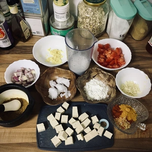
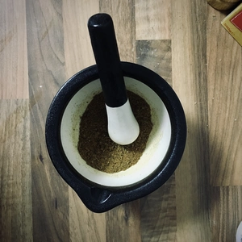
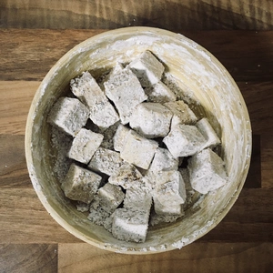
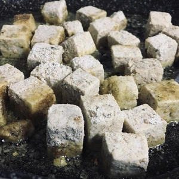
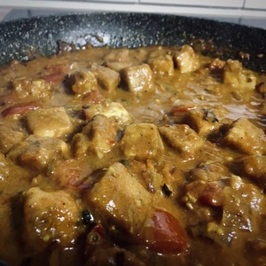
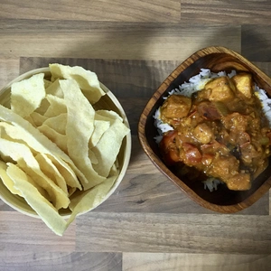

Ein einfaches und doch geschmacklich intensives Basis-Curry Rezept. Es muss nicht immer komplex sein, zu meist reichen einfach nur viele Gewürze.

<!-- more -->

# Zutaten Curry
* 200g Natur Tofu (gewürfelt)
* 200g Tomaten (gewürfelt)
* 3 Schalotten (gewürfelt)
* 3 Knoblauchzehen (gehackt)
* 100 ml Kokosmilch
* 1 EL Ingwer (gehackt)
* 2 EL Kokosöl
* 1 EL Maisstärke
* 1 TL Kurkuma
* 1 TL Paprikapulver
* 1 TL Chilipulver
* Salz und Pfeffer nach Bedarf
* Reis nach Belieben

# Zutaten Würzmischung
* 1/2 EL Karadom
* 1 TL ganze Pfefferkörner
* 1 TL Kümmel
* 1 TL Muskat
* 1/2 EL Zimt
* 1/2 EL Kürbiskerne
* 1 TL Chiliflocken
* 4 Lorbeeren Blätter

Zuerst wird die Gewürzmischung vorbereitet. Hierfür werden Karadom, Pfefferkörner, Kümmel, Muskat, Zimt, Kürbiskerne, Chiliflocken und Lorbeerblätter in einem Mörser zerstampft bis wir ein grobes Pulver erhalten.

Danach drücken wir den Tofu aus, in dem wir einen schweren Gegenstand auf den Tofu stellen und diesen selber auf ein Küchentuch, damit die Flüssigkeit aufgezogen wird. Nachdem ausdrücken wird der Tofu gewürfelt und mit einem Esslöffel bestreut und gut verteilt. Nun kann der Esslöffel Maisstärke darüber gestreut werden und auf alle Tofuwüfel verteilt werden. Ich schüttle hierfür die Schüssel und lass die Tofuwürfel in den Gewürzen und Stärke sich selber wälzen. Wenn alle Tofu würfel mit Stärke und Gewürzen bedeckt sind, werden die Tofuwürfel in Kokosöl angebraten, bis diese von allen Seiten knusprig sind. 

|||
:--:|:--:
|

Während der Tofu anbrät, kann Reis gekocht werden. Sobald der Tofu fertig ist, wird dieser aus der Pfanne genommen und zur Seite gelegt. Im restlichen Öl braten wir die Schalotten an. Sobald die Charlotte Farbe bekommen haben, kommt der Ingwer und der Knoblauch hinzu, welche für ein bis zwei Minuten mit anbraten.

Jetzt geben wir die Tomaten hinzu und streuen einen Esslöffel unserer Gewürzmischung dazu. Rührt und verteilt die Gewürze und lasst diese ebenso kurz anbraten. 
Löscht das ganze mit der Kokosmilch und schmeckt das Curry mit Salz und Pfeffer ab.

Das Curry wird für ca. fünf Minuten mit einem Deckel auf der Pfanne gekocht, bevor das Tofu Curry gegeben wird. Lasst diese ebenfalls kurz mit kochen.

Das Curry ist danach fertig.
  

