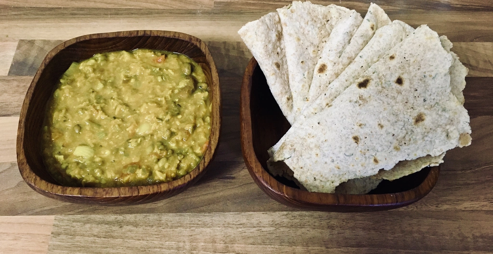
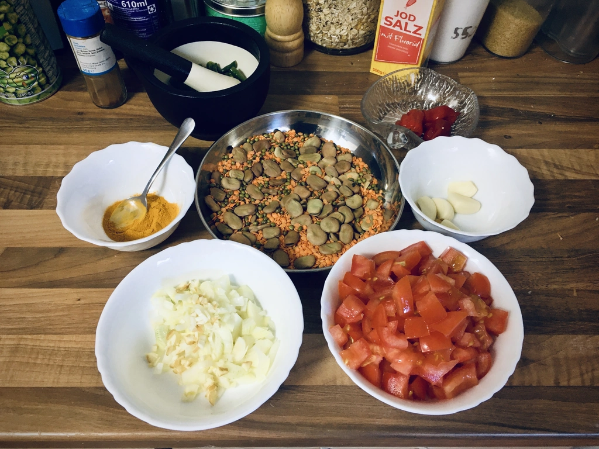
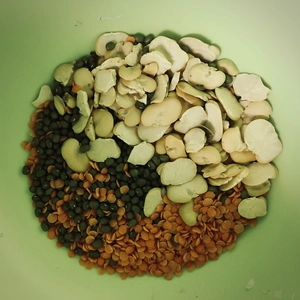
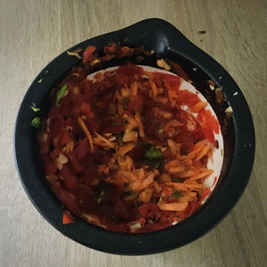
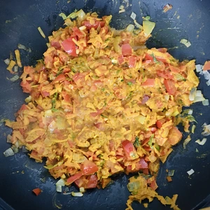
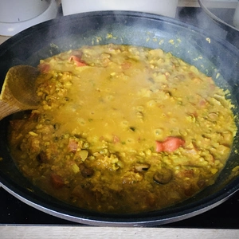
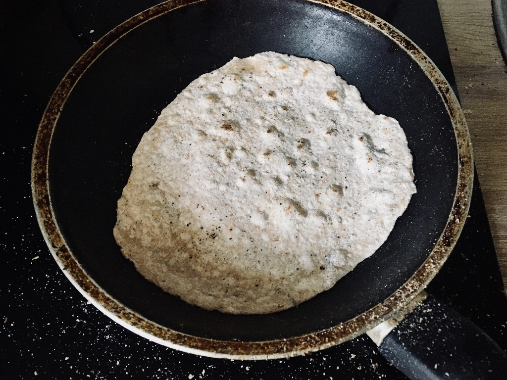
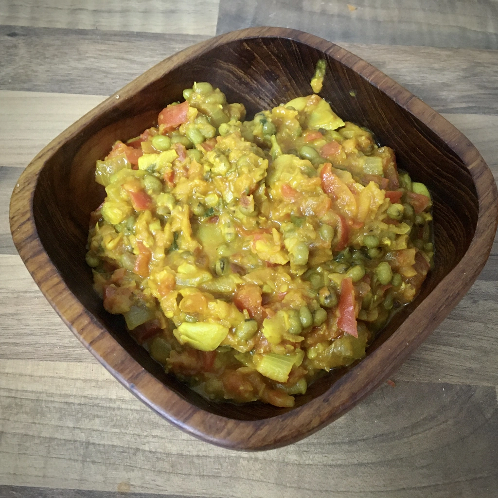

Bei Dhal handelt es sich um ein indisch und pakistanisches Gericht, welches aus vorwiegend Hülsenfrüchten zu bereitet wird. Bei meinem einfachen Rezept reichen ein paar Basiszutaten.

<!-- more -->

# Zutaten
* 50g rote Linsen
* 50g Grüne Moong Bohnen
* 50g gelbe Pferdebohnen
* 1 rote Paprika
* 1 Tomaten 
* Speise Zwiebel
* 5 Knoblauchzehen
* 2 TL Kurkuma Pulver
* 1 TL Chiliflocken
* 1 Möhre
* Salz zum Würzen
* Margarine zum Anbraten

Die Pferdebohnen, auch Ackerbohnen oder Saubohnen genannt, werden von derer Schale getrennt. Danach werden die Linsen und Bohnen in einen Topf gegeben, mit Wasser bedeckt und für dreißig Minuten auf mittlerer Flamme gekocht. 

|||
:---:|:---:
|

Währenddessen wird eine Paprika und zwei Knoblauchzehen klein gehackt und eine Möhre gerieben. Diese müssen zu einer Paste verarbeitet werden. Dies kann händisch in einem Mörser geschehen oder mit einem Mixer. Ich bevorzuge hierbei den Mörser, was jedoch Zeitintensiver ist. 
Danach kann die Speisezwiebel gewürfelt und vier Knoblauchzehen klein gehackt werden, welche in einer Pfanne anbraten werden, bis diese Farbe bekommen.
Tomaten werden ebenfalls gewürfelt und sobald die Zwiebel mit dem Knoblauch so weit sind, werden die Tomaten und die Paste zu den Zwiebeln gegeben. Lasst das ganze so lange braten, bis es andickt.
Das Ganze wird nun mit Kurkuma und Chiliflocken gewürzt. Lasst das ganze nochmals für zehn Minuten braten, bevor ihr die Hülsenfrüchte hinzugebt. Jetzt wird alles für weitere Fünf Minuten mit einem Deckel darauf gekocht. 

|||
:---:|:---:
|

Wer es schärfer mag, kann eine oder zwei ganze Chilis hinzugeben und diese mit köcheln lassen.

# Chapatibrot
* 100g Weizenmehl
* 100g Dinkelmehl
* 1 TL Salz
* 1 EL geschmolzene Margarine

Chapatibrot ist sehr einfach und schnell gemacht. Hierzu müssen alle Zutaten zu einem Teig geknetet werden, von dem immer eine Kugel heraus gezupft werden kann und diese dünn ausgerollt wird, bevor es in eine ungefettet und heiße Pfanne gelegt wird. Sobald der Fladen Blasen wirft oder am Rande sich krümmt, wird dieser gewendet. Ein Chapati sollte sehr schnell fertig werden.

  
