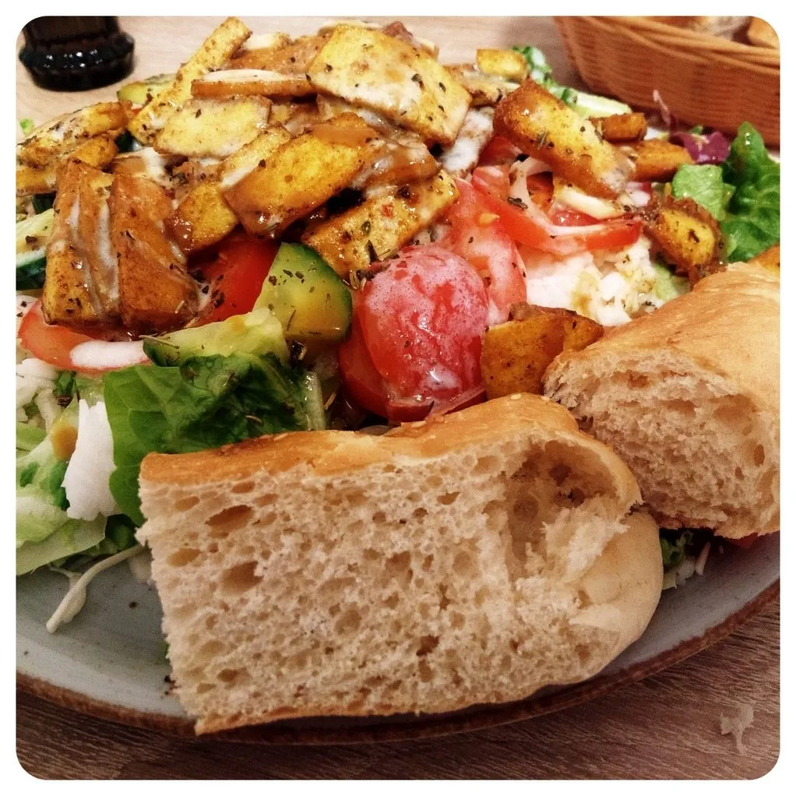
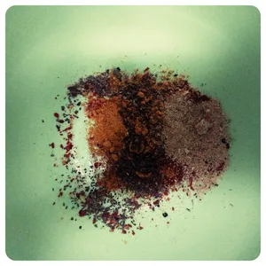
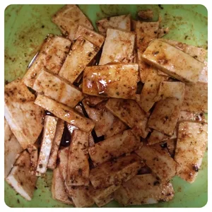
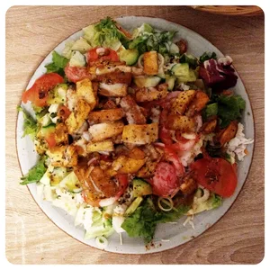
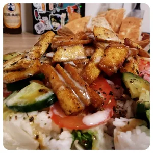

Tofu habe ich eigentlich sehr negativ in Erfahrung. Damals aß ich es zum ersten Mal als jugendlicher bei einen Freund. Der Vater tischte die Speise lieblos auf und es schmeckte einfach nach nichts. Mittlerweile weiß ich auch, das es vieles gibt was man aus Tofu machen kann, weswegen ich mich endlich selber daran machen wollte und mir 400g Tofu besorgte. Für diese einfache und schnelle Zubereitung benötigen wir nur 200g für Zwei Portionen.

## Zutaten für die Marinade

- 1 Prise Salz
- 1 Prise Pfeffer
- 1 TL Chili
- 1 EL Paprikapulver
- 1 EL Currypulver
- 1 TL Gemüsse Brühe
- 1 EL Basilikum Gewürz
- 1 TL Tomatenmark (Optional)
- 6 EL Sonnenblumenöl

Schneidet den Tofu in kleine Scheibchen einer Dicke von circa 0,5cm. Vermischt die Gewürze mit Sonnenblumenöl und optional mit Tomatenmark. Kippt den Tofu hinzu und verrührt es, damit auch jede Seite was von der Marinade einsaugt. Nun könnt ihr es ziehen lassen.

|||
::|::
|

Weiter geht es mit dem Dressing für den Salat. Ich benutze gerne kleine Einmach- oder verschließbare Senfgläser für die Zubereitung. Solch ein Senfglas befüllte ich zur Hälfte mit ungesüßten Sojajoghurt und kippte etwas Öl und Essig hinzu. Zusätzlich bedeckte ich den Sojajoghurt mit Kräutern der Provinz, einer Prise Salz und etwas Pfeffer. Das Glas verschließen und dann ordentlich schütteln.

Nun kann man sich um den Reis und Salat kümmern. Diesen nach Angaben der Verpackung zubereiten und während des Wartens kann man eine Pfanne mit Öl für das Tofu Schnetzel auf die Platte stellen und den Ofen für ein optionales Fladenbrot vorheizen. Salat vorbereiten und auf den Teller verteilen, den Tofu in der Pfanne braten lassen, bis der Tofu eine angenehme Bräune erhält. Reis zum Salat geben, Tofu Schnetzel dazu geben und das Dressing darüber kippen.

Für das nächste Mal werde ich das Brot selber backen.

|||
::|::
|
