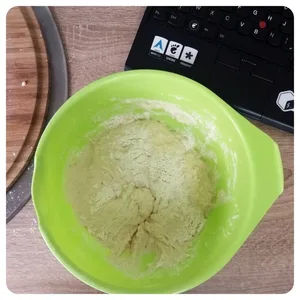
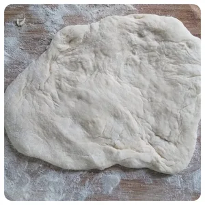
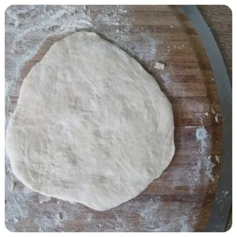
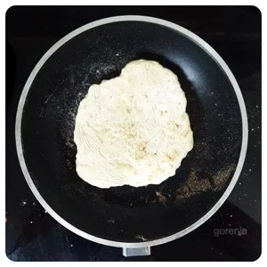
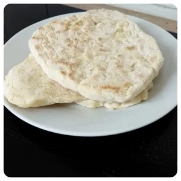
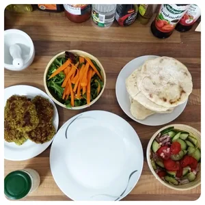
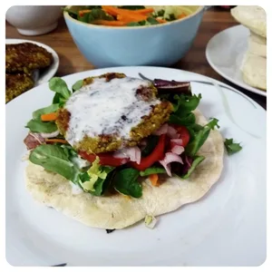

Ich stand letztens vor der Situation, dass ich zwar gerne Döner wollte, jedoch zu faul war die Wohnung zu verlassen. Nachdem ich meine Küche auf den Kopf stellte, hatte ich genug gefunden um etwas vergleichbares zu gestalten, jedoch fehlte immer noch das Brot. Da Brot backen jedoch auch Zeit auf sich nimmt, entschied ich mich Fladenbrot auf die Schnelle in der Pfanne zu machen.

Für Vier kleine Portionen, benötigt man nicht viele Zutaten und einiges kann man Problemlos weglassen oder ersetzen.

## Zutaten:

- 250g Mehl Typ 405
- 1 Packung Backpulver
- Prise Salz
- 100 Ml Wasser
- 100 Ml Pflanzenmilch
- 2 EL Sonnenblumenöl
- 1 EL Kräuter der Provinz

||||
::|::|::|
||

Alle trocknen Zutaten in eine Schüssel geben und vermischen. Danach gebt das Öl, gefolgt vom Wasser und der Milch hinzu. Verrührt danach den Teig. Stellt eine Pfanne auf die Herdplatte und erhitzt diese auf mittlerer Stufe. 

Vom Teig reißt ihr ein Stück ab und rollt dieses auf einer bemehlten Oberfläche aus.

|||
::|::
|

Sobald die Pfanne heiß ist, gießt den Teig in die Pfanne. Nach ca. 2 Minuten könnt ihr den Fladen wenden. Nach weiteren 2 Minuten ist das Fladenbrot fertig. Ein guter optischer Indikator ist eine angenehme Bräune.

Das Fladenbrot kann man gut mit Tofu Geschnetzelten fühlen. Für mein Beispiel, machte ich Bratlinge mit einer Knoblauchsoße auf Salat darauf.  

||||
::|::|::
||
