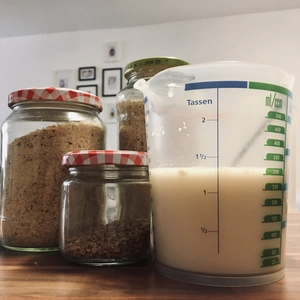
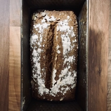
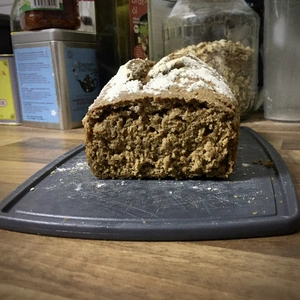

Bei diesem Rezept handelt es sich um eine Abwandlung des Bauernbrotes, welches mit dem [Eichelmehl](/articles/eichelmehl-2023-04-02/) zubereitet wurde. 
Durch den intensiven Eigengeschmack, ist es ratsam nicht mehr als einem Viertel Eichelmehl im Brotteig zu nutzen.
Das Brott wird in einer Kastenform gebacken.

<!-- more -->

# Zutaten
* 100g [Eichelmehl](/articles/eichelmehl-2023-04-02/)
* 300g Dinkelmehl Type 630
* 3 EL Sauerteig
* 2 TL Salz
* 4g Trockenhefe
* 265ml Hafermilch
* Etwas Brotgewürze

Zuerst wird die Hefe in einer lauwarmen Milch mit Honigersatz oder Zucker zu vermischen und diese etwas stehen lassen. Währenddessen kann das Eichel- und Dinkelmehl mit dem Brotgewürz vermischt werden. Dazu kommen zwei Teelöffel Salz und drei Esslöffel Sauerteig, bevor die Milch hinzugegeben wird.
Zum Schluss wird alles verknetetet, sodass ein glatter Teig dabei herauskommt. Lasst den Teig für vier Stunden an einem warmen Ort gehen, bevor dieser erneut verknetet und in die Kastenform ausgelegt wird. 
Lasst den Teig bedeckt für eine weitere Stunde an einen warmen Ort gehen, bevor dieser bei 220 Grad Ober- und Unterhitze für 45 Minuten in den Ofen kommt.

  
