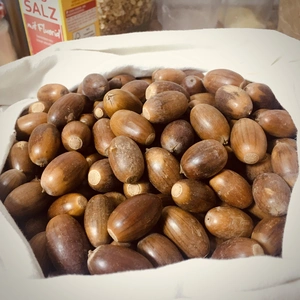
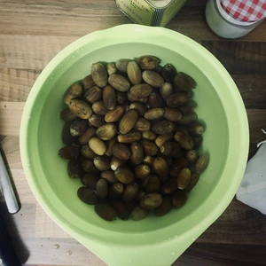
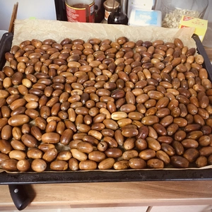
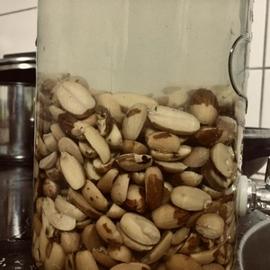
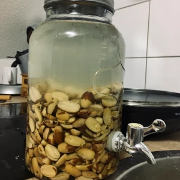

Im Herbst lassen die Laubbäume ihre Eicheln fallen und im Gegensatz zum verbreiteten Wissen, sind Eicheln unter Bedienungen essbar. Diese müssen jedoch vorbereitet werden, in dem die gesäubert und gewässert werden. Dies war auch schon der ländlichen Bevölkerung in früheren Jahren bekannt, weshalb diese zum Winter hin, das Mehl mit jenen von Eicheln gestreckt haben. Das Mehl lässt sich zum backen von Brot oder Gebäck nutzen. Zum Beispiel für Nussplätzchen eignet sich das Mehl hervorragend. Eichelmehl hat einen intensiven Eigengeschmack und ohne dem Strecken des Mehls, wird der Geschmack sehr gewöhnungsbedürftig.

<!-- more -->

||||
:---:|:---:|:---:
||

Bedenkt, die Eicheln welche gesammelt wurden, müssen von der Schale befreit werden und beim Trocknen geht Flüssigkeit verloren, weshalb einiges am Gewicht verloren geht.

Wascht die Eicheln grob vom Dreck ab und entfernt die eventuell noch vorhanden Hüte. Trocknet diese ab und knackt die Schale. Sollte dies mithilfe eines Nussknackers schwerfallen, können die Eicheln für einen kurzen Augenblick bei 80 Grad in den Ofen, damit die Flüssigkeit entzogen werden kann.

Nachdem die Schale geknackt wurde und die Eicheln herausgenommen wurden, müssen diese gewässert werden, damit die Gerbstoffe weg gewaschen werden. Legt hierzu die Eicheln in ein ausreichend großen Behälter mit Wasser und wechselt dieses Wasser am Morgen und am Abend (alle 12 Stunden), bis das Wasser klar ist. Dies kann einiges an Zeit in Anspruch nehmen. **Hinweis**: Beim Wässern können einige Eicheln oben schwimmen. Diese sortiert ihr aus, da die nicht mehr gut sind.

Sobald die Eicheln vom Gerbstoff befreit sind, können diese getrocknet werden. Zu einem tätigt ihr dies mit einem Tuch, zum anderen legt ihr die Eicheln auf ein mit Backpapier belegten Blech und schiebt die Eicheln bei 80 Grad in den Ofen, bis diese mit einem Mörsers klein gemahlen werden können.

|||
:---:|:---:
|

Es ist zu empfehlen, dass die Eicheln mit einem Messer vorher zerkleinert werden, sodass diese in einer Handmühle, Mörser oder Maschine zu Mehl verarbeitet werden können.
Meine ersten Schritte waren mit einem Mörser, was eine Zeitintensive Arbeit ist. Eine elektrische Kaffeemühle oder Stabmixer können hier aushelfen, aber hierbei muss aufgepasst werden, damit die Rotorblätter nicht verkeilen und die Elektronik oder Mechanik einen Schaden hiervon trägt.

Das Mehl ist einige Tage in einem Einmachglas haltbar, 
