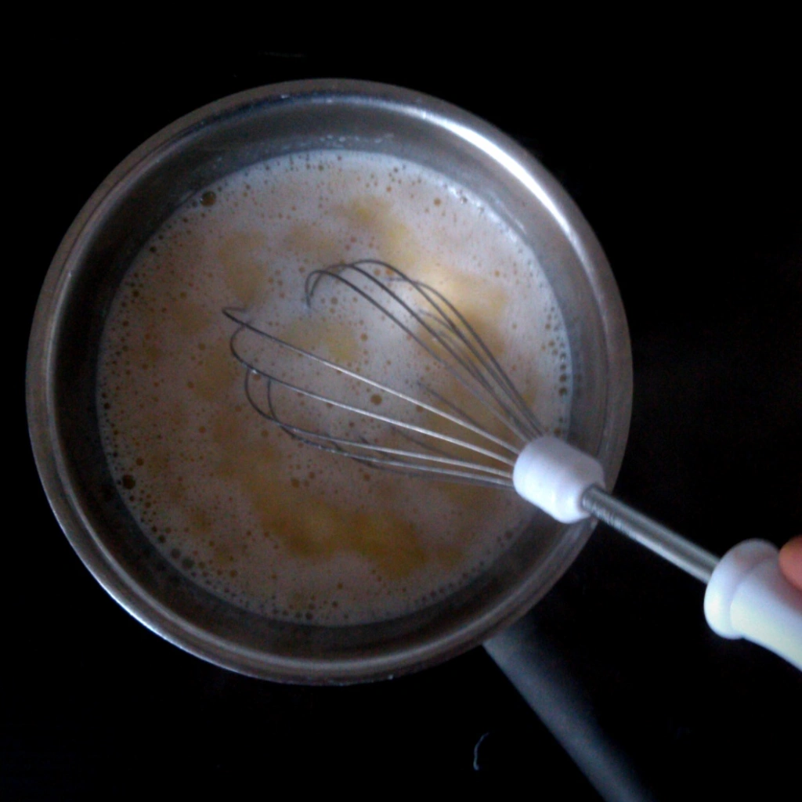
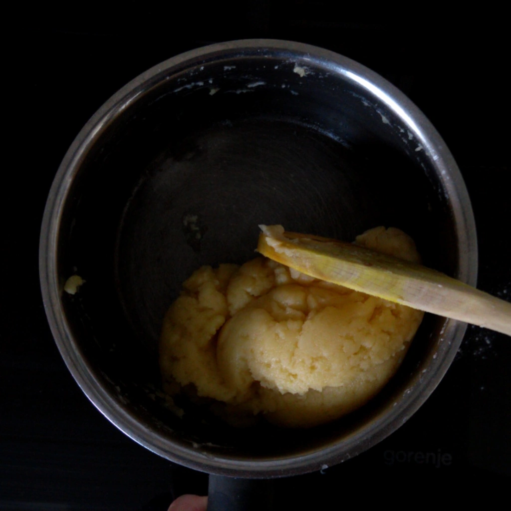
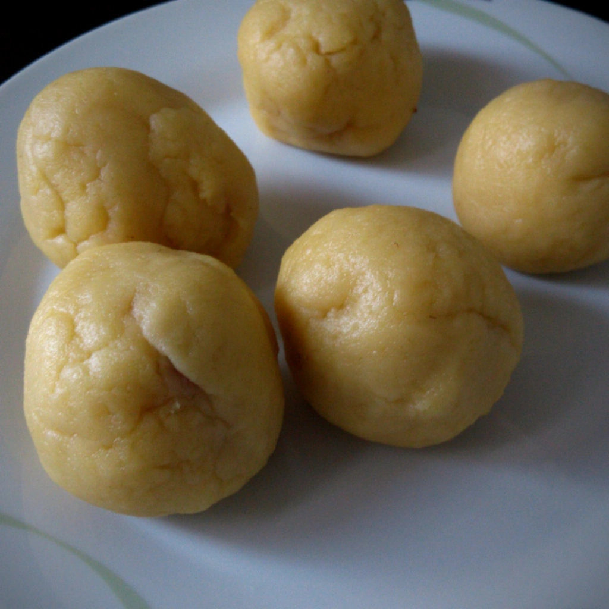

Zu meiner Jugendzeit hat meine Mutter für uns Kinder Knödel gefüllt mit Erdbeeren gemacht. Nun hatte ich letztens auf diese große Lust und so schaute ich nach einem Rezept, welches ich anpassen und modifizieren konnte. Das Rezept verdient noch ein Feinschliff, da die Knödel sehr zart sind und wenn man nicht aufpasst diese schnell zerfallen. Was brauchen wir:

## Zutaten
- 100 ml pflanzliche Milch
- 1 Geriebener Apfel
- 50g Margarine
- 180g Mehl
- 5 Erdbeeren
- 25g Kokosnuss Streusel
- 1 TL Zimt
- 4g Vanillin Zucker
- 25 g Semmelbrösel

Erhitzt die Milch, bis diese kocht, gibt dann die Margarine hinzu und rührt dies mit einem Schneebesen um. Sobald die Margarine zerlaufen ist, gibt ihr das Mehl hinzu und verrührt dies mit einem Holzlöffel, bis daraus ein Teig entstanden ist. Gebt den geriebenen Apfel hinzu und knetet diesen in den Teig hinein. Lasst den Teig etwas abkühlen und kocht in einem zweiten Topf Wasser auf.

Von dem Teig kann jetzt ein Stück abgerupft werden und mit einer Erdbeere eine Kugel geformt werden. Gebt dann die Knödel in das kochende Wasser, welche mindestens 15 Minuten darin baden sollen.

Währenddessen vermischt ihr die Kokosnuss Streusel, Semmelbrösel, Zimt und Vanillin Zucker und erhitzt dies sanft in einer Pfanne.

Sobald die Knödel soweit sind, können diese aus dem Wasser genommen werden und vorsichtig in der Pfanne gewälzt werden, bis diese rundum mit Streusel sind.

Wer noch will, kann 5 Erdbeeren, 4g Vanillin Zucker und 1 EL Löwenzahn Sirup oder Agaven Dicksaft mit einem Pürierstab zu seiner Soße verarbeiten, die über die noch heißen Knödel gegossen werden kann.
