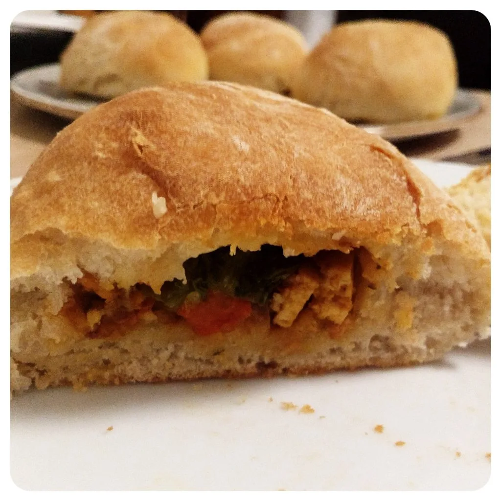
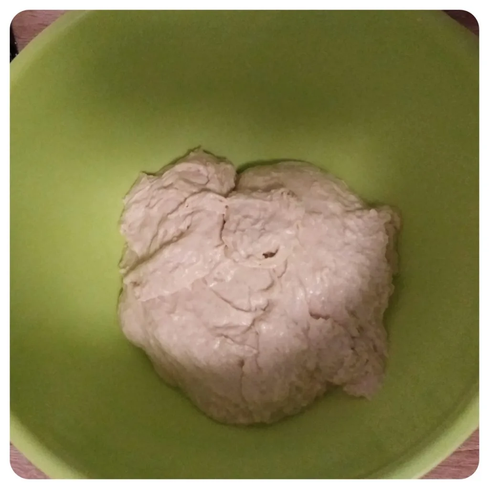
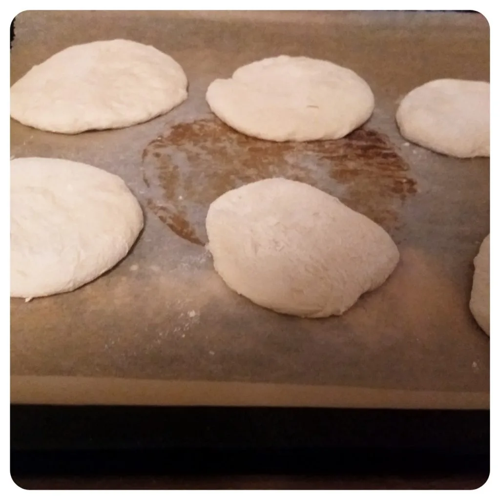
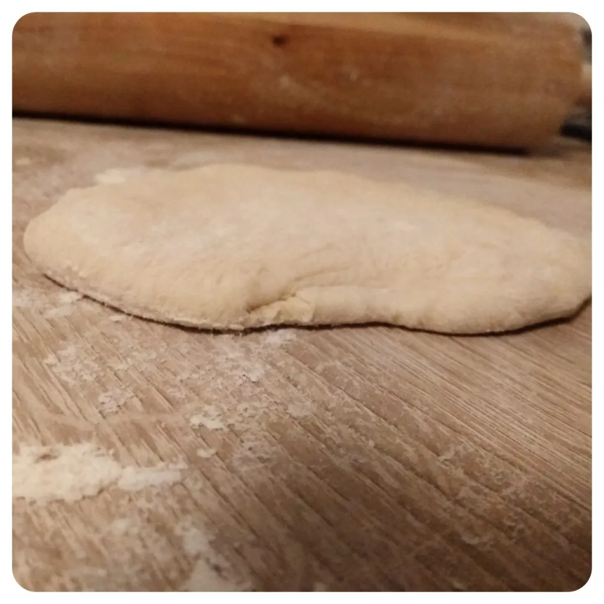
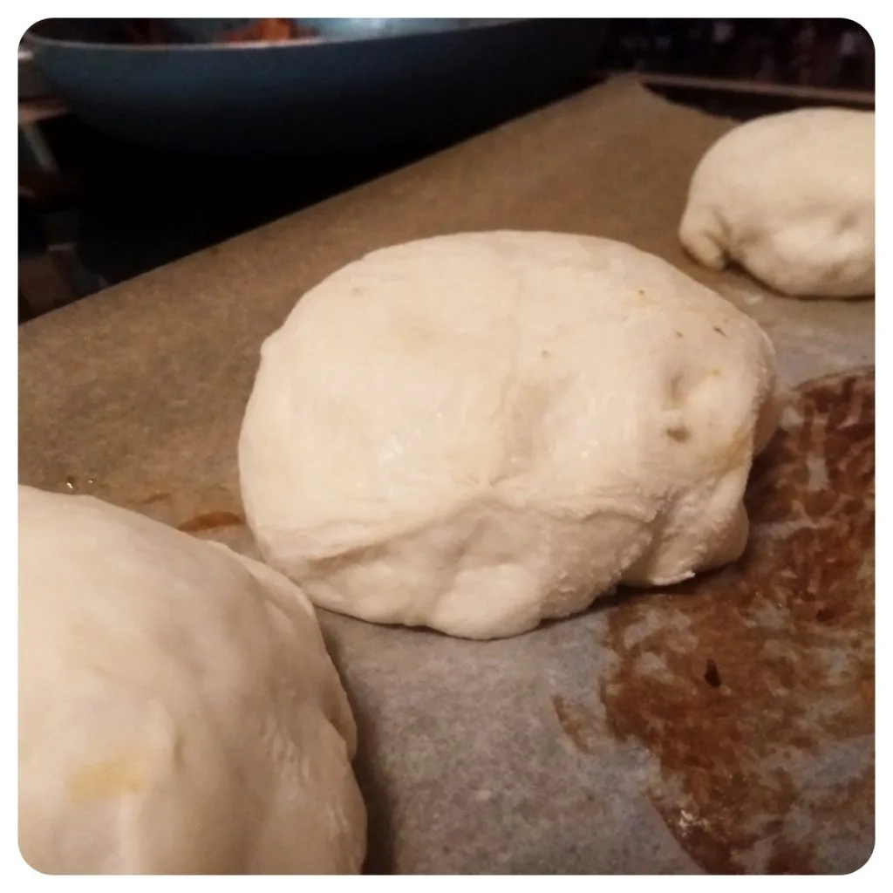
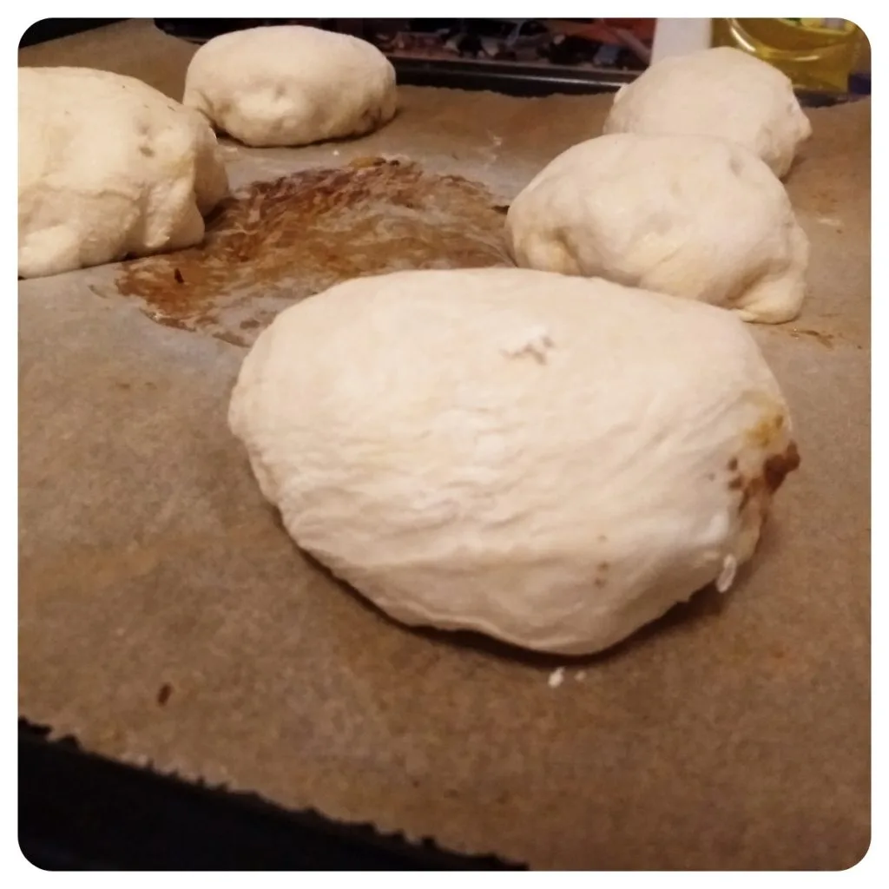
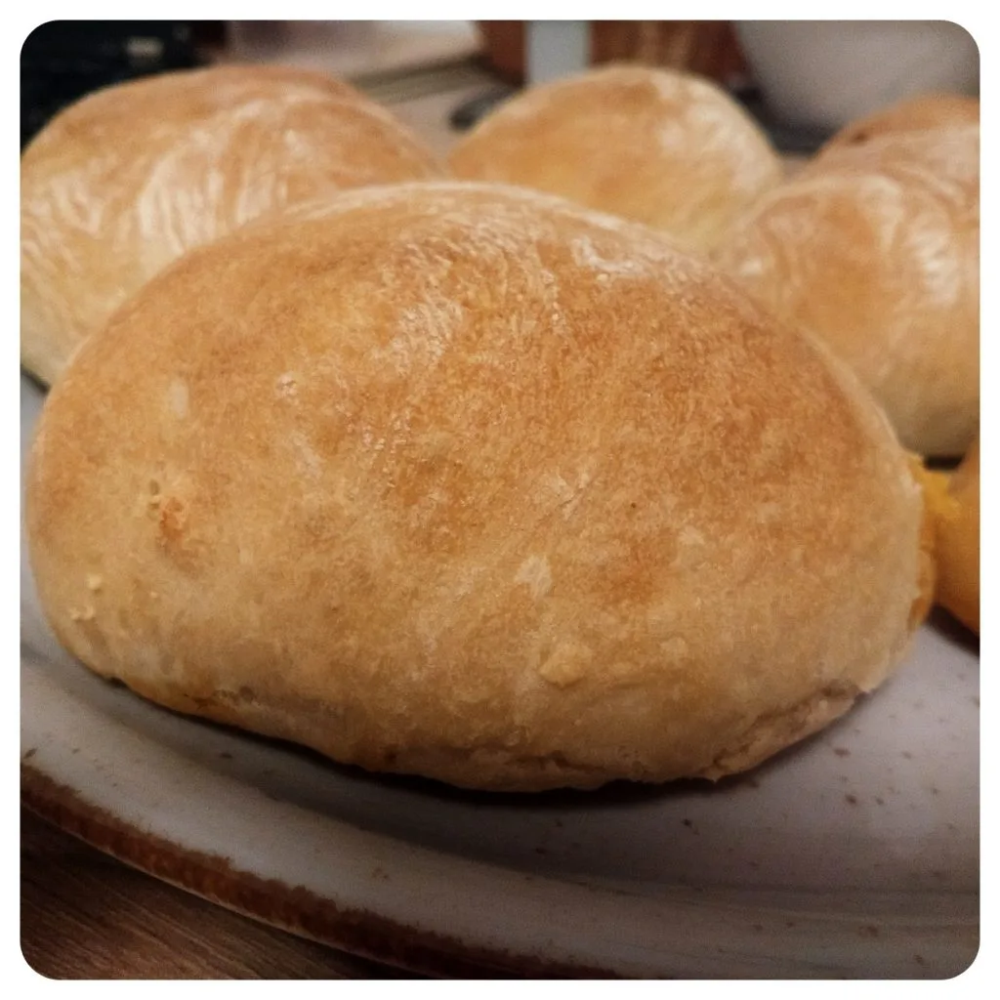
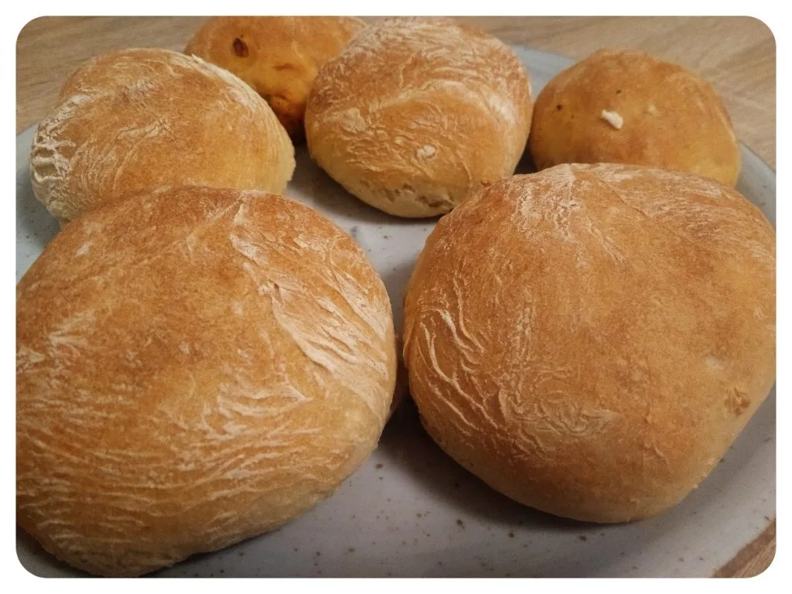
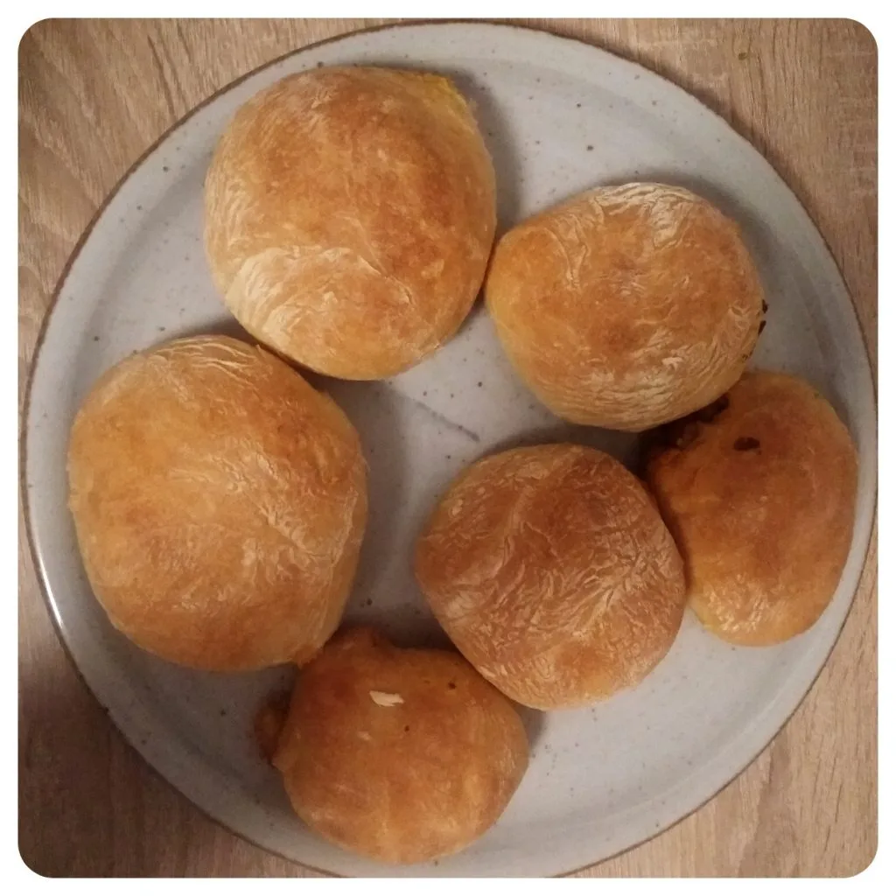

Letztens hatte ich einen großen Appetit auf etwas neues und was man aus der Hand essen kann. Also überlegte ich etwas hin und her bis ich mich dazu entschied Buns zu backen, welche ich dann mit vielen Leckereien und Schmelz fülle. Für Sechs Buns benötigt man: 

## Zutaten:
- 4g Trockenhefe
- 1 EL Rohrohrzucker
- 120 ml laufwarmes Wasser
- 170 ml laufwarme Pflanzenmilch
- 1 EL Sonnenblumenöl
- 1/2 TL Salz
- 200g Mehl Typ 550
- 150g Mehl Typ 405

Schüttet das Mehl Typ 550, Rohrrohrzucker, Hefe und Salz in eine Schüssel. Vermischt die trockenen Zutaten und kippt nun das Öl, gefolgt vom laufwarmen Wasser hinzu und verrührt es langsam zu einem Teig, währenddessen kann man die Pflanzenmilch hin zu schütten. Während des rühren das Mehl Typ 405 hinzugeben und den Teig circa 10 Minuten lang rühren. Den Teig lässt ihr daraufhin eine Stunde gehen.   

Den Teig mit Hilfe von Mehl aus der Schüssel lösen, indem man das Mehl unter den Teig bringt. Ich habe zur Hilfe einen Pfannenwender aus Holz genommen, dabei den Teig leicht angehoben, Mehl darunter gestreut und mit Hilfe des Pfannenwenders den Teig von der Schüssel gelöst.  

|||
::|::
|

Den Teig auf einer bemehlten Oberfläche ausrollen und Sechs gleich große Fladen schneiden. Diese kann man in der Mitte mit Käseschmelz bestreuen und nach Wahl belegen. Ich entschied mich für etwas Tofu mit Paprika, Zwiebeln, Kräutern, Cherrytomaten und etwas BBQ Sauce. Nun kann man den Rand über die Füllung klappen und damit die Buns schließen. Nun kann man den Ofen auf 190° Ober/Unterhitze vorheizen.

|||
::|::
|

Die Buns müssen für 25 Minuten in den vorgeheizten Ofen. Wenn die Buns eine schöne Farbe erhalten, können diese aus dem Ofen herausgeholt und serviert werden, denn man möchte diese auch noch Warm und Frisch genießen. Ich kann mir auch gut vorstellen, dass die Buns mit einer Tex-Mex Füllung ebenfalls prächtig munden würden.  

Lasst es euch schmecken.  

||||
::|::|::
||
