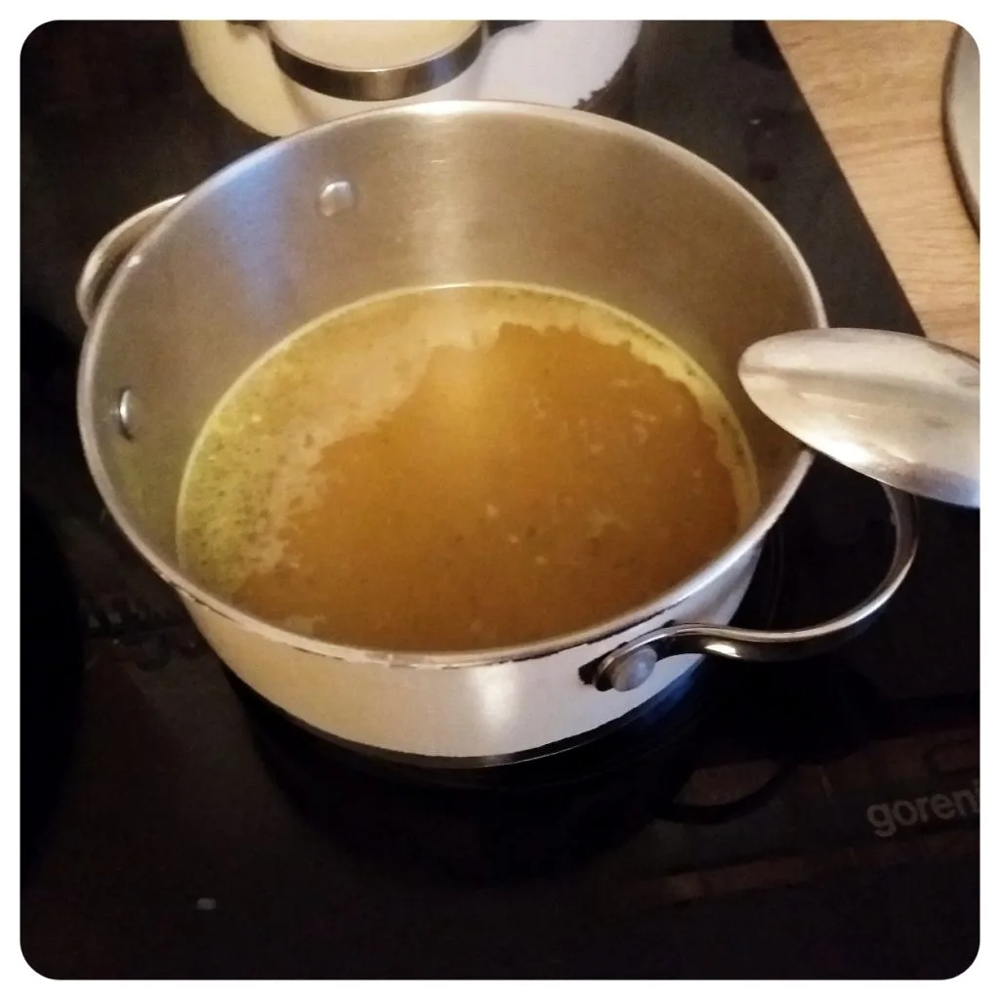
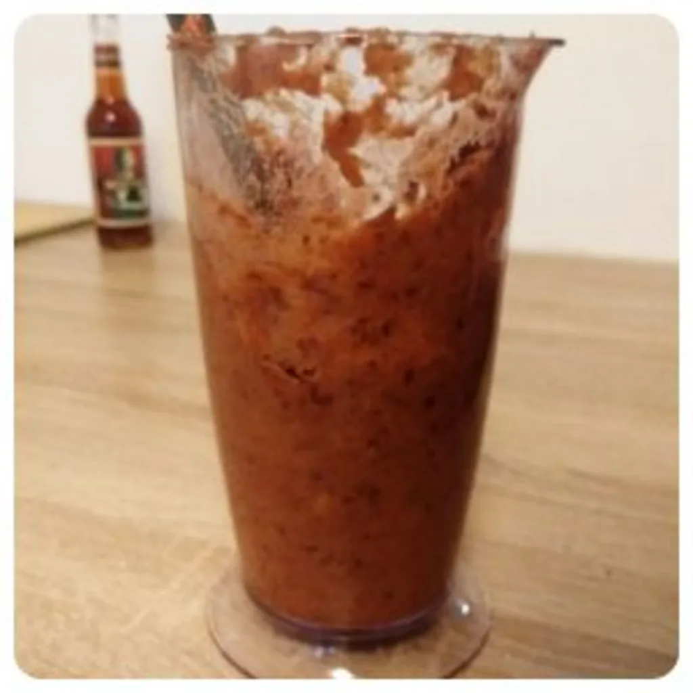
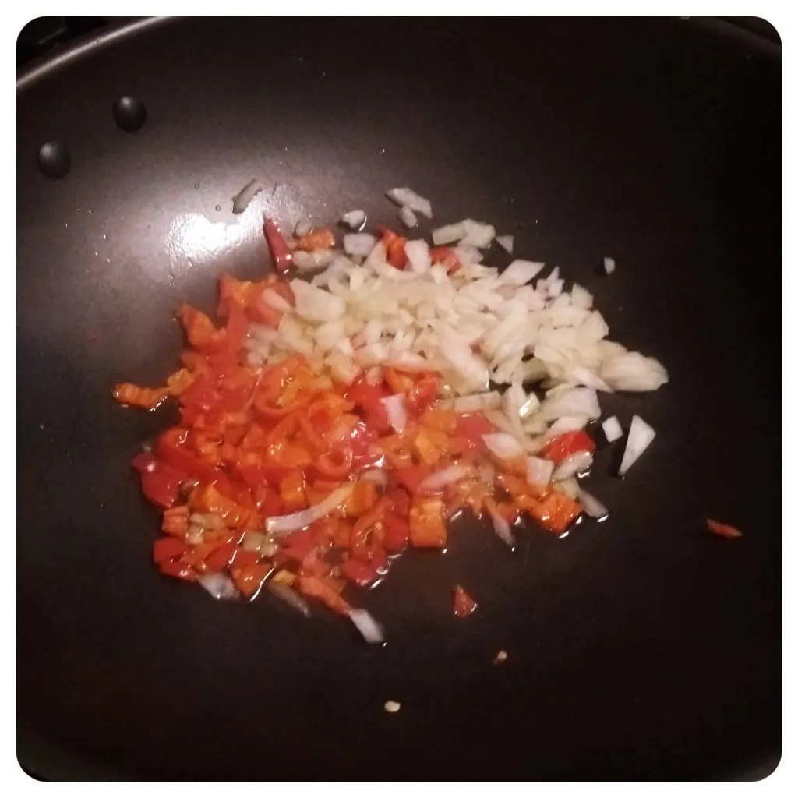
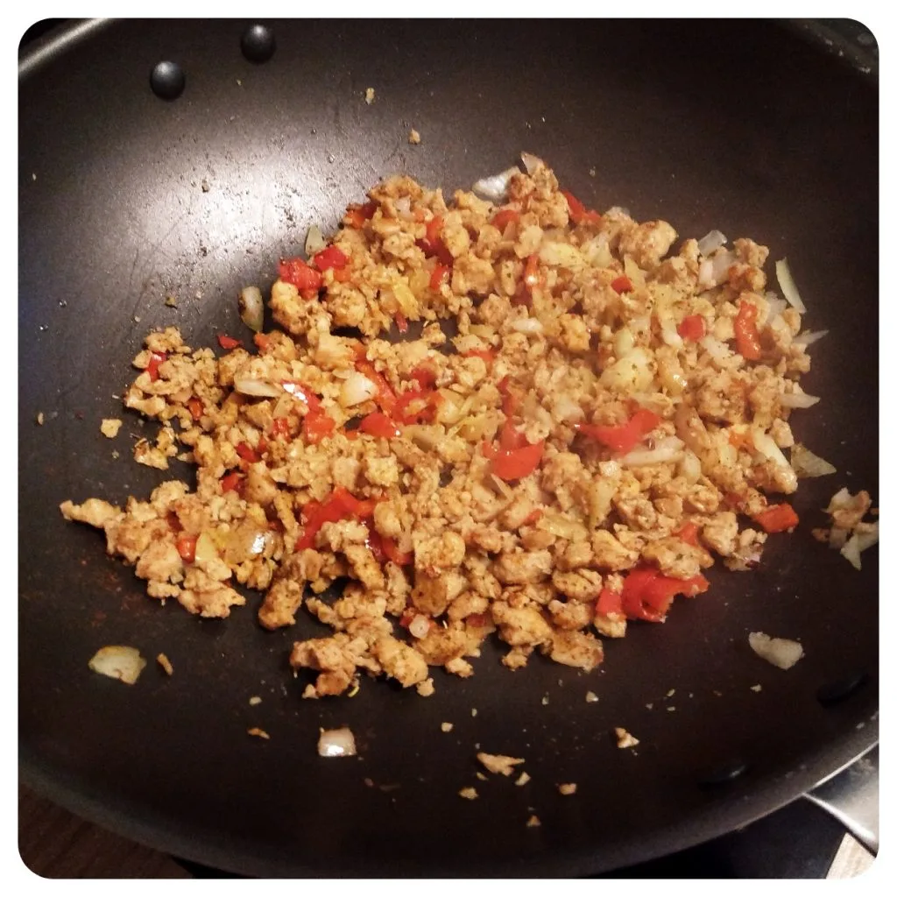

Ich musste letztens geöffnete Reste verarbeiten und war am überlegen, was man daraus machen kann. So entstand dann eine Sauce bolognese aus Tomaten, Mais und Roten Bohnen.

## Zutaten:

Für die Soße

- 285 g Mais
- 255 g Rote Bohnen
- Eine Handvoll Cherrytomaten
- 4 EL Tomatenmark
- Ein Schuss Zitronensaft
- Prise Salz

Für die Beigabe zur Soße

- 60g Grobes Soja
- 2 TL Gemüsebrühe
- 1 Spitzpaprika
- 1 Zwiebel

Setzt ein Topf mit ca. 250ml Wasser auf und bringt es zum kochen. Fügt 2 Teelöfel Gemüßebrühe hinzu und verührt das ganze. Nun gebt ihr die Grobe Soja zur Brühe hinzu, verrührt diese und wartet bis der Geschmack einzog, bzw. das Wasser sich im Topf leert.

Währen dessen kann man sich um die Soße kümmern, schaut aber nach der Soja, dass nicht alles gesamt verkocht ist und die Soja sich an den Topf anbrennt, gelegentlich etwas umrühren.

Mais und die Rote Bohnen (wenn aus der Dose) abtropfen lassen und  mit allen Zutaten in ein Behälter geben. Diese dann mit einen Stabmixer oder ähnlichen zerkleinern bis man kaum noch Stückchen hat.

|||
::|::
|

Währenddessen sollte auch die Soja fertig sein, nun muss man das ganze abtropfen lassen. Ich habe hierfür die Soja Stücke auf ein Zewa gekippt und ewas ausgedrückt. Während ich nun die Soja stehen lies, habe ich die Spitzpaprika und eine Zwiebel klein gehackt und in einer Pfanne mit etwas Öl angebraten.

Zur gleichen Zeit habe ich schon mal ein Topf mit dem Nudelwasser aufgesetzt und als die Zwiebel glasig wurden, gab ich die Soja hinzu und lies es anbraten bin es bräunlich wurde.

Daraufhin folgte die Soße aus dem Behältnis und 0,3 L Wasser. Das ganze wurde nur noch verrührt und mit Gewürzen nach bedarf fein abgeschmeckt. Ich gab in diesem Fall noch etwas frisch gemahlene Chili hinzu und etwas Thymian. Das ganze wurde dann auf einer kleiner Stufe geköchelt, bis die Sauce bolognese eine Konsitenz erreichte, welche mir zusagte. Ich hoffe ihr habt währenddessen die Nudeln nicht vergessen und schon vorbereitet. Soße über die Nudeln und mit etwas Grünzeug dekorieren und dann ist nur noch eins zu erwähnen:

Smacznego (polnisch für Mahlzeit)
