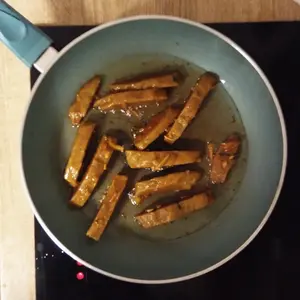

Etwas aufwendig, aber sehr lecker: Gebratene Nudeln mit Erdnusssoße und Fleischersatz. Hierzu wird ein Dampfkorb benötigt.

<!-- more -->

## Zutaten für den Fleischersatz:

- 100g Weizenmehl
- 1EL Gemüsebrühe
- 1EL Steakgewürzmischung
- 1TL Paprikapulver
- 1 Prise Salz
- 50ml Wasser

## Zutaten Marinade

- 1/2 Zwiebel
- 2 Knoblauchzehen
- 1 Prise Salz
- etwas Pfeffer
- 2 EL Soja Soße
- 1 EL Pflanzenöl
- 1 EL Petersilie (oder auch andere Kräuter nach wahl)

## Zutaten Erdnusssoße

- 50ml ungesalzene Erdnüsse
- 1 EL Pflanzenöl
- 1 EL Mehl
- 125ml Soja Kochcreme
- Schuss Sojasoße

## Liste an Gemüse zum Anbraten

- 1 Paprika
- 1/2 Kohlrabi
- 1 Möhre
- 1/2 Zwiebel
- 1 Chili (Optional)
- Bambussprossen

Im Grunde ist das gewählte Gemüse egal. Ich habe das genommen, was vorhanden war und ich kann mir auch vorstellen, dass manchen ebenso Pilze hierzu schmecken würden.

|||
:----:|:----:
|

Für den Fleischersatz, werden die trockenen Zutaten vermischt, dann kommen die 50 ml Wasser hinzu und das Ganze wird zu einem Leib geknetet. Bedeckt den Leib mit Wasser und lasst es für eine Stunde stehen. Nach der einen Stunde, schüttet ihr das Wasser aus und bedeckt den Leib mit frischen Wasser. Nun lasst ihr das ganze für eine halbe Stunde stehen und schüttet danach erneut das Wasser aus. Knetet, drückt und zieht den Teig und wascht diesen aus. Dies wiederholt ihr noch ein oder zweimal. Bringt Wasser in einem Topf zu kochen und stellt darauf den Dampfkorb. In den Dampfkorb legt ihr den ausgewaschenen Teig und lässt diesen für 30 Minuten garen. Nach 30 Minuten soll der Teig gewendet werden. In der Zwischenzeit kann eine Marinade nach Wahl zubereitet werden.

||||
:---:|:----:|:----:
||

Die Zwiebel wird gewürfelt und der Knoblauch klein gehackt. Alle Zutaten werden in ein Behälter vermischt. Für einen fruchtigen Geschmack, kann man noch ein 1 TL Tomatenmark hinzugeben.

Sobald die Stunde vorbei ist, kann unser Fleischersatz aus dem Dampfkorb raus und in Streifen geschnitten werden. Diese kommen dann in die Marinade für mindestens eine Stunde. Ich habe diese in eine Box gelegt, damit ich diese jede 15 Minuten einmal schütteln kann und sich die Marinade gut verteilt. Es schadet auch nicht, wenn etwas Wasser hinzukommt, damit mehr vom ganzen bedeckt ist.

Während wir unser Fleischersatz ziehen lassen, können wir 50ml Erdnüsse mit einem Esslöffel Öl mittels einen Stabmixer pürieren. Die Erdnussmasse brauchen wir erst wieder, sobald wir unser Fleischersatz angebraten haben. Wir können aber in der Zwischenzeit die Zwiebel, Paprika und Chili klein, sowie die Möhre in dünne Streifen schneiden und das Wasser für 200g Reisnudeln zum Kochen bringen. Alternativ kann man auch Reis nehmen.

||||
:----:|:----:|:----:
||

Nun brauchen wir etwas Öl in einer Pfanne, damit wir unser Fleischersatz von zwei Seiten anbraten können. Dadurch erhalten wir oben und unten eine angenehme Kruste. Die fertigen Stücke lege ich in eine Auflaufform und gebe diese in einen auf 150 Grad vorgeheizten Ofen. Die Stücke bleiben dort für 20 Minuten.

In das Öl, im welchen wir gerade noch gebraten haben, geben wir den einen Esslöffel Mehl und verrühren dies mit einem Schneebesen. Nun geben wir die Kochcreme hinzu und danach die Erdnusspaste. Rührt das ganze mit dem Schneebesen und gebt einen Schuss Sojasoße hinzu. Lasst die Soße auf kleiner Pfanne köcheln und rührt dies gelegentlich um.

||||
:----:|:----:|:----:|
||

Bratet die Zwiebel, bis diese glasig sind und gebt nach und nach Paprika, Kohlrabi, Chili und Möhren hinzu. Zum Schluss kommen die Bambussprossen.

Falls der Ofen eine Grillfunktion hat, kann unser Fleischersatz für maximal fünf Minuten an gegrillt werden. Portioniert die Nudeln und Gemüse auf ein Teller, legt den Fleischersatz darauf und gebt etwas Erdnusssoße hinzu.

|||
::|::
|
