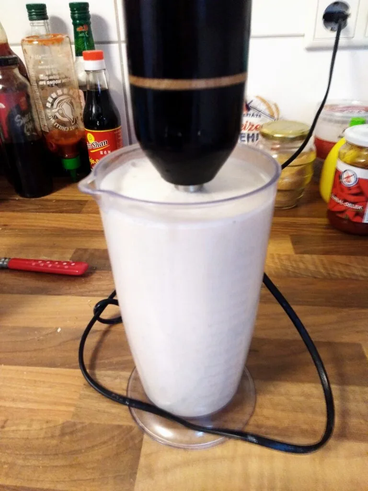

Da mich der Verpackungsmüll der (Hafer)Milch nervte, entschied ich mich Hafermilch selber anzufertigen. Als **Zutaten** benötigt man

- 100ml zarte Haferflocken
- 1 gestrichener TL Salz
- Prise Rohrohrzucker
- 1 TL grüne Erbsen
- 1 EL Pflanzenöl
- 1 L kaltes Wasser

Nun gibt es zwei Möglichkeiten die Milch zuzubereiten:

### Auf die schnelle

Die Haferflocken, Rohrohrzucker und Salz im Wasser für mindestens 10 Minuten in etwas Wasser einweichen, danach das Öl und die Erbsen hinzugeben. _(Sollten es sich, wie in meinen Fall, um trocken Erbsen halten, weicht diese ebenfalls ein und trennt diese vom Wasser, bevor ihr sie zu den Haferflocken gebt)_. Jetzt werden mit einem Mixer die Zutaten püriert. Sobald es etwas schäumt, kommt während des Mixens langsam das kalte Wasser hinzu. Danach kann es durch einen Nussmilchbeutel oder ein dünnes Geschirrtuch in ein Behältnis gepresst werden. Alternativ tut es auch ein Sieb. Beim Sieb trennt ihr zuerst die Flüssigkeit von der festen Masse. Die Masse wird ins Sieb geschüttet, die Flüssigkeit darüber gegossen und mit einem Löffel gepresst.

### Über Nacht

Weicht die Haferflocken über Nacht mit Öl, Salz und Zucker ein. Sollte es sich bei den grünen Erbsen um trocken gelagerte sein, weicht diese ebenfalls ein. Am nächsten Tag gebt ihr die gequollene Masse in einen Nussmilchbeutel oder einem dünnen Geschirrtuch, gebt etwas Wasser hinzu und presst die Flüssigkeit aus der Masse. Das wiederholt ihr solange, bis ihr einen Liter Hafermilch habt.
