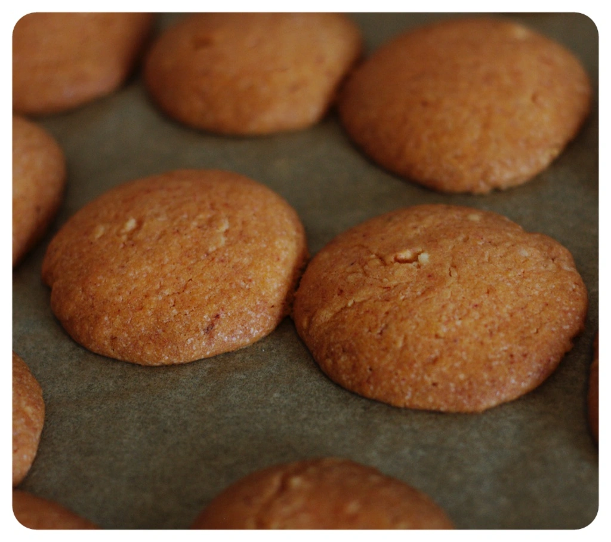

Diese Kekse sind nicht anders, wie die Monster Kekse. Das Grundrezept ist das selbe, es unterscheidet sich nur am geringeren Aufwand beim backen. Der Mehr Aufwand war das malen gewesen.

Zutaten:

- 200 g Mehl
- 100 g Margarine
- 80 g Zucker
- 16 g Vanillezucker
- Messerspitze Backpulver
- Prise Salz
- 4 El Sojamilch
- Lebensmittelfarbe (in diesem Fall Orange)
- Nuss-Nougat Creme

Alle Zutaten, bis auf die Nuss-Nougat Creme, zusammen mischen und rühren. Danach kleine Stücke aus dem Teig zupfen und auf ein mit Backpapier ausgelegten Backblech legen. Das Blech in ein, auf 165 Grad Ober- und Unterhitze, vorgeheizten Ofen schieben und warten bis die Kekse nach ca. 25-30 Minuten fertig sind.

 

Daraufhin kann man Ein bis Zwei Teelöffel der Nuss-Nougat Creme in eine Schalle geben und z.B. in einer Mikrowelle für 30 Sekunden erhitzen, bis die Creme sich leicht verflüssigt, somit man die Kekse mit verschiedenen Motiven bepinseln kann.
