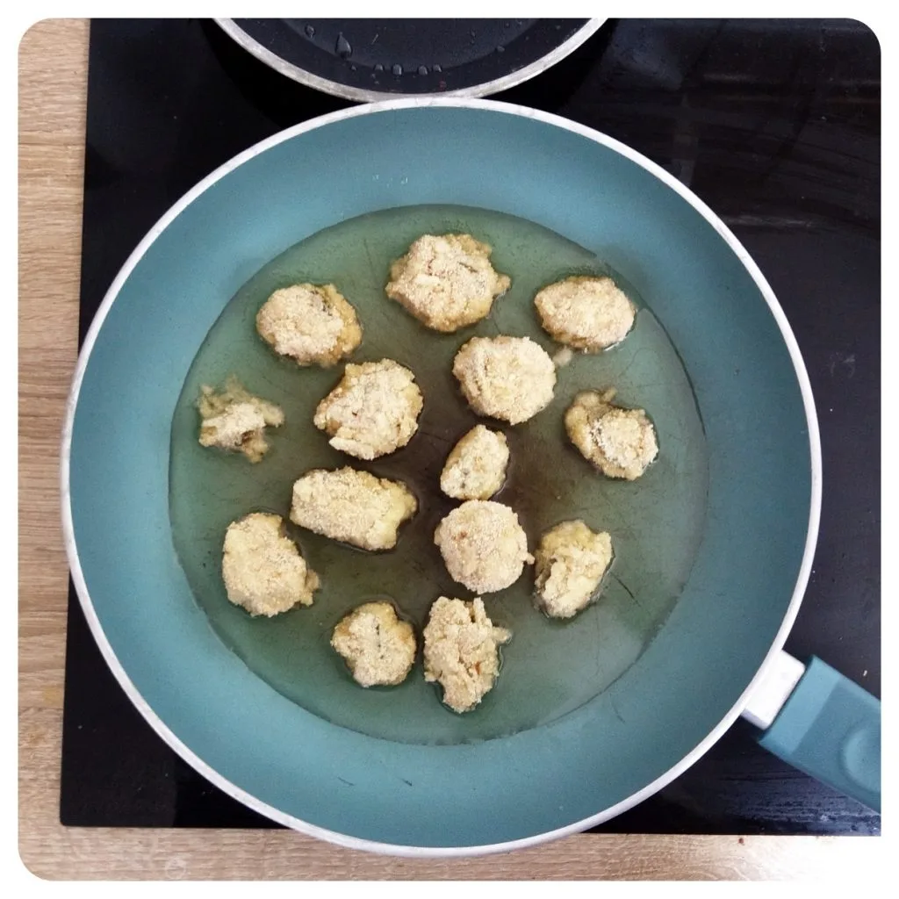

Lange ist es her, dass ich ein Rezept niederschrieb oder etwas Neues ausprobiert habe. Langsam legt sich mein Umzug und ich finde wieder Zeit mich mit dem Kochen und Backen auseinander zu setzen.

Dieses Mal wollte ich Jalapeño-Cheese-Nuggets machen. Es erwies sich als etwas schwierig den Schmelz mit den Jalapeños zu einer Kugel zu formen. Bemehlte Hände waren hierbei eine große Hilfe.

Zu den Nuggets habe ich Bratkartoffeln und Tomaten Bratlinge zu bereitet. Um den Geschmack abzurunden, habe ich auf die Schnelle ein BBQ-Tomaten Dip zubereitet.

## Zutaten

- Jalapeños
- Mehl
- Pflanzenmilch
- Paprikapulver
- Chiligewürz
- Paniermehl
- Schmelz
- Öl

Den Schmelz/Käseersatz klein reiben. Falls bereits geriebener Schmelz benutzt wird, diesen noch etwas nach hacken. Damit das geriebene Schmelz an den Jalapeños hält, mischt etwas Mehl, Chiligewürz, Paprikapulver und Pflanzenmilch zusammen, bis wir eine leicht dicke Flüssigkeit haben. Darin tunken wir eine Scheibe Jalapeño, nehmen etwas schmelz in die Hand, legen darin die Scheibe Jalapeño und formen eine Kugel daraus. Diese Kugel tunken wir wieder in die Flüssigkeit und rollen diese im Paniermehl. Danach können die Nuggets in eine erhitzte Pfanne mit Öl kurz von beiden Seiten angebraten (wie man es meinen Bildern entnehmen kann, habe ich die Nuggets etwas zu lange in der Pfanne liegen gelassen).

|||
::|::
|

Für den BBQ Dip, nahm ich ein Senf Glas und fühlte dieses zur Hälfte mit Tomatenmark, dazu gab ich ein Esslöffel Soja Soße, ein Esslöffel Agavendicksaft, ein Schuss Öl und füllte es etwas mit der Flüssigkeit der eingelegten Jalapeños, für den Geschmack, auf. Deckel darauf und schütteln. Mit Tomatenmark und Wasser kann man die Konsistenz des Dips beeinflussen.

Hierzu passen gut Bratkartoffeln. Diese kann man nach eigenen belieben zu bereiten. Da ich noch Tomaten Bratlinge zubereitete, hatte ich kein Platz mehr auf dem Herd und wich auf den Backofen aus. Einfach die Kartoffel, schälen, in Scheiben schneiden und auf mit Backpapier bestückten Backblech legen. Diese in ein mit 150 Grad vorgeheizten Ofen mit Umluft legen und nach gewünschten Bräunungsgrad herausholen und nach Belieben würzen. Für ein Experiment nach Freischnauze war ich sehr zufrieden mit dem Ergebnis. Lasst es euch schmecken.  

||||
::|::|::
||
