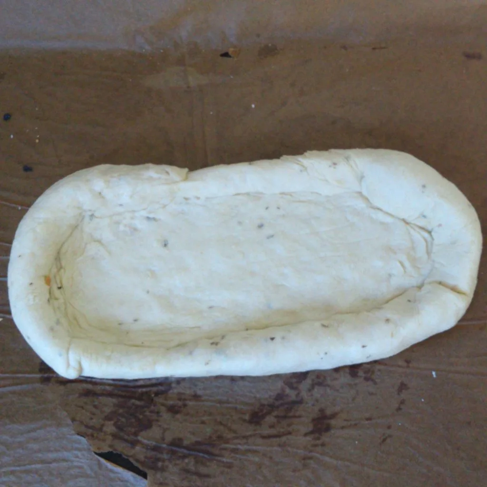
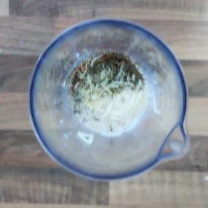

Ich hätte es auch Käseboot nennen können, weil es ähnlich wie Käsebrot klingt. Aber was ist das? Im Grunde ist es doch nur eine Pizza, mit flüssiger Käsefüllung. Es ist wirklich schnell gemacht und es ist sehr einfach.

Was wir hierfür benötigen?  

## Zutaten Teig:
160 Gramm Mehl  
2 TL Backpulver  
100 ML Pflanzenmilch  
Prise Salz  
1 TL gestrichen Knoblauch Granulat (Optional)  
2 EL Oliven Öl  

## Zutaten Füllung:
90 Gramm Käse  
100 ML Pflanzenmilch  
1 TL Paprikapulver  
2 TL Oregano  
2 TL Thymian  
2 TL Majoran  

## Zutaten Belag:
1 EL Tomatenmark  
1 Scheibe vegetarischen Aufschnitt  
Röstzwiebel

Heizt euren Ofen auf 250 Grad Ober- und Unterhitze vor.  
Während der Ofen sich vorbereitet, vermischt alle trockenen Zutaten für den Teig, gebt das Öl hinzu und gießt langsam die Pflanzenmilch zu den trockenen Zutaten. Vermischt alles und knetet den Teig zu einer Kugel. Rollt diese dann dünn auf einem Backblech aus. Danach rollt ihr den Rand zusammen, bis ihr eine Wanne mit dem Durchmesser eines Tellers erhaltet.

Weiter geht es mit der Füllung. Alle Zutaten mit einem Stabmixer, in einem hohen Behältnis (z.B. Messbecher), zu einer dickflüssigen Soße vermischen.

|||
::|::
|

Nun bestreicht das innere des Teiges mit Tomatenmarkt, gießt die Füllung in die Teigwanne und belegt es nach Belieben, zum Beispiel wie ich mit Aufschnitt. Stellt das Blech auf mittlerer Schiene für 15 Minuten in den Ofen. Sobald der Teig Goldbraun ist, kann das Schiffchen auch schon raus. Lasst die Füllung leicht abkühlen und lasst es schmecken.
