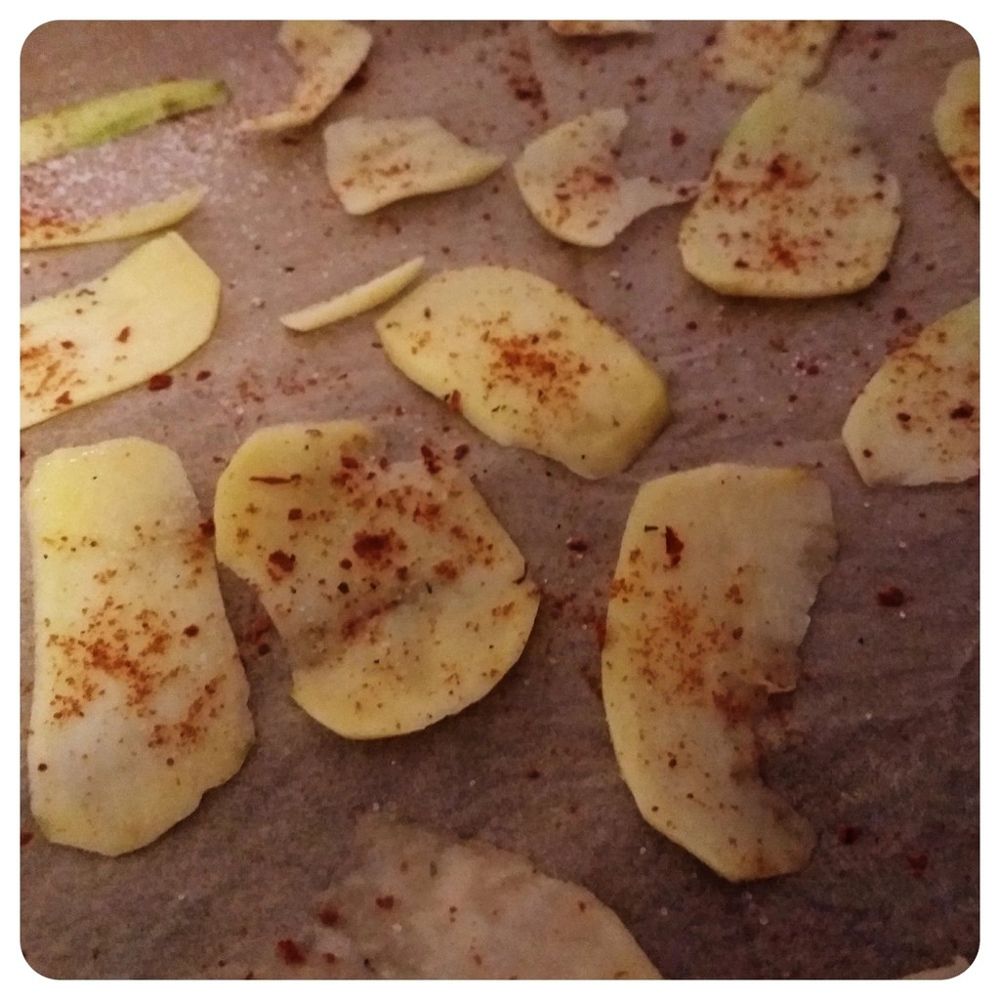
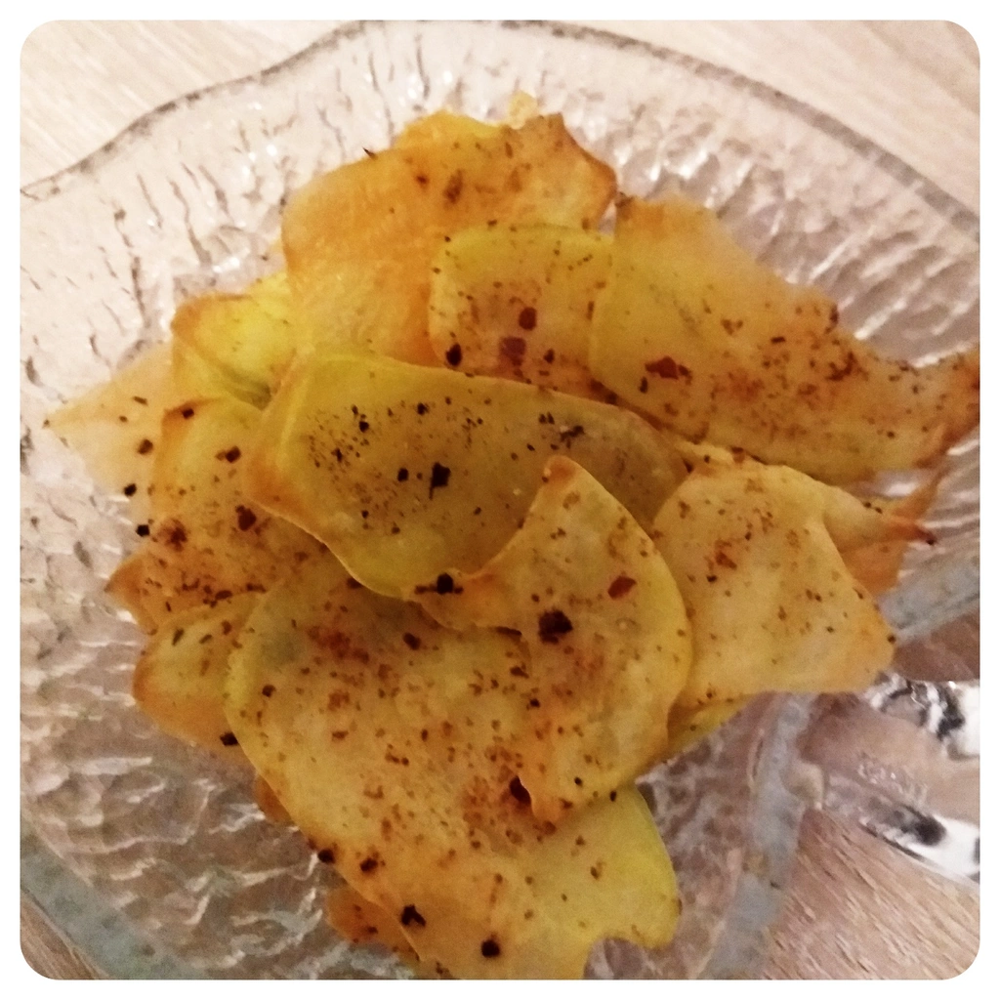

Falls zum Daddel- oder dem Filmeabend die Snacks vergessen wurden und die Geschäfte auch bereits schlossen, kann man sehr einfach und schnell Kartoffelchips selber machen. Heizt den Ofen auf 220 Grad mit Ober- und Unterhitze auf und schält eine Anzahl an Kartoffeln, die ihr verarbeiten wollt. Für mich reichten Zwei kleine Kartoffeln. Mit dem Sparschäler zieht man sich dünne Scheiben ab und legt diese auf ein mit Backpapier belegtes Backblech. Würzung nach Wunsch, zum Beispiel mit etwas Salz, Paprikapulver und in meinen Fall Chili. Die Chips in den Ofen schieben und warten bis die Goldbraun werden. Zackfeddich. Chips.

