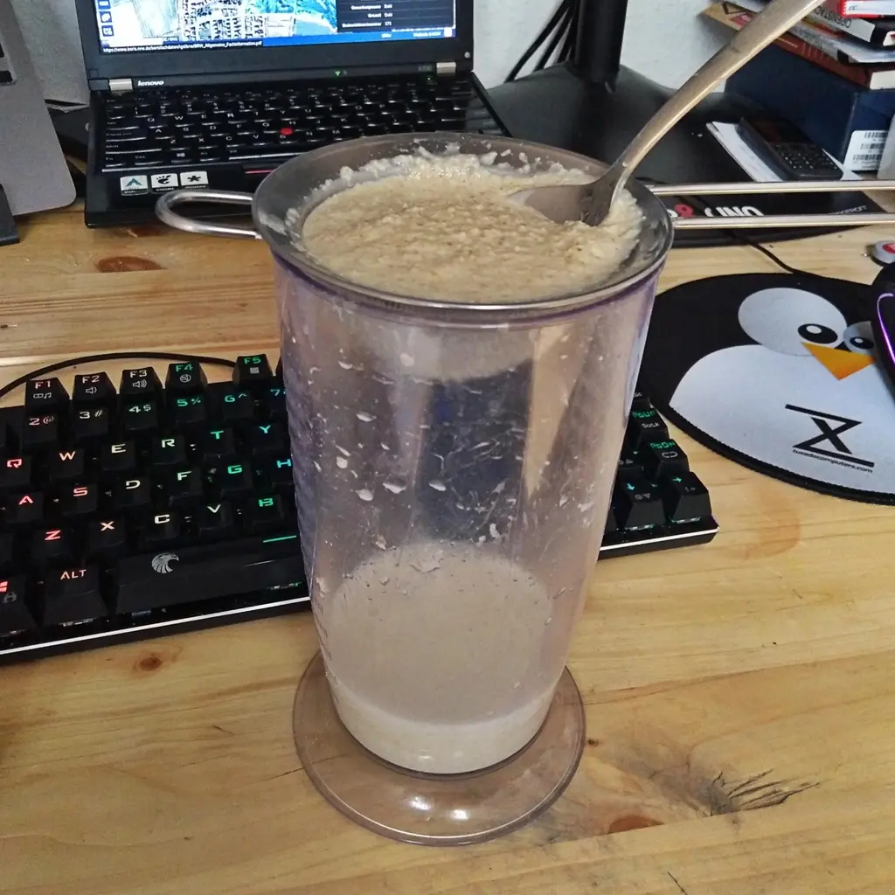
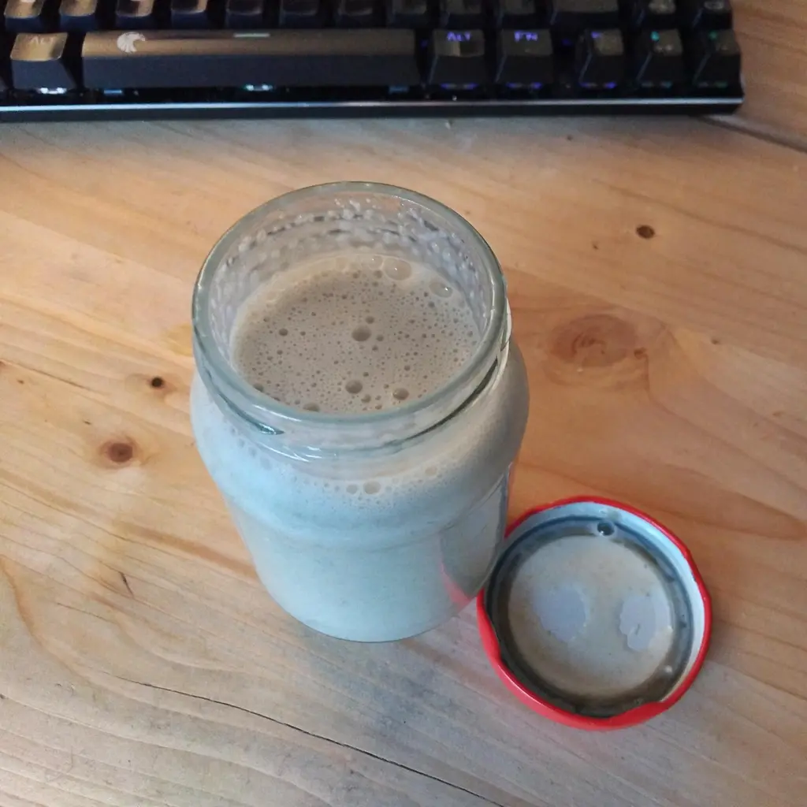

Letztens habe ich mich gefragt, was ich aus den Resten der Produktion der [Hafermilch](/articles/hafermilch-2022-01-29) mache. Ich meine damit den Brei, welcher übrig bleibt. So habe ich den Brei genommen, mit Wasser bedeckt, noch etwas frischen Hafer dazu getan und ziehen lassen. Danach wurde das ganze mit einem Mixer püriert und in ein Sieb gelegt. Mit der kontinuierlichen Zugabe von klein wenig Wasser wurde mithilfe eines Löffels, eine dickere Flüssigkeit herausgepresst. Daraus erhalte ich etwa 250ml Kochcreme, welche ich in den folge Tagen in meine Speisen weiter verarbeite.

Die Kochcreme benutze ich zum Beispiel in Verbindung mit Schmelz, welcher nicht so gut schmilzt (ich schaue auf dich, billiger Käseersatz aus dem Lidl!). Diese kann auch für scrambled Tofu benutzt werden, falls man auf Joghurt verzichten möchte, aber auch zum andicken von Soßen.

