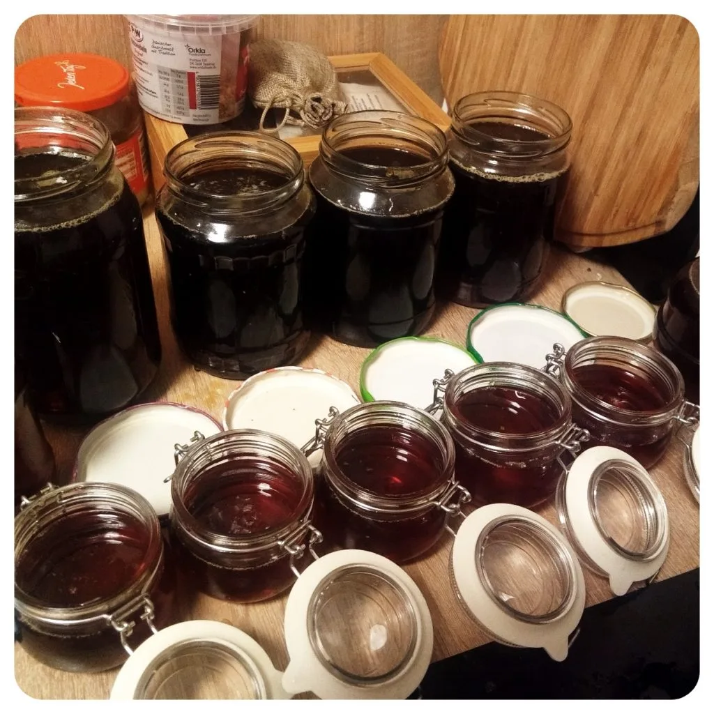
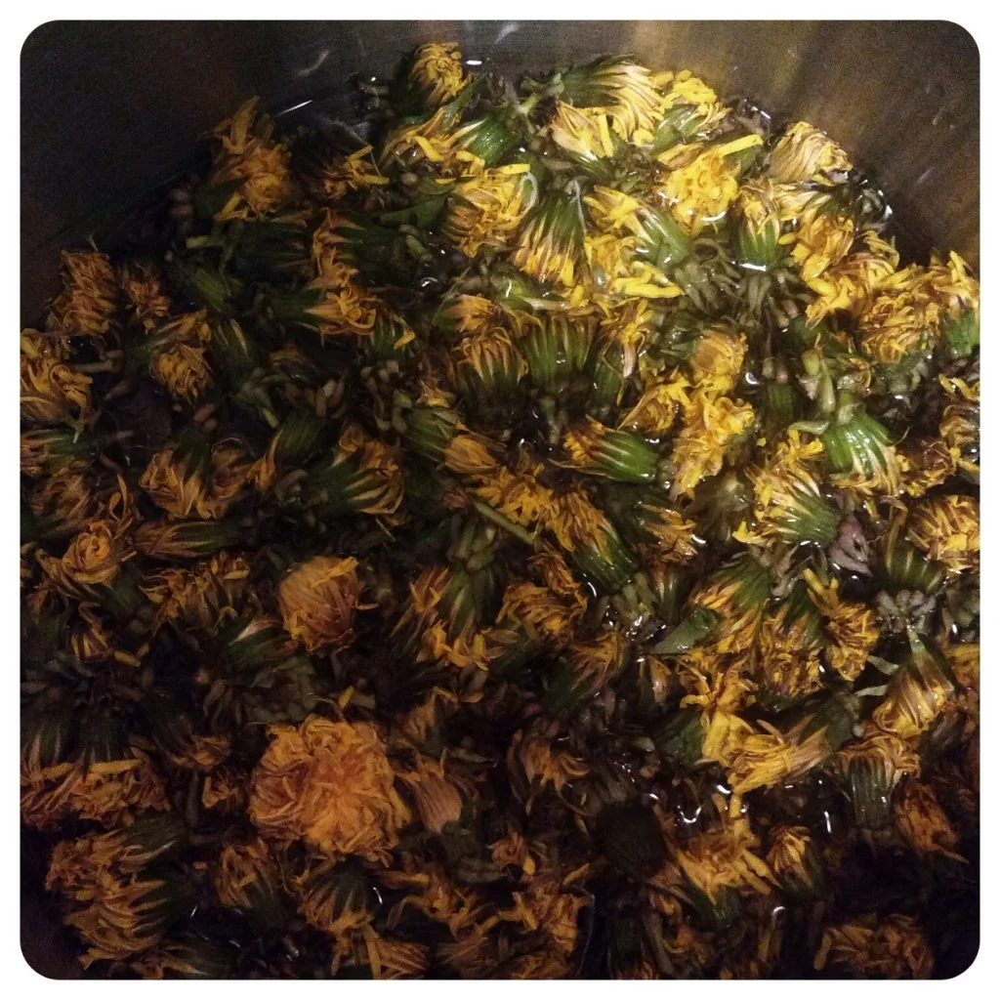
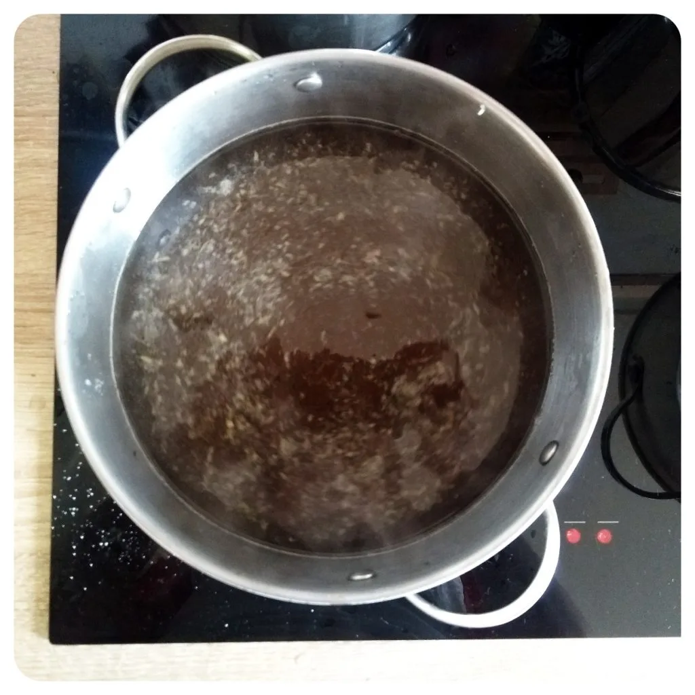
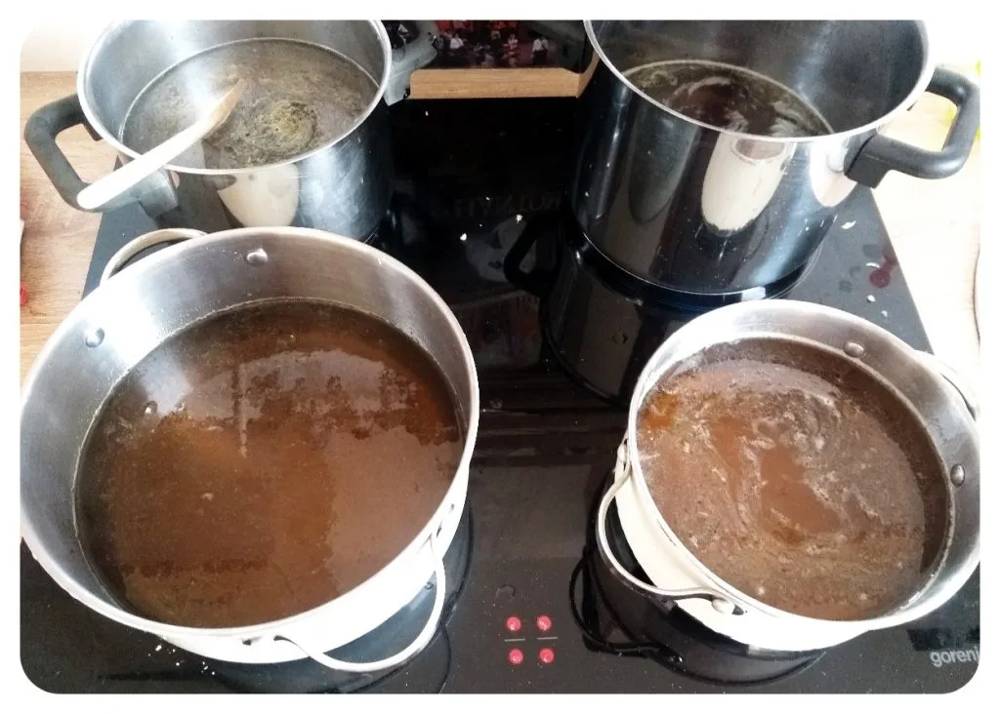
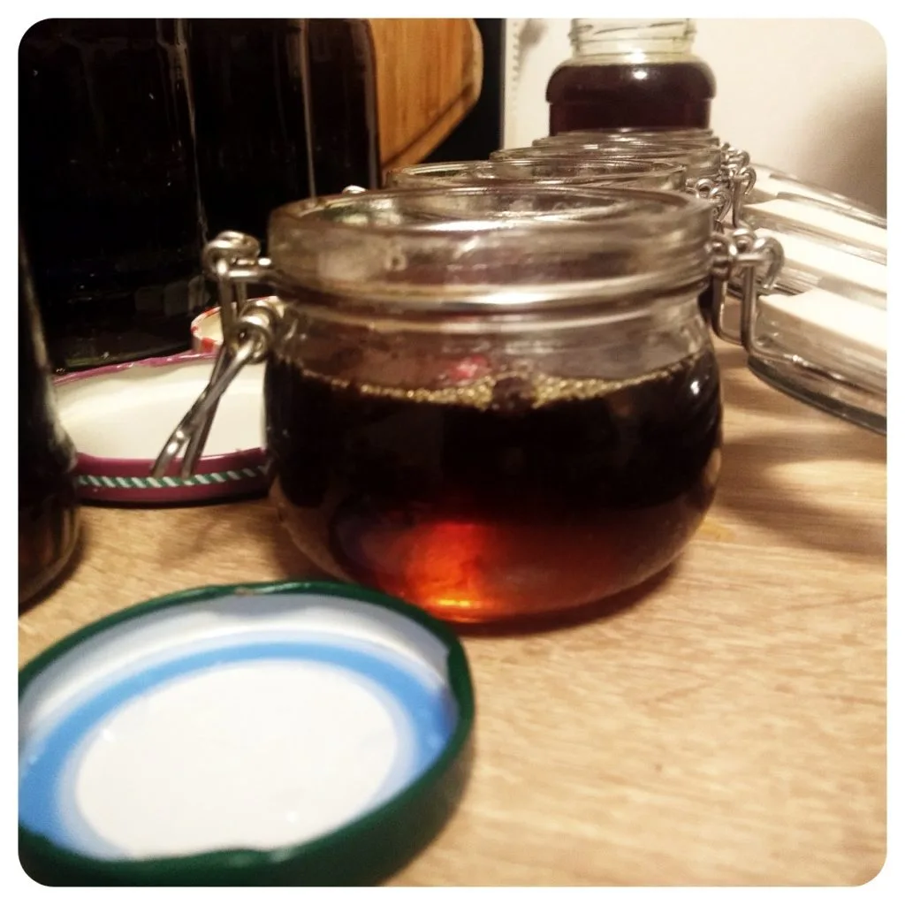

Draußen wird es wieder wärmer, die Sonne scheint länger und auf den Wiesen blühen wieder einige Pflanzen, so auch der Löwenzahn. Diesen kann man auch super verarbeiten, um einen süßen aufstrich auf Brot und Brötchen zu benutzen oder auch als Basis für ein köstlichen veganen Honig-Senf Dressing für Salate. Gerne gebe ich mir auch ein Teelöffel zum Joghurt-Müsli, oder lasse es zu Met gären. Für die Zubereitung benötigt man nicht viel, nur: 

## Zutaten
- 200g Löwenzahn bzw. Drei Handvoll (ohne Stängel, nur die Köpfe) 
- 1 L Wasser 
- 1KG Zucker  
- ½ Zitrone 

Säubert sanft den Löwenzahn und gebt diesen in einen Topf mit 1 Liter Wasser. Bedeckt diesen mit einem Deckel und lasst es für mindestens Zwei Stunden ziehen.  

Nach diesen Zwei Stunden bringt ihr das Wasser zum Kochen. Sobald das Wasser kocht, stellt die Flamme runter. Lasst es auf der Resthitze für Zehn Stunden abkühlen und ziehen.  

Siebt den Löwenzahn aus dem Wasser, gebt den Zucker hinzu und reibt die Schalle der Zitrone in die Flüssigkeit, presst danach den Saft der Zitrone aus und bringt das Wasser wieder zum Kochen und verrührt dabei die Zutaten. Sobald das Wasser kocht stellt ihr auf eine kleine Flamme um, so dass der Sirup die nächsten ca. Sechs Stunden sanft vor sich her köchelt. Rührt gelegentlich die Flüssigkeit um. Ihr könnt prüfen ob der Sirup fertig ist, wenn ihr etwas aus dem Topf auf einen Teller abkühlen lässt und dieser dann zwischen den Fingern Fäden zieht. Falls dieser noch sehr hell oder flüssig sein sollte, einfach weiter köcheln lassen. 

|||
::|::
| 

Wenn der Löwenzahnsirup fertig ist, mit Hilfe eines Siebes in Einmachglas umgießen und abkühlen lassen. Das war es auch schon. Lasst es euch schmecken, was auch immer ihr damit machen wollt. 

