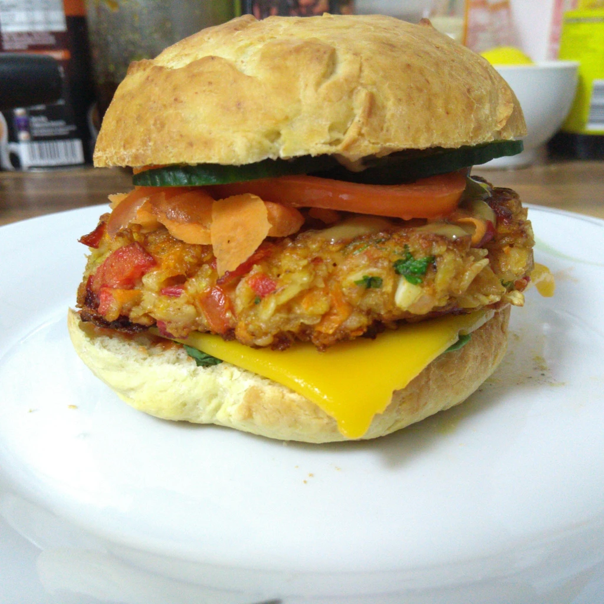
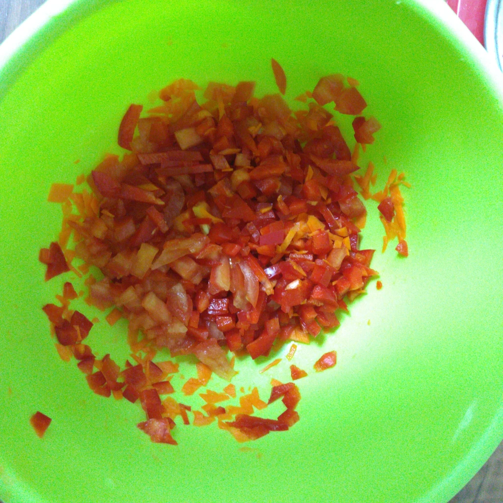
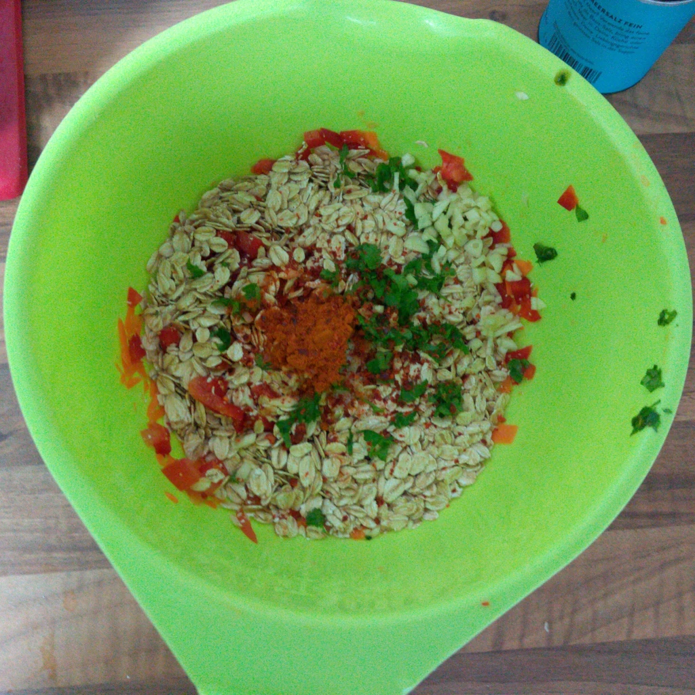
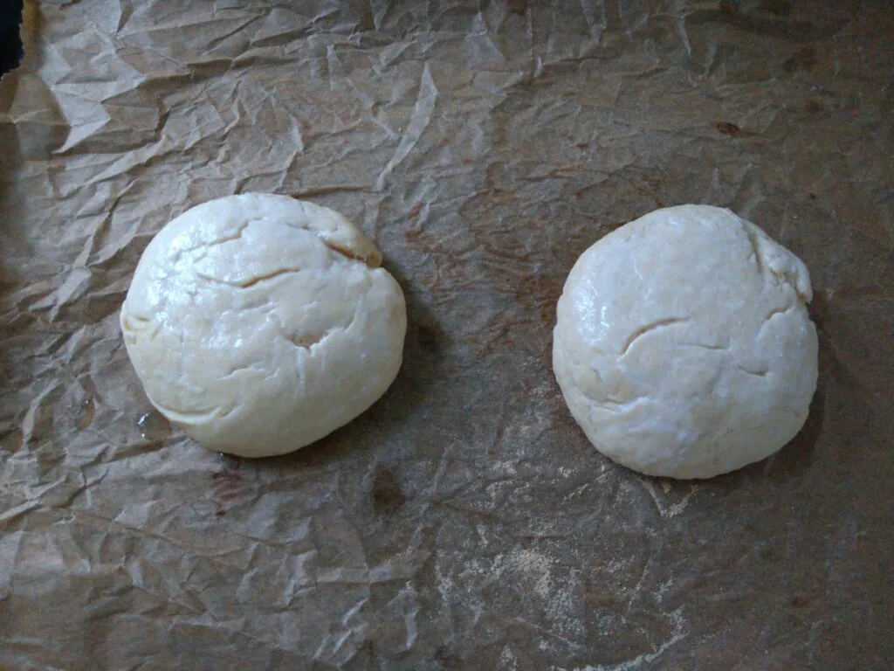
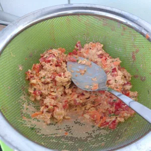
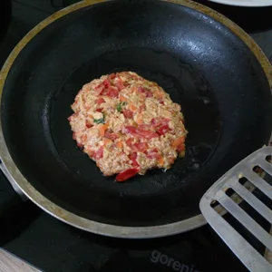
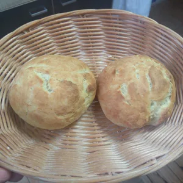
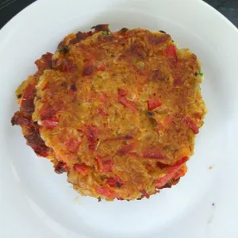

In den letzten Tagen haben einige User in meiner Timeline doch vermehrt Bilder von Burgern gepostet und ich bekam dann auch wieder Lust Burger zu machen. Jedoch hatte ich keine Lust auf ein Fleischersatz und entschied mich, Tomaten-Paprika Bratlingen. Für die Buns habe ich mir ein neues Rezept zusammen geworfen.

## Zutaten für zwei Buns:

- 150g Mehl Typ 550
- 8g Trockenhefe
- 1 gestrichener TL Salz
- 2 TL Zucker
- 90 Ml ungesüssten Sojajoghurt
- 30 g Margarine
- 1 EL Sojamilch mit einer Prise Salz für Toppig

## Zutaten für 2 Bratlinge:

- 80g Haferflocken Kernig
- Halbe Karotte
- 1 Tomate
- 1/2 Paprika
- 1/2 TL Salz
- 1 TL Paprika Pulver
- 1 Knoblauchzehe
- Handteller Petersilie
- 80ml kochendes Wasser
- Öl zum anbraten

## Zutaten für die Soße:

- 2 TL Dijon Senf
- 1 TL Löwenzahn Sirup (oder anderer Honigersatz)
- 1 Schuss Balsamico

Wir fangen mit den Buns an, da diese am längsten Zeit beanspruchen. Vermischt Mehl, Trockenhefe, Salz und Zucker in einer Schüssel.  
Erhitzt einen Topf leicht, in welcher die Margarine schmilzt. Gebt den Sojajoghurt hinzu und verrührt das ganze. Lasst es auf jeden Fall nicht kochen. Gebt dann die Mischung zum Mehl hinzu und knetet den Teig für 10 Minuten, bis der Teig sich fest anfühlt und nicht mehr klebt. Bedeckt den Teig mit einem feuchten Küchentuch und lasst diesen für eine Stunde an einen warmen Ort gehen. Nach dieser Stunde teilt ihr den Teig in zwei und formt zuerst eine Kugel und macht jeweils einen Fladen daraus. Legt die Fladen auf ein Backblech und deckt diese erneut mit dem Tuch zu. Diese müssen erneut 45 Minuten gehen. Währenddessen könnt ihr euren Ofen auf 220 Grad vorheizen.

|||
::|::
|

Für die Bratlinge hackt ihr Paprika, Tomaten, Karotte und Knoblauch klein. Gebt die Zutaten in eine Schüssel und gebt die Haferflocken hinzu. Zum Schluss kommen die Gewürze. Hackt auch hier die Petersilie klein.  
Gießt zum Abschluss das kochende Wasser über die Zutaten und verrührt diese. Lasst die Bratlinge für 15 Minuten stehen.

Nun widmen wir uns der einfachen Soße. Nehmt Löwenzahn-Sirup, Agaven Dicksaft oder den Honigersatz eurer Wahl und vermischt das mit dem Dijon-Senf und Balsamico. Das wäre es auch schon.

Mittlerweile können die Buns mit der Sojamilch und Salz bestrichen werden und wer mag auch mit Sesam bestreut werden. Die Buns kommen dann für 15 Minuten in den Ofen.

Die Bratlinge können bei zu viel Flüssigkeit auch durch ein Sieb gepresst werden, damit diese schneller an Feuchtigkeit verlieren. Nach den 15 Minuten erhitzt eine Pfanne und formt mit feuchten Händen einen Fladen, welcher angebraten werden kann. In der zwischen Zeit sollten die Buns auch langsam fertig werden. Holt diese raus und lasst diese abkühlen.

|||||
::|::|::|::
| | | 

Die Burger können nun nach Belieben belegt werden. Ich hatte die untere Seite mit rotem Pesto bestrichen und mit Basilikum bedeckt. Darauf folgte eine Scheibe Burger-Schmelz, welche ich im Ofen schmelzen ließ. Auf diese kamen die Bratlinge, die Honig-Senf Soße, Karotte-streifen, Tomaten und Gurken. Deckel darauf und genießen. Was ich mir sehr gut dazu vorstellen kann, ist auch eine Balsamico Creme.
