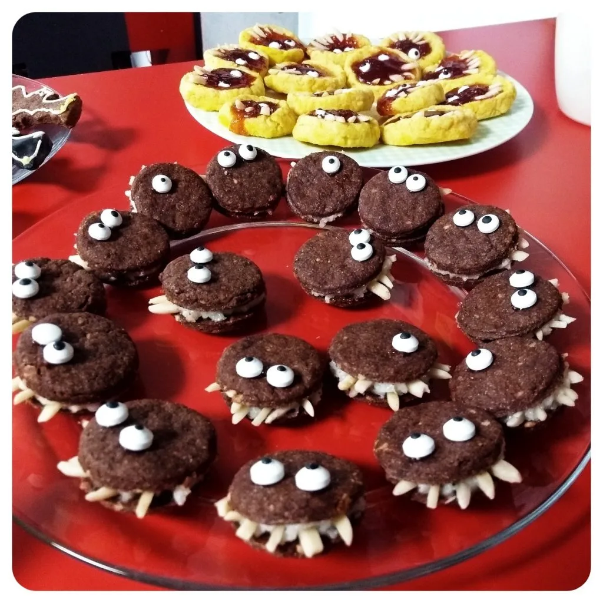

Es steht mal wieder Halloween vor der Tür, also muss wieder etwas Süßkram her. Neben den bestehenden Rezepten vom letzten Jahr ([Zombiefinger](articles/zombiefinger-2018-11-07/), [Jack O' Latern](articles/jack-olantern-cookie-2018-11-06/), [Monster Kekse](articles/monster-kekse-2019-10-30/)), habe ich auf meiner bewehrten Basis, Schokodoppelkekse mit Puddingfüllung gezaubert.  
Hier treffen zwei Rezepte aufeinander. Einmal für den Keksteig:

- 200g Mehl
- 100 Margarine
- 80g Zucker
- Gehackte Nüsse nach Bedarf
- Kakao nach Bedarf.
- 3 EL Milch(ersatz)

Alles wird zu einem großen Klumpen verknetet. Danach wickelt man den Teig in Frischhaltefolie ein und stellt diesen für eine Stunde in den Kühlschrank. Währenddessen kann man die Füllung vorbereiten.

Dabei greifen wir auf dieses [Pudding Rezept](images/30/pudding-mischung/) zurück und ersetzen Kakao durch Vanillearoma oder benutzt gleich Soja Milch mit Vanillegeschmack.

- 50g Speisestärke
- 20g Zucker
- Vanillearoma
- 0,3L Vanille Milch

Die Speisestärke wird mit dem Zucker vermischt, während die Milch erhitzt wird. Das Vanillearoma, kann man zur kochenden Milch hinzugeben. Sobald die Milch erhitzt wurde, kann man die Speisestärke mit dem Zucker hinzugeben und rühren, bis man eine ordentliche Masse erhält.  
Sobald der Pudding fertig ist, kann man den zur Seite stellen und abkühlen lassen.

Nun kann der Teig aus dem Kühlschrank herausgenommen und ausgerollt werden. Als Ausstechform kann alles genommen werden, was rund ist. Ich habe in ein Pinnchen 'für genommen.  
Die Kekse können nun in einen vorgeizten Ofen, bei 180 Grad, hinein geschoben werden.

Nach 15-20 Minuten können die Kekse aus dem Ofen und ebenfalls abgekühlt werden. Daraufhin kann der Pudding zwischen die Kekse und diese dekoriert werden. Zum Beispiel mit Mandeln und Deko Augen.

So, dann bleibt nur noch 🧛 Happy Halloween 🎃 zu sagen :)
