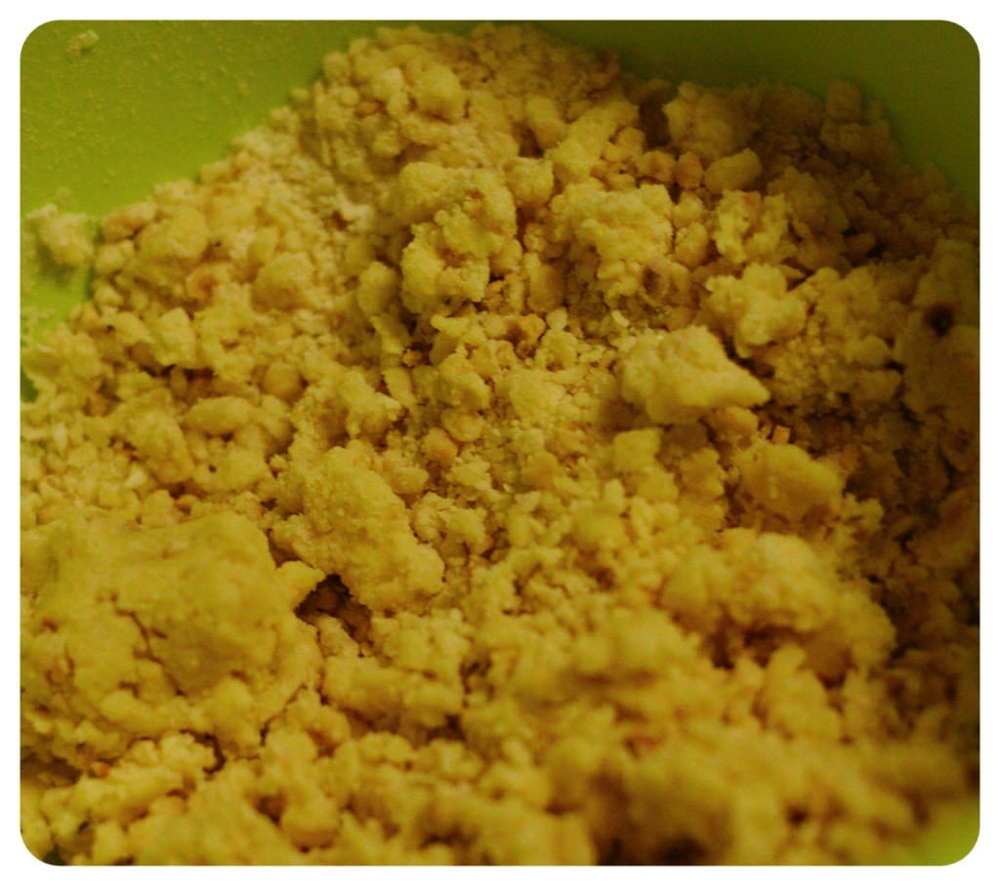

Zu Halloween war ich bei der wundervollen Leah und da ich nicht mit leeren Händen hingehen mochte, fing ich an zu backen. Für die Monster Kekse, habe ich simplen Teig gemacht und mit Marmelade gefüllt und mit Zuckeraugen sowie Mandeln dekoriert.

Für das Rezept benötigt man:

- 200 g Mehl
- 100 g Margarine
- 80 g Zucker
- 16 g Vanillezucker
- Messerspitze Backpulver
- Prise Salz
- 4 El Sojamilch
- Himbeermarmelade
- Lebensmittelfarbe (in diesem Fall Gelb)

Alle Zutaten in eine Schale legen und verrühren bis man einen festen Teig hat. Währenddessen kann man den Backofen auf 160 Grad Ober- und Unterhitze vorheizen.

Aus dem Teig kleine Stücke abzupfen und kleine Kugeln formen, diese eindrücken, damit man die Marmelade einfüllen kann.  Den Teig auf ein mit Backpapier ausgelegten Backblech legen.

|||
::|::
|

Die angehenden Kekse schiebt man nun für 25 Minuten in den Ofen. Nach der Zeit, entnimmt man das Backblech und dekoriert es mit den Zuckeraugen und Mandeln zu kleinen monsterhaften Gesichtern und schiebt das Blech wieder bis zu 10 Minuten in den Ofen. Der Teig wird sich ausbreiten und durch die Form soll die Marmelade nicht verlaufen.

Das wäre es auch schon. Einen gruseligen Appetit wünsch ich euch :)
