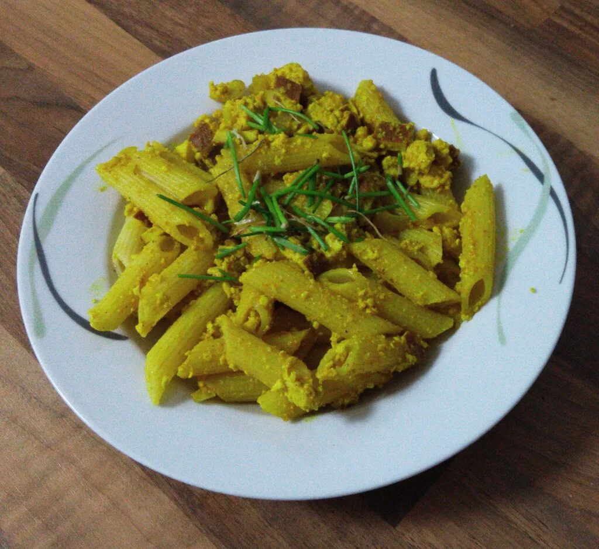
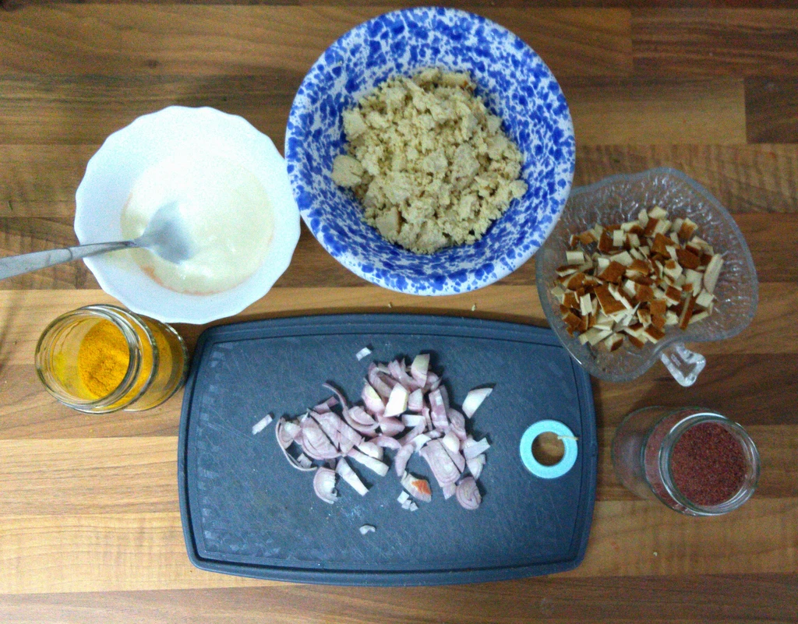
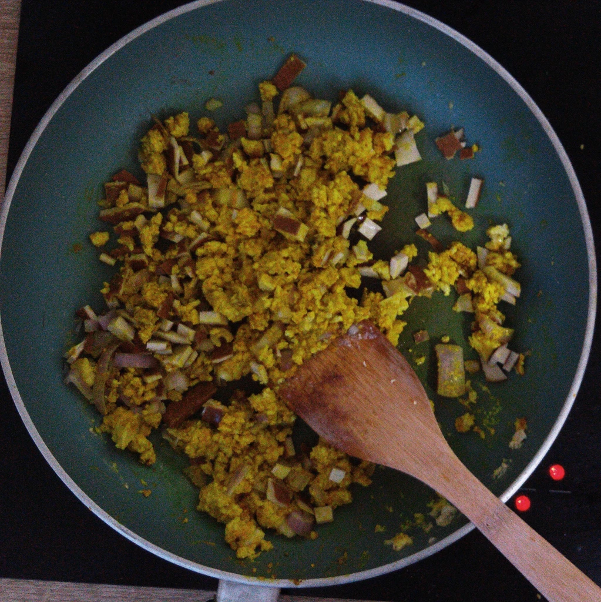

Ich bin kein großer Fan von luxuriösen Küchen, für mich muss es einfach und gut sein. So erfreue ich mich auch sehr, wenn Nudeln vom Vortag mit Scrambled Tofu (Rührei-Ersatz) erweitert werden. Für die Zubereitung wird nicht viel Zeit benötigt, dafür aber zwei Gewürze welche nicht in jeder Küche vorhanden sind.

**Zutaten für Zwei Portionen:**  
1 TL Kala Namak  
1 TL Kurkuma Gewürz  
2-3 EL Soja Joghurt (Ungesüßt)  
175g Räucher Tofu  
1 Schalotte  
Margarine oder Öl zum Anbraten

**Zubereitung:**

Natürlich kann auch ungeräucherter Tofu genommen werden, ich wollte jedoch Speck simulieren. Also trennte ich die Kruste vom Tofu und schnitt es klein. Den Tofu habe ich mit der Hand in kleine Stücke zerrupft und die Schalotte klein gehackt. Die Pfanne auf mittlerer Stufe erhitzen und das zerrupfte Tofu leicht anbraten und den Joghurt hinzugeben. Beides gut umrühren und ein Teelöffel Kurkuma dazu geben, sowie weiter verrühren. Danach das Kala Namak unterrühren und die Schalotte, die Räucherkruste des Tofu und die Nudeln in die Pfanne legen. Alles zusammen fertig braten und mit frischem Pfeffer würzen. Das wäre es schon. Schnell und einfach.
