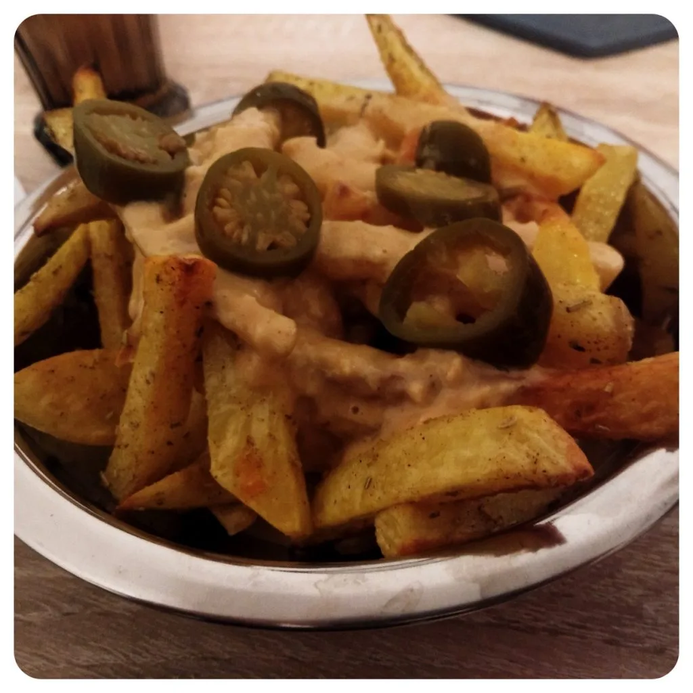
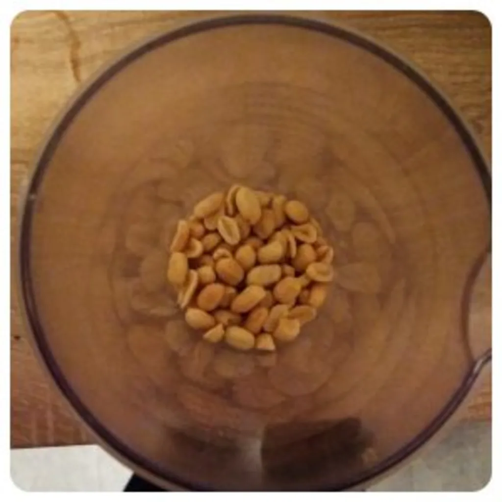
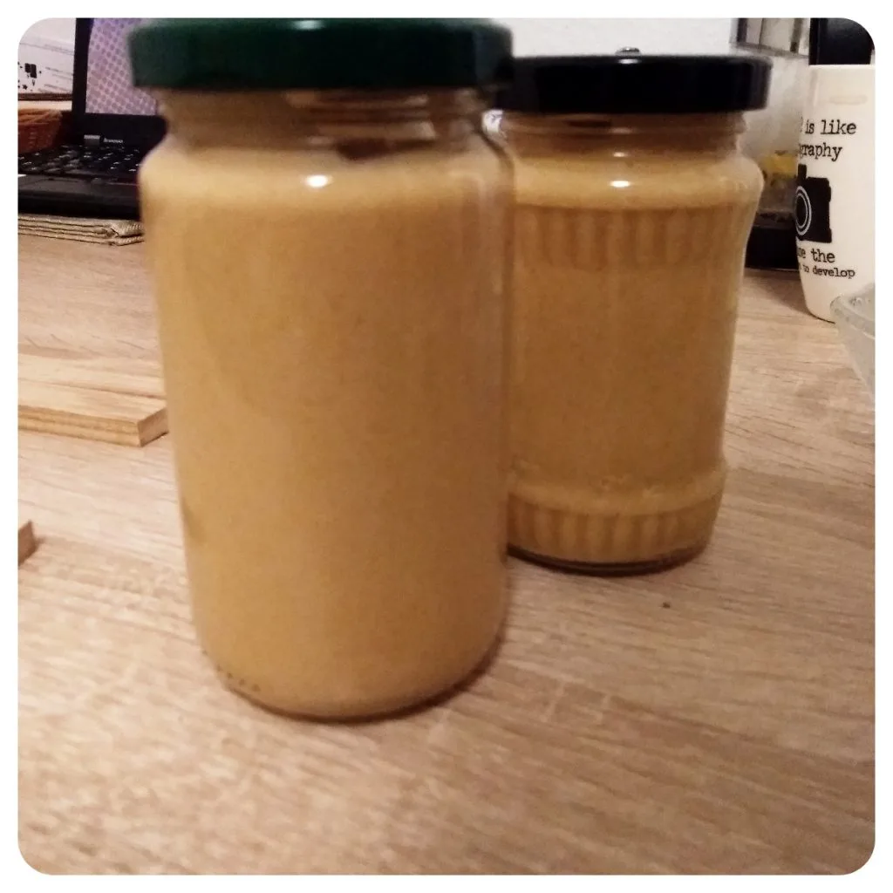
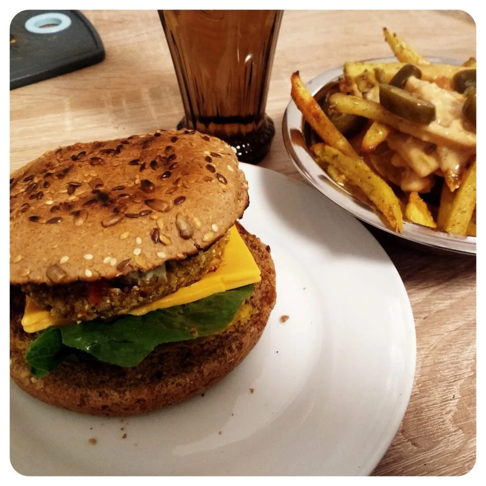

Ich wäre gerne faul, aber dies ist mir nicht gegeben. Pommes ist hierfür ein wundervolles Beispiel. Wieso ausgerechnet Pommes? Nun ja. Pommes sind super. Man macht die Tüte auf, wirf die Pommes in die Friteuse, Pfanne, Ofen und stellt den Rest ins Tiefkühlfach. Habe ich nicht. Also das Tiefkühlfach. Da denkt man sich "Ha. Ich kaufe eine kleinere Packung!1". Gibt es nicht. Also als Single mit ohne Tiefkühlfach ist sowas simples wie Pommes nicht machbar. So muss ich wohl wieder selber ran. Die Pommes sind schnell und einfach gemacht.

## Zutaten Pommes
- Vier Dicke Kartoffel
- 4 EL Oliven Öl
- Rosmarin Gewürz und Paprika Pulver

Öl, Rosmarin Gewürz und das Paprika Pulver in einer Schalle vermischen. Die Kartoffel waschen, schälen und in Streifen schneiden. Die Streifen in die Schalle zum Öl legen. Vermischt das Ganze. Währenddessen kann man den Ofen auf 200 Grad vorheizen. Die Pommes auf ein Backblech auslegen und in den vorgeheizten Ofen schieben. Nach ca. 20 Minuten die Pommes wenden und weitere 20 Minuten warten.

## Zutaten Erdnusssoße

Nun da die Kartoffelstreifen im Ofen sind und darauf warten Pommes zu werden, kann man die Soße vorbereiten. Hierfür nahm ich folgendes:

- 100g Erdnüsse
- 4 El Sonnenblumen Öl
- 1 El Zitronensaft
- 1 TL Pfeffer
- 1 Schalotte (klein gehackt)
- 2 EL Sojajoghurt
- 8 EL Wasser
- 1 Knoblauch Zehe
- 1 EL schwarzes Balsamico

Alle Zutaten in einen hohen Behälter geben und diese mit einen Standmixer klein pürieren. Wem das noch zu dick sein sollte, kann es mit Wasser noch etwas strecken. Nun kann man die Pommes aus dem Ofen holen, salzen nicht vergessen, die Erdnusssoße darüber geben und dazu ein paar Jalapeños hinzu geben.

Was dazu gut passt, sind Hamburger, mit zum Beispiel Bratlingen als Patty.

