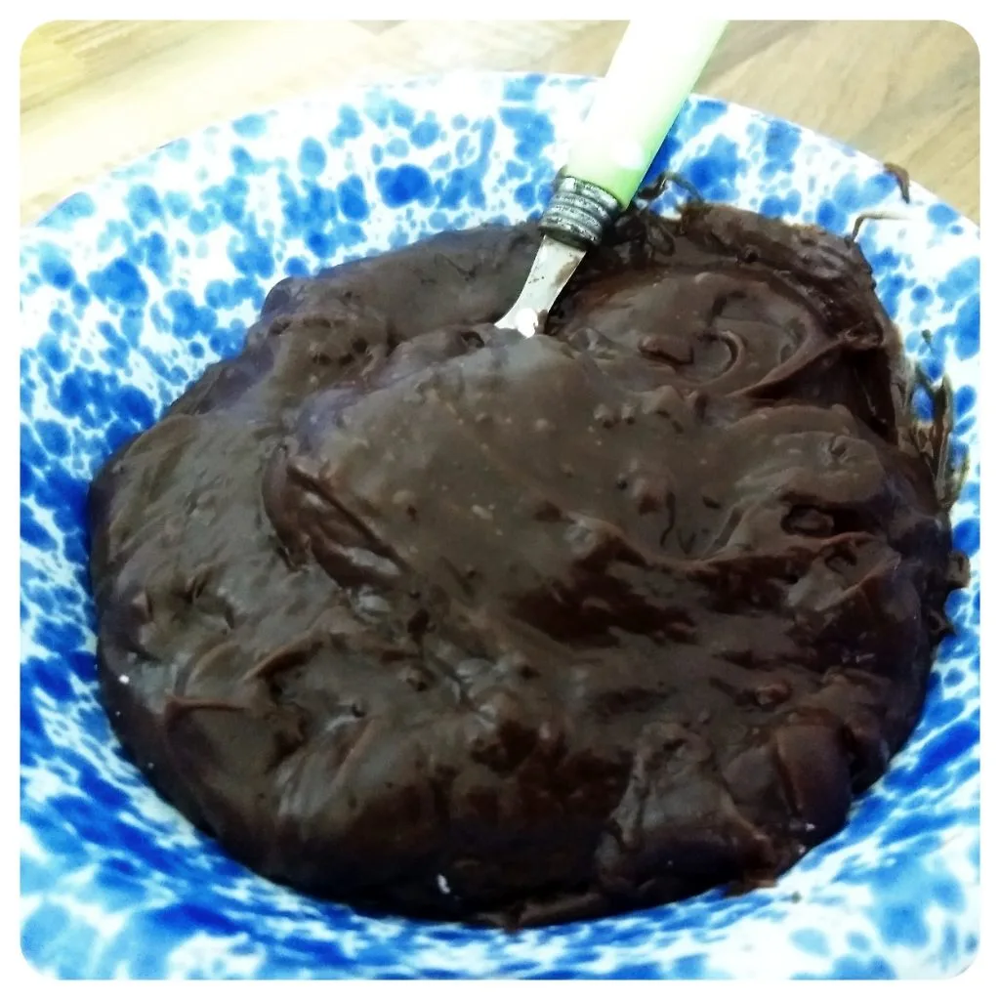
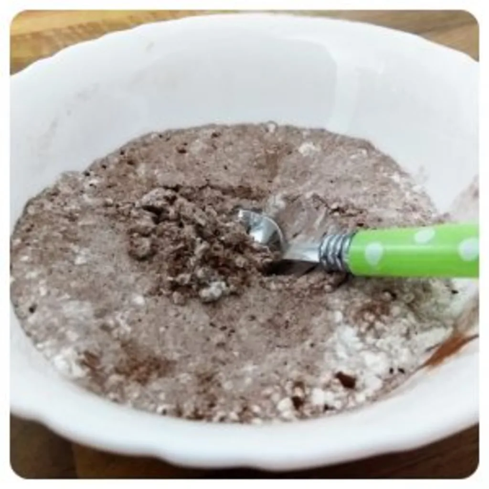

Letztens hatte ich Lust auf eine süße Nachspeise, jedoch war die Küche relativ leer. Was ich jedoch hatte, war Speisestärke und Kakao.  
Also gab es spontan Schoko Pudding. Für die Basis benötigt man nicht viel.

- 50g Speisestärke
- 20g Zucker
- Kakao nach Bedarf.
- 0,3L Milch(ersatz)

Alles wird vermischt, während man ein Glas Milch(ersatz) aufkocht. Sobald die Milch erhitzt wurde, mischt man die Speisestärke mit Kakao und Zucker unter die Milch und lässt es fest werden.  
Jetzt heißt es zu rühren, bis man eine gute Pudding Masse hat.

Zackfeddich - Pudding.
