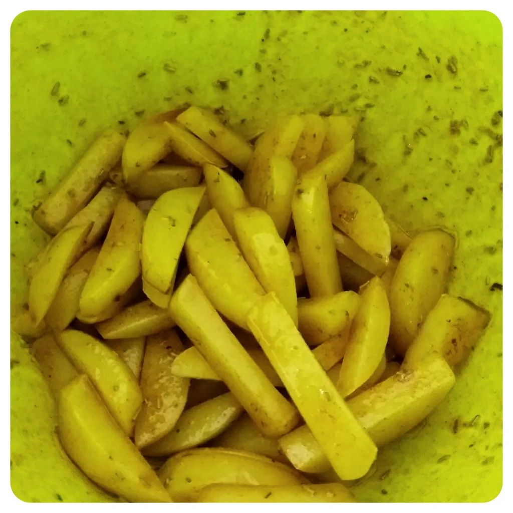

Ich habe mich letztens an einer Käsesoße als Dip für meine Nachos probiert. Da dies nicht so gut geklappt hatte, wollte ich es ausbessern und ich muss gestehen, so bin ich mehr als zufrieden. Aber vorerst an den Anfang.

Zuerst brauchen wir folgende Zutaten:

## Marinade für die Tofu  
* 2 EL Pflanzen Öl  
* 1 Schuss Sojasoße  
* 2 EL Wasser  
* 3 TL Grillgewürz  
* 1 EL Honig([ersatz](/2019/04/22/loewenzahn-sirup/))  
* 1 Räucher Tofu

Presst die Flüssigkeit aus dem Tofu, indem ihr es auf einen Teller legt, mit etwas abdeckt und für 15 Minuten beschwert, zum Beispiel einem schweren Buch. Mischt alle anderen Zutaten in einem Behältnis zusammen. Schneidet danach den Tofu in Würfel und legt diese ins Behältnis hinzu und verrührt das ganze. Jetzt kann es zur Seite gelegt werden und ziehen lassen.

## Nun zum Käse-Lauch.
Hierfür benötigen wir:

* 2 EL Mandel Milch  
* 6x Scheiblettenkäse nach Wahl  
* ca. 1 EL gehackten Lauch und Petersilie

Ihr braucht eine Schale, welche Ihr in den Ofen stellen könnt. Zerkleinert den Käse und legt diese in die Schale. Gibt nun die Mandel-Milch hinzu und legt das Lauch und die Petersilie darüber.

Heizt den Ofen auf 100 Grad vor.

Schneidet währenddessen 400g Kartoffeln in Streifen und legt diese auf ein mit Backpapier belegtes Backblech. Sobald der Ofen vorgeheizt ist, legt die Pommes für 15 Minuten zum Trocknen hinein. Zu den Pommes legt ihr die Schale mit dem Käse-Lauch Dip.

Jetzt wir die Würze für die Pommes vorbereiten. Ich nahm dafür 2 EL Oliven Öl und gab 1 TL Salz und 1 EL Paprikapulver und etwas Rosmarin dazu. Nachdem die Pommes 15 Minuten im Ofen waren, holt diese heraus und gibt diese der Würzmischung mit dem Öl hinzu, die Pommes können jetzt etwas ziehen. Erhöht nun den Ofen auf 200 Grad und verrührt den Käse Dip. Sobald der Ofen auf Temperatur ist, können die Pommes wieder rein und jetzt fertig gemacht werden. Bei Umluft sollte dies ca. 15 Minuten dauern.

 

Nun können wir den Tofu aus der Marinade nehmen und in einer Pfanne mit etwas Öl anbraten.

## Curry-Tomaten-Soße:  
* 1 EL Tomatenmark  
* 1 EL Dijon Senf  
* 1 Schuss Soja Soße  
* 3 TL Curry Pulver  
* 1 EL Wasser

Verrührt das ganze und gebt bei Bedarf mehr Curry Pulver für den Geschmack hinzu, sowie Wasser oder Tomatenmark für die Konsistenz.

Achtet auf die Pommes, dass diese nicht zu dunkel werden. Holt die Schale mit dem Käse Dip heraus und verrührt das ganze. Lasst den Käse Dip etwas abkühlen und verrührt dann das ganze erneut. Beim Abkühlen verfestigt sich alles. Nun muss nur noch alles auf ein Teller serviert werden und schmecken lassen 😀

