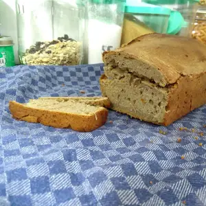
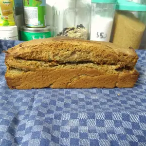

Die Vorbereitung für Sauerteigbrot benötigt etwas Zeit, da der Teig mehrere Stunden gehen muss. 
Je nachdem ob der Sauerteig vorbereitet ist. Bei diesem Rezept wird davon ausgegangen, dass der Sauerteig bereits angesetzt wurde und griffbereit ist. 

<!-- more -->

# Zutaten
* 500ml Sauerteig
* 200ml Lauwarmes Wasser
* 1TL Salz
* 500g Roggenmehl

Aktiviert den Sauerteig, in dem die benötigte Menge mit etwas warmen Wasser verrührt wird. Erkennbar daran, dass der Sauerteig Bläschen wirft. 
Gebt in eine Schüssel 165g Roggenmehl und macht eine Mulde im inneren. In diese gießt ihr nun die 500ml Sauerteig und bedeckt dabei das Mehl. Die Schüssel muss nun über Nacht an einem warmen Ort gehen.

Am nächsten Morgen gebt ihr etwas lauwarme Wasser zum Sauerteig hinzu und verrührt das ganze zu einem dickflüssigen Teig. Dieser geht zugedeckt für weitere Zwölf Stunden am einen warmen Ort. 

Nun kann Salz, Wasser und das restliche Mehl zum Sauerteig hinzugegeben werden und diesen danach kneten, bis sich der Teig vom Schüsselrand löst. Fettet daraufhin eine Kastenform ein, in welcher der Teig gegossen werden kann. Diese Kastenform bleibt zugedeckt für bis zu sechs Stunden an einem warmen Ort, damit dieser gehen kann.

Der Backofen sollte auf 190 Grad Ober- und Unterhitze vorgeheizt sein. Das Brot wird für 45 bis 60 Minuten auf der mittleren Schiene gebacken. Nachdem das Brot gebacken ist, sollte dieser zum Abkühlen gestürzt werden. 

