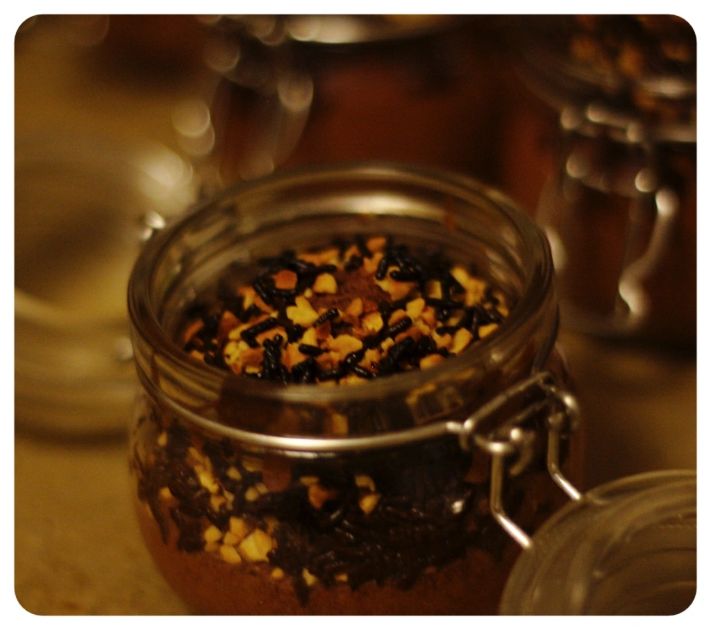

Eine Süße Nachspeise mögen viele und einer meiner Lieblings Nachspeisen ist dieses Schoko-Nuss-Nougat Küchlein im Einmachglas. Dieses Rezept besteht aus einen leicht abgewandelten Muffin Rezept, welches ich schon für die Apfel-Zimt Muffins benutzt habe und dieses Mal haben wir sogar eine vegane Nuss-Nougat Creme Füllung. Zu den Zutaten:

- 180 g Mehl (Typ 405)
- 2 Esslöffel (Back)Kakao
- 60 ml Sonnenblumenöl
- 100 g Zucker
- 120 ml Sojamilch
- Halbe Packung Backpulver
- gehackte Nüsse
- Schokostreusel
- Vegane Nuss-Nougat Creme

Für die Zubereitung vermischt man alle trockenen Zutaten und gibt nun das Sonnenblumenöl, sowie die Sojamilch hinzu und verrührt das Ganze zu einen Teig. Nun gießt man den Teig in die Einmachgläschen, bis diese bis zu 1/3 befüllt sind. Darauf kann man dann jetzt ein Kleks Nuss-Nougat-Creme machen (wenn man diese vorher kurz erhitzt, lässt die sich leichter in die Gläschen machen).

Den Kleks Nuss-Nougat Creme überdeckt man nun wieder mit ein bisschen Teig. Das ganze wird dann mit den gehackten Nüssen, sowie mit Schokostreusel oder Splitter bedeckt und in einen Ofen, welcher auf 220 Grad mit Ober und Unterhitze vorgeheizt, geschoben. Denkt daran das Gummi vom Glas vorher ab zu machen.

Nach ca. 25 bis 30 Minuten sollten die Küchlein fertig sein. Das Blech mit den Gläsern aus dem Ofen ziehen und abkühlen lassen. Stäbchenprobe nicht vergessen.

