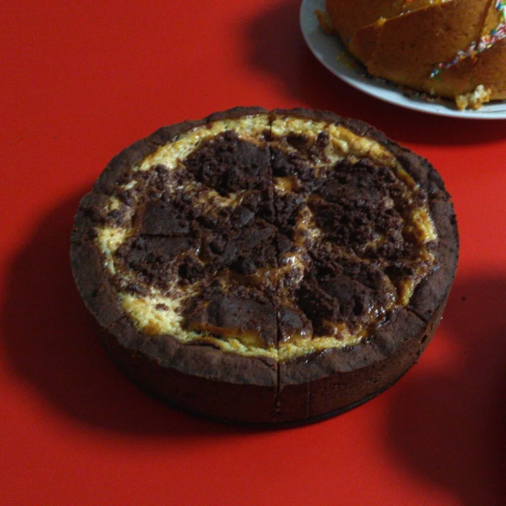
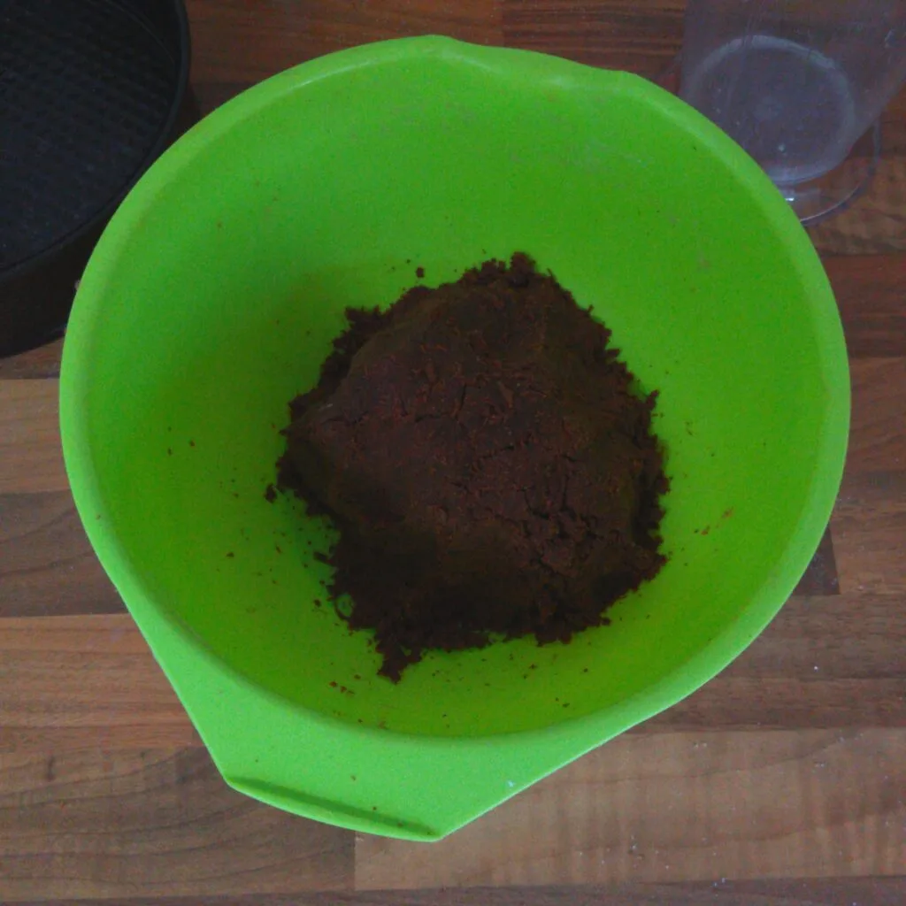
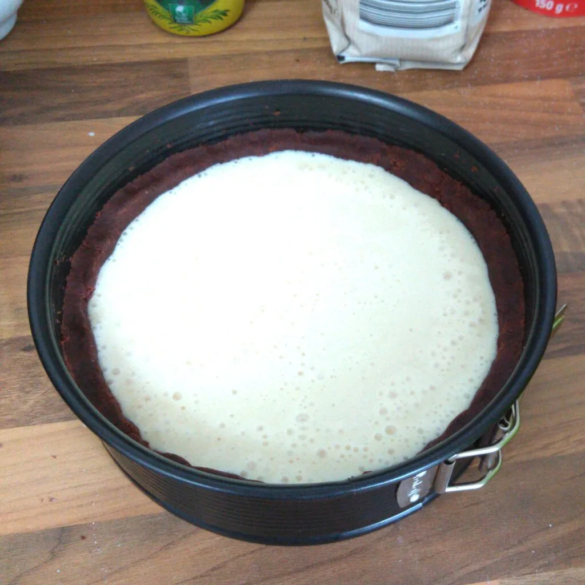

Traditionell gibt es bei Feierlichkeiten in unserer Familie Sernik, ein Käsekuchen mit Schokolade. Auch bekannt unter Zupfkuchen. Ich habe nun nach einer Möglichkeit geschaut, den Kuchen mit meiner Lebensmittel-Unverträglichkeit vereinbar zu machen. Während des Oster DiVoc 2020 kam es dann, dass wir in einer Selbstorganisierte Session mit mehreren Personen gemeinsam Kuchen backten. Dabei wurden jeweils leichte Anpassungen gemacht und daraus entstand dann auch dieses Rezept für eine Springform mit 26 Zentimeter Durchmesser.

## Zutaten

### Für den Knetteig benötigt man:

- 220 Gramm Mehl (Typ 405)
- 8 Gramm Backpulver
- 125 Gramm Margarine
- 80 Gramm Zucker
- 16 Gramm Vanillezucker 
- 50 Gramm ungesüßten Backkakao
- 20 Milliliter Pflanzenmilch

### Für die Füllung:

- 500 Gramm Soja Joghurt
- 50 Gramm Zucker
- 8 Gramm Vanillezucker
- Ein Schuss Zitronensaft
- 50 Gramm Speisestärke
- Ein Esslöffel Honigalternative
- Vanillearoma

Vermischt die Trockenzutaten für den Teig in einer Schüssel. Zupft die Margarine hinzu und gießt die Pflanzenmilch zum Teig. Nun kann der Teig mit der Hand ordentlich verkneten werden, bis dieser Fest ist. Fettet die Springform mit Margarine ein und füllt die Form dünn mit 4/5 des Teiges aus. Stellt dann die Springform in den Kühlschrank und den restlichen Teig zur Seite. Nun kann der Ofen auf 160 Grad vorgeheizt werden.

Für die Füllung vermischt alle Zutaten in einem hohen Behältnis. Den Honigersatz kann man alternativ auch durch Früchte oder Sirup austauschen. Das Vanillearoma gebt ihr nach eigenen Bedarf hinzu. Ich habe sechs Tropfen benutzt. Wenn es geschmacklich passt, kann die Füllung in die Form gegossen werden. Den restlichen Teig streut man dann über die Füllung.

Nun kann der Kuchen, auf die unterste Schiene, in den Ofen geschoben werden und bei 160 Grad Umluft für 45 Minuten gebacken werden. Nach dieser Zeit stellt man den Ofen auf 140 Grad und backt den Kuchen für 15 Minuten. Daraufhin kann der Ofen ausgeschaltet werden und die Tür auf Kippe gestellt werden. Den Kuchen darin auskühlen lassen, damit die Füllung fest wird.

Nun kann der Kuchen genossen werden. Da bleibt nur noch eins zusagen.  
Smacznego.
